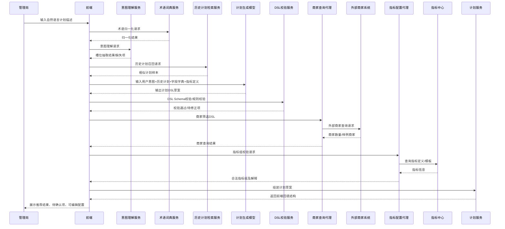

# 自然语言计划生成的时序流程设计

返回：[AI / Agent 文档总览](/Users/zhouzhixiong/code/zuozhanV2/docs/ai-agent-solution/README.md)

关联：

1. [基于现状的 V2 落地实施方案](/Users/zhouzhixiong/code/zuozhanV2/docs/ai-agent-solution/02-v2-implementation-plan.md)
2. [自然语言计划生成的数据准备与存储设计](/Users/zhouzhixiong/code/zuozhanV2/docs/ai-agent-solution/03-nl-plan-data-design.md)
3. [自然语言计划生成的意图理解设计](/Users/zhouzhixiong/code/zuozhanV2/docs/ai-agent-solution/05-nl-plan-intent-understanding.md)

## 1. 定位

本文件描述自然语言计划生成的推荐系统链路，重点是“不是单段 Prompt，而是一条可校验、可追踪、可降级的业务流程”。

## 2. 主链路目标

1. 先理解用户意图
2. 再召回历史计划
3. 再生成 DSL 草案
4. 再校验和补全
5. 最后调用外部商家接口并回填前端

## 3. 推荐主链路步骤

1. 用户输入自然语言计划描述
2. 术语归一化服务识别业务词、商家属性词、指标词和时间词
3. 意图理解模块抽取槽位，得到目标类型、商家范围、指标偏好、限制条件和缺失信息
4. 历史计划检索模块进行关键词召回、向量召回和效果重排
5. 将用户输入、意图理解结果、历史计划样本、商家字段字典、指标定义一起提供给模型
6. 模型生成计划 DSL 草案
7. 服务端对 DSL 进行 Schema 校验和规则校验
8. 商家查询代理将商家筛选 DSL 转为外部商家接口请求
9. 调用外部商家接口获取候选商家和商家数量
10. 指标配置代理校验指标组是否合法，并补充指标解释
11. 组装最终计划草案
12. 前端展示推荐结果、推荐原因和待确认项
13. 用户修改、确认后保存正式计划

## 4. Mermaid 时序图

## 5. 关键校验点

1. 术语归一化后，是否存在无法识别的关键业务词
2. 意图理解后，是否缺少关键槽位
3. DSL 生成后，是否满足 Schema
4. 商家查询前，字段和枚举是否合法
5. 指标组生成后，是否存在冲突或不可检核指标
6. 保存正式计划前，是否存在必须人工确认项

## 6. 降级策略

1. 历史计划检索失败：
降级为基于用户输入和基础模板生成

2. 模型生成失败：
降级为推荐历史计划模板，不做自动结构化生成

3. DSL 校验失败：
提示用户修正，不进入商家查询

4. 商家接口失败：
展示条件草案，但不展示商家结果

5. 指标校验失败：
展示候选指标，但标记为待确认

## 7. 实施建议

首期建议按以下顺序落地：

1. 先完成术语归一化、意图理解、历史计划召回
2. 再完成 DSL 生成和校验
3. 再接商家查询代理
4. 再接指标配置代理
5. 最后做多轮澄清和交互优化

## 8. 与数据设计的关系

本时序文件依赖的数据资产定义见：
[自然语言计划生成的数据准备与存储设计](/Users/zhouzhixiong/code/zuozhanV2/docs/ai-agent-solution/03-nl-plan-data-design.md)

涉及“术语归一化、槽位抽取、缺失项识别、候选筛选意图、映射到商家服务字段”的详细设计，见：
[自然语言计划生成的意图理解设计](/Users/zhouzhixiong/code/zuozhanV2/docs/ai-agent-solution/05-nl-plan-intent-understanding.md)
