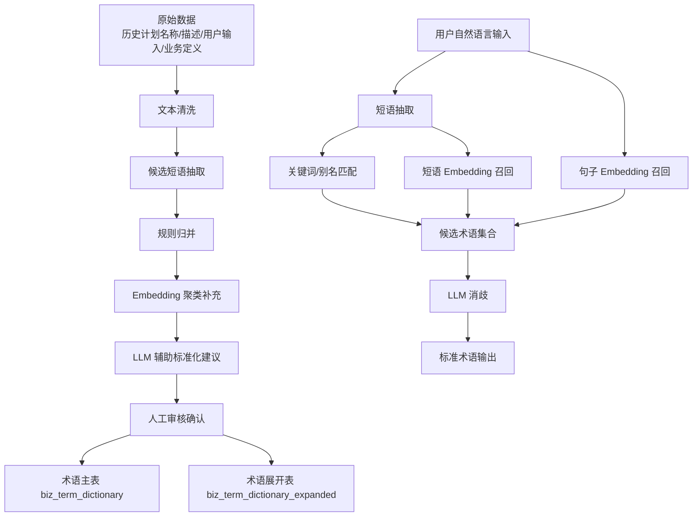

# 自然语言计划生成的意图理解设计

返回：[AI / Agent 文档总览](/Users/zhouzhixiong/code/zuozhanV2/docs/ai-agent-solution/README.md)

关联：

1. [基于现状的 V2 落地实施方案](/Users/zhouzhixiong/code/zuozhanV2/docs/ai-agent-solution/02-v2-implementation-plan.md)
2. [自然语言计划生成的数据准备与存储设计](/Users/zhouzhixiong/code/zuozhanV2/docs/ai-agent-solution/03-nl-plan-data-design.md)
3. [自然语言计划生成的时序流程设计](/Users/zhouzhixiong/code/zuozhanV2/docs/ai-agent-solution/04-nl-plan-sequence-design.md)

## 1. 定位

本文件用于回答一个核心问题：

自然语言计划生成里，“用户一句自然语言”到底如何被系统理解，并最终转换为可执行的商家筛选 DSL。

推荐总链路不是：

`用户输入 -> LLM 直接生成 DSL`

而是：

`用户输入 -> 术语归一化 -> 槽位抽取 -> 缺失项识别 -> 候选筛选意图 -> 映射到商家服务边界 -> 生成 DSL`

这样更稳，也更容易校验。

---

## 2. 术语归一化

## 2.1 目标

术语归一化的目标不是直接写 DSL，而是把用户口语化表达先转成系统更容易理解的标准业务术语。

例如用户输入：

```text
帮我找华东餐饮新商家，优先上海杭州，排除闭店商家，做一个首单提升计划
```

系统要先识别出其中的关键业务词：

1. 华东
2. 餐饮
3. 新商家
4. 上海、杭州
5. 闭店商家
6. 首单提升

---

## 2.2 需要的基础数据

术语归一化通常依赖三类基础数据：

### 2.2.1 业务术语词典

主要来自业务侧沉淀，包括：

1. 历史计划名称
2. 历史计划描述和备注
3. 管理岗和运营岗真实输入的话术
4. 内部业务定义

示例：

```json
{
  "term": "首单提升",
  "term_type": "goal_type",
  "normalized_code": "first_order_growth",
  "normalized_name": "首单提升",
  "aliases": ["拉首单", "冲首单", "首单拉升"]
}
```

### 2.2.2 商家服务元数据

主要来自上游商家服务，表示当前可查的字段、标签、枚举和操作符。

示例：

```json
{
  "field": "industry_code",
  "field_name": "行业",
  "field_type": "enum",
  "operators": ["=", "in"],
  "values": ["餐饮", "零售", "丽人"]
}
```

```json
{
  "tag_code": "new_merchant",
  "tag_name": "新商家",
  "tag_type": "merchant_stage"
}
```

### 2.2.3 指标中心术语

主要来自你们系统的指标中心，用于识别目标和指标相关表达。

示例：

```json
{
  "metric_code": "first_order_cnt",
  "metric_name": "首单商家数",
  "aliases": ["首单", "首单数", "首单提升"],
  "category": "first_order"
}
```

---

## 2.3 输入、模型动作与输出

### 输入

```text
帮我找华东餐饮新商家，优先上海杭州，排除闭店商家，做一个首单提升计划
```

### 系统预处理

系统先做分词或短语提取，拿到候选短语：

1. 华东
2. 餐饮
3. 新商家
4. 上海杭州
5. 闭店商家
6. 首单提升

然后系统基于三类基础数据，为每个短语召回候选解释。

### 给 LLM 的输入

```json
{
  "user_query": "帮我找华东餐饮新商家，优先上海杭州，排除闭店商家，做一个首单提升计划",
  "candidate_terms": [
    {"raw": "华东", "candidates": [{"type": "region_concept", "value": "华东"}]},
    {"raw": "餐饮", "candidates": [{"type": "industry_enum", "value": "餐饮"}]},
    {"raw": "新商家", "candidates": [{"type": "merchant_tag", "value": "new_merchant"}]},
    {"raw": "闭店商家", "candidates": [{"type": "merchant_tag", "value": "closed_merchant"}]},
    {"raw": "首单提升", "candidates": [{"type": "goal_type", "value": "first_order_growth"}]}
  ]
}
```

### LLM 做的动作

LLM 在这一步不做自由生成，而是做两件事：

1. 候选选择
2. 歧义消解

也就是帮系统判断：

1. 哪个候选解释更符合上下文
2. 某个词到底是在表达商家条件、目标类型还是别的意思

### LLM 输出

```json
{
  "normalized_terms": [
    {"raw": "华东", "type": "region_concept", "normalized": "华东"},
    {"raw": "餐饮", "type": "industry_enum", "normalized": "餐饮"},
    {"raw": "新商家", "type": "merchant_tag", "normalized": "new_merchant"},
    {"raw": "闭店商家", "type": "merchant_tag", "normalized": "closed_merchant"},
    {"raw": "首单提升", "type": "goal_type", "normalized": "first_order_growth"}
  ]
}
```

### 这一步的本质

`用户自然语言 -> 标准业务术语`

---

## 3. 槽位抽取

## 3.1 目标

槽位抽取的目标是把归一化后的业务术语，填充到预定义的业务槽位中。

推荐首期槽位：

1. `region`
2. `industry`
3. `merchant_stage`
4. `merchant_status_exclusion`
5. `priority_city`
6. `goal_type`

---

## 3.2 输入、模型动作与输出

### 输入

术语归一化结果：

```json
{
  "normalized_terms": [
    {"raw": "华东", "type": "region_concept", "normalized": "华东"},
    {"raw": "餐饮", "type": "industry_enum", "normalized": "餐饮"},
    {"raw": "新商家", "type": "merchant_tag", "normalized": "new_merchant"},
    {"raw": "闭店商家", "type": "merchant_tag", "normalized": "closed_merchant"},
    {"raw": "首单提升", "type": "goal_type", "normalized": "first_order_growth"}
  ]
}
```

### 给 LLM 的任务

告诉模型：

1. 请将这些术语填充到指定槽位
2. 只输出 JSON
3. 不要生成 DSL

### LLM 输出

```json
{
  "slots": {
    "region": ["华东"],
    "industry": ["餐饮"],
    "merchant_stage": ["new_merchant"],
    "merchant_status_exclusion": ["closed_merchant"],
    "priority_city": ["上海", "杭州"],
    "goal_type": "first_order_growth"
  }
}
```

### 这一步的本质

`标准业务术语 -> 结构化业务槽位`

---

## 4. 缺失项识别

## 4.1 目标

并不是所有用户输入都足够完整。缺失项识别的目的是判断：

1. 哪些槽位已经有值
2. 哪些关键槽位还缺失
3. 是否需要追问用户
4. 是否已经可以进入商家映射

---

## 4.2 输入、模型动作与输出

### 输入

槽位结果：

```json
{
  "slots": {
    "region": ["华东"],
    "industry": ["餐饮"],
    "merchant_stage": ["new_merchant"],
    "merchant_status_exclusion": ["closed_merchant"],
    "priority_city": ["上海", "杭州"],
    "goal_type": "first_order_growth"
  }
}
```

### LLM 或规则层动作

根据预定义规则判断：

1. 商家筛选是否已有足够条件
2. 是否缺少关键限定项
3. 是否存在表达模糊

例如：

1. 如果没有行业、区域、标签中的任何一类，通常不够
2. 如果目标类型清楚但计划周期缺失，可以先生成草案，同时保留待确认项

### 输出

信息足够时：

```json
{
  "missing_slots": [],
  "clarifications": [],
  "is_ready_for_mapping": true
}
```

信息不足时：

```json
{
  "missing_slots": ["region"],
  "clarifications": [
    "请确认计划区域范围，是全国还是某个大区"
  ],
  "is_ready_for_mapping": false
}
```

### 这一步的本质

`结构化槽位 -> 判断是否足够进入映射`

---

## 5. 候选筛选意图

## 5.1 定义

候选筛选意图是一个中间层，它不是用户原话，也不是最终 DSL，而是：

一份已经标准化、但还没有绑定到商家服务真实字段的业务筛选意图。

它的价值是把：

1. 业务理解
2. 商家服务字段映射

这两件事解耦。

---

## 5.2 示例结构

```json
{
  "intent_type": "merchant_filter",
  "goal_type": "first_order_growth",
  "include": [
    {"slot": "region", "value": "华东", "value_type": "concept"},
    {"slot": "industry", "value": "餐饮", "value_type": "enum"},
    {"slot": "merchant_stage", "value": "new_merchant", "value_type": "tag"}
  ],
  "exclude": [
    {"slot": "merchant_status", "value": "closed_merchant", "value_type": "tag"}
  ],
  "priority": [
    {"slot": "city", "value": ["上海", "杭州"], "value_type": "enum"}
  ]
}
```

### 这一步的本质

`槽位结果 -> 可映射的标准筛选意图`

---

## 6. 映射到商家服务字段 / 标签 / 枚举

## 6.1 目标

这一步的目标是把候选筛选意图，映射成商家服务真正支持的查询条件。

推荐由系统规则层完成，不建议完全交给 LLM。

---

## 6.2 商家服务边界示例

```json
{
  "fields": [
    {
      "field": "industry_code",
      "name": "行业",
      "operators": ["=", "in"],
      "values": ["餐饮", "零售", "丽人"]
    },
    {
      "field": "region_code",
      "name": "城市",
      "operators": ["=", "in"],
      "values": ["上海", "杭州", "苏州", "南京"]
    }
  ],
  "tags": [
    {
      "tag_code": "new_merchant",
      "tag_name": "新商家"
    },
    {
      "tag_code": "closed_merchant",
      "tag_name": "闭店商家"
    }
  ]
}
```

---

## 6.3 映射规则

### 6.3.1 直接枚举匹配

如果候选意图值和商家服务字段枚举直接一致，则直接映射。

示例：

- 候选意图：`industry = 餐饮`
- 映射结果：`industry_code = 餐饮`

### 6.3.2 标签匹配

如果候选意图表达的是标签语义，则映射到商家服务标签。

示例：

- 候选意图：`merchant_stage = new_merchant`
- 映射结果：`tag_code in [new_merchant]`

### 6.3.3 概念展开

如果候选意图表达的是大区、概念集合或抽象概念，而商家服务只支持更细粒度值，则先展开再映射。

示例：

- 候选意图：`region = 华东`
- 展开结果：`[上海, 杭州, 苏州, 南京]`
- 映射结果：`region_code in [上海, 杭州, 苏州, 南京]`

---

## 6.4 输入、系统动作与输出

### 输入

候选筛选意图：

```json
{
  "intent_type": "merchant_filter",
  "goal_type": "first_order_growth",
  "include": [
    {"slot": "region", "value": "华东", "value_type": "concept"},
    {"slot": "industry", "value": "餐饮", "value_type": "enum"},
    {"slot": "merchant_stage", "value": "new_merchant", "value_type": "tag"}
  ],
  "exclude": [
    {"slot": "merchant_status", "value": "closed_merchant", "value_type": "tag"}
  ]
}
```

### 系统动作

系统中的 `Intent Mapper` 做以下事情：

1. 读取当前商家服务元数据
2. 对每个候选条件进行直接匹配、标签匹配或概念展开
3. 产出已映射条件、未映射条件和歧义项

### 输出

```json
{
  "mapped_conditions": [
    {
      "slot": "industry",
      "field": "industry_code",
      "operator": "=",
      "value": "餐饮",
      "match_type": "direct_enum"
    },
    {
      "slot": "region",
      "field": "region_code",
      "operator": "in",
      "value": ["上海", "杭州", "苏州", "南京"],
      "match_type": "concept_expand"
    },
    {
      "slot": "merchant_stage",
      "field": "tag_code",
      "operator": "in",
      "value": ["new_merchant"],
      "match_type": "tag_mapping"
    }
  ],
  "mapped_exclusions": [
    {
      "slot": "merchant_status",
      "field": "tag_code",
      "operator": "in",
      "value": ["closed_merchant"],
      "match_type": "tag_mapping"
    }
  ],
  "priority_hints": [
    {
      "slot": "city",
      "field": "region_code",
      "value": ["上海", "杭州"]
    }
  ],
  "unmapped_conditions": [],
  "ambiguities": []
}
```

---

## 7. 最终 DSL 生成

系统在映射完成后，组装最终商家查询 DSL。

示例：

```json
{
  "conditions": [
    {"field": "industry_code", "operator": "=", "value": "餐饮"},
    {"field": "region_code", "operator": "in", "value": ["上海", "杭州", "苏州", "南京"]},
    {"field": "tag_code", "operator": "in", "value": ["new_merchant"]}
  ],
  "exclusions": [
    {"field": "tag_code", "operator": "in", "value": ["closed_merchant"]}
  ]
}
```

这时才进入商家服务查询。

---

## 8. LLM 与系统规则的职责分工

推荐分工如下：

### LLM 负责

1. 术语归一化中的候选选择和歧义消解
2. 槽位抽取
3. 缺失项识别
4. 候选筛选意图生成

### 系统规则层负责

1. 从商家服务获取字段、标签、枚举和操作符边界
2. 做概念展开
3. 将候选筛选意图映射成真实查询条件
4. 组装 DSL
5. 做合法性校验

### 商家服务负责

1. 执行 DSL 查询
2. 返回商家结果

---

## 9. 一条完整链路示例

### 用户输入

```text
帮我找华东餐饮新商家，优先上海杭州，排除闭店商家
```

### 术语归一化输出

```json
{
  "normalized_terms": [
    {"raw": "华东", "type": "region_concept", "normalized": "华东"},
    {"raw": "餐饮", "type": "industry_enum", "normalized": "餐饮"},
    {"raw": "新商家", "type": "merchant_tag", "normalized": "new_merchant"},
    {"raw": "闭店商家", "type": "merchant_tag", "normalized": "closed_merchant"}
  ]
}
```

### 槽位抽取输出

```json
{
  "slots": {
    "region": ["华东"],
    "industry": ["餐饮"],
    "merchant_stage": ["new_merchant"],
    "priority_city": ["上海", "杭州"],
    "merchant_status_exclusion": ["closed_merchant"]
  }
}
```

### 缺失项识别输出

```json
{
  "missing_slots": [],
  "clarifications": [],
  "is_ready_for_mapping": true
}
```

### 候选筛选意图输出

```json
{
  "intent_type": "merchant_filter",
  "include": [
    {"slot": "region", "value": "华东"},
    {"slot": "industry", "value": "餐饮"},
    {"slot": "merchant_stage", "value": "new_merchant"}
  ],
  "exclude": [
    {"slot": "merchant_status", "value": "closed_merchant"}
  ],
  "priority": [
    {"slot": "city", "value": ["上海", "杭州"]}
  ]
}
```

### 映射结果输出

```json
{
  "mapped_conditions": [
    {"field": "industry_code", "operator": "=", "value": "餐饮"},
    {"field": "region_code", "operator": "in", "value": ["上海", "杭州", "苏州", "南京"]},
    {"field": "tag_code", "operator": "in", "value": ["new_merchant"]}
  ],
  "mapped_exclusions": [
    {"field": "tag_code", "operator": "in", "value": ["closed_merchant"]}
  ]
}
```

### 最终 DSL

```json
{
  "conditions": [
    {"field": "industry_code", "operator": "=", "value": "餐饮"},
    {"field": "region_code", "operator": "in", "value": ["上海", "杭州", "苏州", "南京"]},
    {"field": "tag_code", "operator": "in", "value": ["new_merchant"]}
  ],
  "exclusions": [
    {"field": "tag_code", "operator": "in", "value": ["closed_merchant"]}
  ]
}
```

---

## 10. 设计结论

意图理解最重要的设计原则是：

1. 不让 LLM 直接自由生成最终 DSL
2. 先做术语归一化，再做槽位抽取
3. 生成“候选筛选意图”作为中间层
4. 再由系统规则层将其映射到商家服务的真实字段、标签和枚举

这条链路既保留了 LLM 的理解能力，也保留了系统的可控性和可校验性。

---

## 11. 业务术语词典生成流程

## 11.1 目标

业务术语词典不是让模型凭空生成，而是从历史计划数据、真实用户输入和内部业务定义中沉淀出来的一份“标准术语库”。

它的核心目标是：

1. 把历史上分散的自然语言说法沉淀下来
2. 给术语归一化提供稳定的标准答案
3. 为后续槽位抽取和意图理解提供输入

---

## 11.2 原始数据来源

推荐从以下四类数据中抽取候选术语：

1. 历史计划名称
2. 历史计划描述和备注
3. 管理岗和运营岗真实输入的话术
4. 内部业务定义

这些数据的角色分别是：

1. 历史计划名称：沉淀高频目标词和主题词
2. 历史计划描述和备注：沉淀口语化表达
3. 真实输入话术：沉淀未来真实查询表达
4. 内部业务定义：给出标准名称和标准编码

---

## 11.3 生成步骤

建议按以下流程生成业务术语词典：

### 11.3.1 候选短语抽取

从原始文本中抽取候选术语，常用做法：

1. 分词
2. n-gram 切片
3. 高频短语统计
4. 基于规则抽业务关键词

例如从以下文本中抽取：

```text
首单提升计划
拉首单
冲首单
首单拉升
```

得到候选短语：

1. 首单提升
2. 拉首单
3. 冲首单
4. 首单拉升

### 11.3.2 候选归并

把可能表达同一概念的词归成一组。

这一步可以采用：

1. 规则归并
2. 关键词相似归并
3. embedding 相似聚类
4. LLM 辅助判断是否属于同一概念

给 LLM 的输入可以是：

```json
{
  "candidate_group": [
    "首单提升",
    "拉首单",
    "冲首单",
    "首单拉升"
  ],
  "task": "判断这些表达是否属于同一业务目标，如果是，请给出标准术语名称和标准编码建议"
}
```

LLM 输出可以是：

```json
{
  "is_same_concept": true,
  "term_type": "goal_type",
  "normalized_name": "首单提升",
  "normalized_code": "first_order_growth",
  "aliases": ["拉首单", "冲首单", "首单拉升"]
}
```

### 11.3.3 标准项确认

建议前期加入人工确认环节，确认：

1. 是否属于同一概念
2. 标准名称是什么
3. 标准编码是什么
4. 哪些别名可以保留

### 11.3.4 入库

确认通过后，生成标准词典记录。

示例：

```json
{
  "term": "首单提升",
  "term_type": "goal_type",
  "normalized_code": "first_order_growth",
  "normalized_name": "首单提升",
  "aliases": ["拉首单", "冲首单", "首单拉升"]
}
```

---

## 11.4 推荐存储设计

推荐采用“两层存储”：

### 11.4.1 标准术语主表

表名建议：`biz_term_dictionary`

字段建议：

1. `id`
2. `term`
3. `term_type`
4. `normalized_code`
5. `normalized_name`
6. `aliases_json`
7. `description`
8. `source`
9. `status`
10. `created_at`
11. `updated_at`

### 11.4.2 展开匹配表

表名建议：`biz_term_dictionary_expanded`

作用：

把一条术语记录展开成多条可直接匹配的记录，方便查询。

例如：

| match_text | term_type | normalized_code | normalized_name |
| --- | --- | --- | --- |
| 首单提升 | goal_type | first_order_growth | 首单提升 |
| 拉首单 | goal_type | first_order_growth | 首单提升 |
| 冲首单 | goal_type | first_order_growth | 首单提升 |
| 首单拉升 | goal_type | first_order_growth | 首单提升 |

字段建议：

1. `id`
2. `match_text`
3. `term_type`
4. `normalized_code`
5. `normalized_name`
6. `source_term_id`
7. `status`

---

## 11.5 查询使用方式

用户输入一句话后，系统先做短语抽取，再去查术语词典展开表。

例如用户输入：

```text
帮我做个拉首单的计划
```

系统抽到候选短语：

1. 拉首单

然后查：

```sql
select normalized_code, normalized_name, term_type
from biz_term_dictionary_expanded
where match_text = '拉首单'
```

返回：

```json
{
  "normalized_code": "first_order_growth",
  "normalized_name": "首单提升",
  "term_type": "goal_type"
}
```

---

## 12. 关键词匹配与 Embedding 的选择

## 12.1 核心问题

业务术语词典在查询归一化时，既可以走关键词匹配，也可以走 embedding 召回。

这两种方式不是绝对互斥的，更推荐采用分层组合，而不是只选一种。

---

## 12.2 关键词匹配的优势和劣势

### 优势

1. 结果可解释
2. 性能好
3. 成本低
4. 命中标准别名时准确率高
5. 适合做精确归一化

### 劣势

1. 对表达变化敏感
2. 对未登录词不友好
3. 对口语化改写覆盖有限
4. 难以处理语义相近但字面不同的表达

示例：

- “拉首单” 和 “首单提升” 可以靠别名表解决
- 但“让新商家尽快出第一单”这种说法，纯关键词匹配就更容易漏掉

---

## 12.3 Embedding 的优势和劣势

### 优势

1. 能识别语义相近但字面不同的表达
2. 对口语化表达更友好
3. 对长句子理解更强
4. 可以提高召回率

### 劣势

1. 可解释性较弱
2. 需要向量存储和召回能力
3. 成本更高
4. 容易召回“看起来相似但业务不完全一样”的结果
5. 不适合作为最终唯一归一化依据

示例：

- “让新商家尽快出第一单” 可能会召回 “首单提升”
- 但也可能误召回“转化提升”这类语义相近但不完全一致的概念

---

## 12.4 推荐策略

推荐采用“关键词优先 + embedding 补召回 + LLM 消歧”的组合策略。

推荐链路：

1. 先走关键词 / 别名精确匹配
2. 命不中或置信度低时，再走 embedding 召回
3. 将关键词候选和 embedding 候选一起交给 LLM 做最终选择
4. 最终结果仍要回落到标准术语编码

这样做的好处是：

1. 保留关键词匹配的稳定性
2. 同时利用 embedding 提高召回率
3. 让 LLM 负责做上下文消歧，而不是自由生成

---

## 13. 原始数据统一梳理方案

## 13.1 问题定义

术语归一化会查很多原始数据，包括：

1. 历史计划名称
2. 历史计划描述和备注
3. 管理岗真实输入
4. 业务定义
5. 商家服务元数据
6. 指标中心术语

如果这些数据直接分散查，后续会出现：

1. 链路复杂
2. 查询成本高
3. 规则不一致
4. 难以回放和审计

所以推荐建设一层“语义底座整理层”。

---

## 13.2 推荐落地分层

### 13.2.1 原始采集层

采集以下原始数据：

1. 历史计划文本
2. 用户输入日志
3. 商家服务元数据
4. 指标中心定义
5. 业务定义文档

建议先落到：

1. `ods_plan_text`
2. `ods_user_query_text`
3. `ods_merchant_meta`
4. `ods_metric_meta`
5. `ods_biz_definition`

### 13.2.2 语义标准化层

对原始数据做清洗、抽取和归并，形成统一语义资产。

建议产物：

1. `dim_biz_term_dictionary`
2. `dim_biz_term_dictionary_expanded`
3. `dim_merchant_meta_adapted`
4. `dim_metric_term_adapted`
5. `dim_region_concept_mapping`

### 13.2.3 在线服务层

为意图理解提供统一查询能力。

建议服务：

1. `term-normalization-service`
2. `merchant-meta-adapter-service`
3. `intent-mapper-service`

---

## 13.3 推荐落地流程

### 第一步：离线整理

定时任务处理：

1. 从历史计划和用户输入中抽候选术语
2. 聚类归并
3. 借助 LLM 生成标准项建议
4. 人工审核后入词典

### 第二步：元数据同步

定时同步商家服务元数据和指标中心元数据到本地适配层。

### 第三步：在线查询

当用户发起自然语言计划生成时：

1. 查询术语词典
2. 查询商家元数据适配结果
3. 查询指标术语
4. 统一组装给 LLM 的候选上下文

---

## 13.4 推荐表与服务关系

推荐最小落地组合：

### 表

1. `biz_term_dictionary`
2. `biz_term_dictionary_expanded`
3. `merchant_meta_cache`
4. `metric_term_cache`
5. `region_concept_mapping`

### 服务

1. `term-normalization-service`
负责：
- 候选术语匹配
- 关键词召回
- embedding 召回
- 归一化输出

2. `merchant-meta-adapter-service`
负责：
- 拉取商家服务元数据
- 适配字段 / 标签 / 枚举
- 输出给 LLM 和校验服务使用

3. `intent-understanding-service`
负责：
- 术语归一化
- 槽位抽取
- 缺失项识别
- 候选筛选意图生成

---

## 13.5 建议实施顺序

第一阶段：

1. 建 `biz_term_dictionary`
2. 建 `biz_term_dictionary_expanded`
3. 做关键词精确匹配
4. 打通术语归一化链路

第二阶段：

1. 引入 embedding 召回
2. 建立 LLM 消歧流程
3. 增加用户输入日志沉淀和词典迭代机制

第三阶段：

1. 完善商家元数据适配层
2. 完善区域 / 概念映射
3. 形成统一语义底座

---

## 13.6 最终建议

落地上最稳的方案不是“全靠关键词”，也不是“全靠 embedding”，而是：

1. 先用历史计划和用户输入沉淀标准词典
2. 用关键词匹配提供稳定命中
3. 用 embedding 做补召回
4. 用 LLM 做歧义消解
5. 用统一语义底座服务后续所有意图理解能力

---

## 14. 原始数据如何一步步做到归一化

本节重点回答：

从现有原始数据出发，系统如何一步步把分散的自然语言说法，沉淀成可在线使用的标准术语。

---

## 14.1 原始数据示例

假设当前系统已有如下原始数据：

### 数据 A：历史计划名称

```text
华东新商家首单提升
新店拉首单
餐饮首单冲刺
```

### 数据 B：历史计划描述和备注

```text
针对华东区域新开商家，提升首单转化
拉一批新商家尽快出第一单
聚焦餐饮新店，冲首单
```

### 数据 C：管理岗和运营岗真实输入

```text
帮我找一批新商家拉首单
想做华东餐饮新商家的首单计划
帮我圈新店，先把第一单做出来
```

### 数据 D：内部业务定义

```json
[
  {
    "goal_type": "first_order_growth",
    "goal_name": "首单提升",
    "description": "提升首次下单相关结果"
  }
]
```

---

## 14.2 第一步：原始文本采集与清洗

### 目标

把散落在不同系统和字段里的文本，先整理成统一可处理的文本源。

### 做法

1. 从历史计划表提取名称、描述、备注
2. 从用户输入日志提取真实自然语言输入
3. 对文本做基础清洗：
   - 去特殊符号
   - 统一空格
   - 统一全角半角
   - 去无意义前后缀

### 示例

原始：

```text
【4月重点】华东新店拉首单！！！
```

清洗后：

```text
4月重点 华东新店拉首单
```

### 产出

建议落到原始采集表：

1. `ods_plan_text`
2. `ods_user_query_text`

---

## 14.3 第二步：候选短语抽取

### 目标

从整句文本中，抽出可能有业务意义的短语。

### 用什么做

优先用轻量规则和文本工具，不必一开始就依赖大模型：

1. 分词
2. n-gram
3. 高频短语统计
4. 业务停用词过滤

### 示例

输入：

```text
华东新店拉首单
```

抽取结果可能是：

1. 华东
2. 新店
3. 拉首单
4. 首单

输入：

```text
帮我圈新店，先把第一单做出来
```

抽取结果可能是：

1. 新店
2. 第一单
3. 做出来

### 这一步改变了什么

从“整句文本”变成“候选短语集合”。

### 产出

建议落到临时中间表：

1. `tmp_candidate_terms`

---

## 14.4 第三步：候选归并

### 目标

把不同文本中表达同一含义的候选短语归并成同一个概念簇。

### 示例

候选词里可能出现：

1. 首单提升
2. 拉首单
3. 冲首单
4. 第一单
5. 首单拉升

这些词很多是在表达同一个业务目标。

### 推荐做法

分两段做：

#### 14.4.1 规则归并

先用规则合并明显同义项：

1. 新店 -> 新商家
2. 第一单 -> 首单
3. 拉首单 -> 首单提升

#### 14.4.2 Embedding / LLM 辅助归并

对规则归不出来的候选，先用 embedding 找相近短语，再让 LLM 判断是否真的属于同一个概念。

给 LLM 的输入：

```json
{
  "candidate_group": [
    "拉首单",
    "首单提升",
    "第一单拉升",
    "让商家出第一单"
  ],
  "task": "这些表达是否属于同一个业务目标？如果是，请给出标准名称和标准编码建议。"
}
```

LLM 输出：

```json
{
  "is_same_concept": true,
  "term_type": "goal_type",
  "normalized_name": "首单提升",
  "normalized_code": "first_order_growth",
  "aliases": ["拉首单", "第一单拉升", "让商家出第一单"]
}
```

### 这一步改变了什么

从“很多零散词”变成“同义表达簇”。

### 产出

建议落到：

1. `tmp_term_clusters`

---

## 14.5 第四步：标准化确认

### 目标

把词簇变成正式可入库的标准术语。

### 示例

词簇：

1. 首单提升
2. 拉首单
3. 冲首单
4. 第一单拉升

确认后生成：

```json
{
  "term": "首单提升",
  "term_type": "goal_type",
  "normalized_code": "first_order_growth",
  "normalized_name": "首单提升",
  "aliases": ["拉首单", "冲首单", "第一单拉升"]
}
```

### 做法

1. LLM 给标准化建议
2. 产品 / 业务做审核
3. 确认后入正式词典

### 这一步改变了什么

从“相似词集合”变成“正式词典项”。

---

## 14.6 第五步：展开成可查词典

### 目标

把术语主记录展开为可直接匹配的别名明细，方便在线查询。

### 示例

主记录：

```json
{
  "term": "首单提升",
  "aliases": ["拉首单", "冲首单", "第一单拉升"]
}
```

展开后：

| match_text | normalized_code | normalized_name | term_type |
| --- | --- | --- | --- |
| 首单提升 | first_order_growth | 首单提升 | goal_type |
| 拉首单 | first_order_growth | 首单提升 | goal_type |
| 冲首单 | first_order_growth | 首单提升 | goal_type |
| 第一单拉升 | first_order_growth | 首单提升 | goal_type |

### 这一步改变了什么

从“存储友好”变成“查询友好”。

---

## 14.7 第六步：在线归一化查询

### 示例

用户输入：

```text
帮我圈一批新店先做第一单
```

系统先抽短语：

1. 新店
2. 第一单

再查展开词典，得到候选：

1. 新店 -> 新商家
2. 第一单 -> 首单提升 / 首单相关

然后结合上下文，由 LLM 做消歧，输出：

```json
{
  "normalized_terms": [
    {
      "raw": "新店",
      "normalized_code": "new_merchant",
      "normalized_name": "新商家",
      "term_type": "merchant_tag"
    },
    {
      "raw": "第一单",
      "normalized_code": "first_order_growth",
      "normalized_name": "首单提升",
      "term_type": "goal_type"
    }
  ]
}
```

### 这一步的本质

`用户输入 -> 查词典候选 -> LLM 消歧 -> 标准术语`

---

## 15. 关键词匹配、短语向量和句子向量

## 15.1 不建议只做单词向量

如果只对单个词做向量化，容易出现语义偏差。

例如：

- “第一单” 单独看，可能召回：
  - 首单提升
  - 首单商家数
  - 下单率
  - 转化提升

原因是单词上下文太弱，无法判断用户到底在表达：

1. 目标类型
2. 指标
3. 执行动作

---

## 15.2 推荐分层方式

### 第一层：关键词 / 别名匹配

适合：

1. 单词
2. 固定短语
3. 明确别名

例如：

1. 拉首单
2. 新店
3. 闭店商家

### 第二层：短语级向量

适合：

1. 口语化短语
2. 表达变体

例如：

1. 让商家出第一单
2. 把首单做起来
3. 拉一批新店做第一单

### 第三层：句子级向量

适合：

1. 整句理解
2. 利用上下文做语义补召回

例如：

1. 帮我圈一批新店先做第一单
2. 想做华东餐饮新商家的首单计划

---

## 15.3 推荐策略

推荐链路：

1. 先走关键词 / 别名精确匹配
2. 对未命中短语，再走短语 embedding 召回
3. 对整句，再走句子 embedding 召回
4. 把关键词候选、短语候选、句子候选一起交给 LLM 做最终消歧

### 角色分工

1. 关键词：保精度
2. embedding：补召回
3. LLM：做上下文判断
4. 规则：做类型和边界约束

---

## 15.4 如果 embedding 查偏了怎么办

不建议让 embedding 直接决定最终结果，而是只让它负责候选召回。

推荐兜底方式：

1. embedding 只召回 Top N 候选
2. 加类型约束，例如目标类型只在 `goal_type` 词典里召回
3. 结合整句上下文做重排
4. 低置信度时进入 LLM 消歧或待确认

---

## 16. 术语归一化处理链路图



---

## 17. 关键词 + Embedding + LLM 消歧接口示例

## 17.1 输入示例

```json
{
  "user_query": "帮我圈一批新店先做第一单",
  "candidate_phrases": ["新店", "第一单"],
  "keyword_matches": [
    {
      "raw": "新店",
      "candidates": [
        {
          "normalized_code": "new_merchant",
          "normalized_name": "新商家",
          "term_type": "merchant_tag",
          "score": 1.0,
          "source": "keyword"
        }
      ]
    }
  ],
  "phrase_embedding_matches": [
    {
      "raw": "第一单",
      "candidates": [
        {
          "normalized_code": "first_order_growth",
          "normalized_name": "首单提升",
          "term_type": "goal_type",
          "score": 0.86,
          "source": "phrase_embedding"
        },
        {
          "normalized_code": "first_order_cnt",
          "normalized_name": "首单商家数",
          "term_type": "metric",
          "score": 0.79,
          "source": "phrase_embedding"
        }
      ]
    }
  ],
  "sentence_embedding_matches": [
    {
      "raw": "帮我圈一批新店先做第一单",
      "candidates": [
        {
          "normalized_code": "first_order_growth",
          "normalized_name": "首单提升",
          "term_type": "goal_type",
          "score": 0.91,
          "source": "sentence_embedding"
        }
      ]
    }
  ]
}
```

## 17.2 LLM 输出示例

```json
{
  "normalized_terms": [
    {
      "raw": "新店",
      "normalized_code": "new_merchant",
      "normalized_name": "新商家",
      "term_type": "merchant_tag",
      "reason": "关键词精确命中"
    },
    {
      "raw": "第一单",
      "normalized_code": "first_order_growth",
      "normalized_name": "首单提升",
      "term_type": "goal_type",
      "reason": "短语召回和整句召回均更偏向业务目标，而非具体指标"
    }
  ]
}
```
