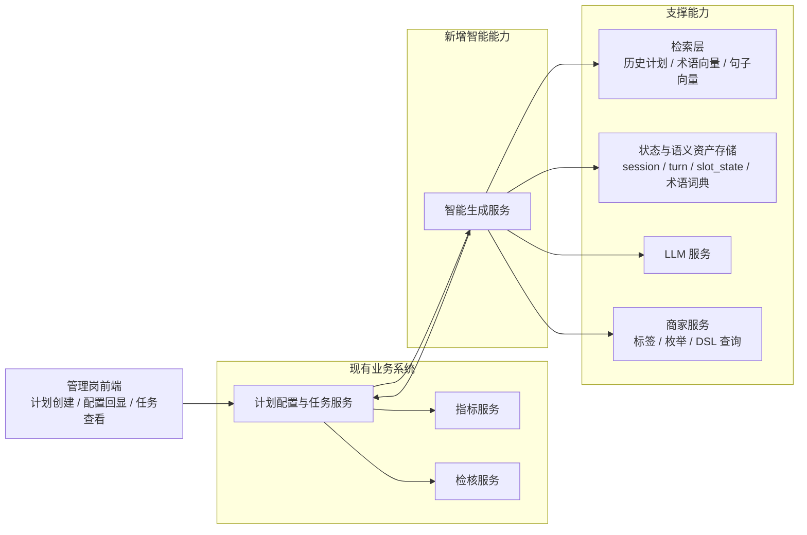
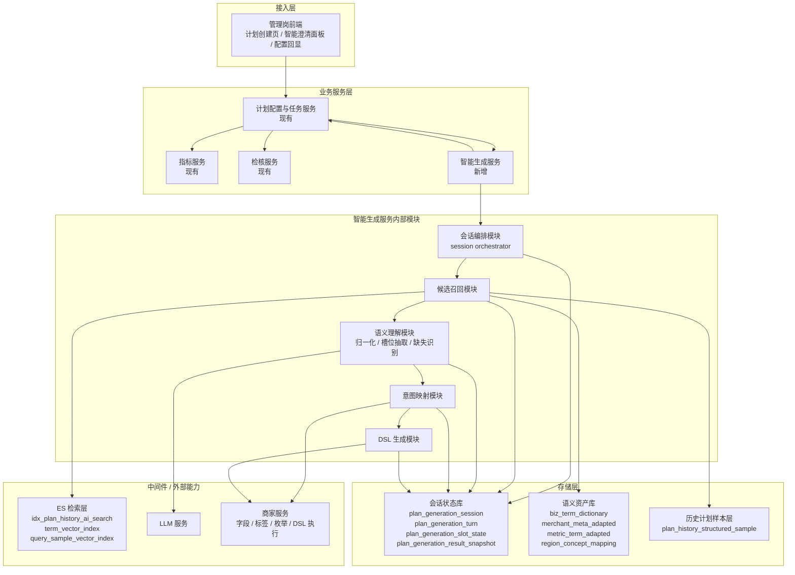

# 自然语言计划生成总览

返回：[总册与导航](/Users/zhouzhixiong/code/zuozhanV2/docs/任务分配与自动检核系统AI方案/02-自然语言计划生成/00-总册与导航.md)

## 1. 为什么需要这份总览

因为这个专题横跨三类问题：

1. 主链路怎么跑
2. 数据和语义底座怎么准备
3. 工程上怎么编排、拆服务、定接口

如果没有一份总览文档，后面的细节很容易各自展开，但读者不知道它们为什么存在、先后顺序是什么、彼此如何衔接。

## 2. 这个能力到底要解决什么问题

目标不是让大模型直接根据一句话“自由生成配置”，而是让系统把一句自然语言逐步转成：

1. 标准术语结果
2. 候选筛选意图
3. 商家服务可执行的 DSL

这样做的意义是：

1. 提升可解释性
2. 提升可执行性
3. 让系统规则和 LLM 各自做擅长的事情
4. 支持回放、审计、评估和降级

## 3. 整体分成哪三层

### 3.1 总方案层

作用：定义主链路骨架。  
文档：

1. [意图理解与筛选映射](/Users/zhouzhixiong/code/zuozhanV2/docs/任务分配与自动检核系统AI方案/02-自然语言计划生成/01-总方案/02-意图理解与筛选映射.md)

### 3.2 数据与语义底座层

作用：提供历史计划样本、术语词典、商家边界、指标语义、DSL 和样本数据。  
文档：

1. [数据准备与存储设计](/Users/zhouzhixiong/code/zuozhanV2/docs/任务分配与自动检核系统AI方案/02-自然语言计划生成/02-数据与语义底座/01-数据准备与存储设计.md)
2. [数据资产落地实施设计](/Users/zhouzhixiong/code/zuozhanV2/docs/任务分配与自动检核系统AI方案/02-自然语言计划生成/02-数据与语义底座/02-数据资产落地实施设计.md)

### 3.3 工程落地层

作用：把主链路变成可执行、可校验、可降级的服务链路。  
文档：

1. [处理流程与时序设计](/Users/zhouzhixiong/code/zuozhanV2/docs/任务分配与自动检核系统AI方案/02-自然语言计划生成/03-工程落地/01-处理流程与时序设计.md)
2. [接口清单与服务拆分](/Users/zhouzhixiong/code/zuozhanV2/docs/任务分配与自动检核系统AI方案/02-自然语言计划生成/03-工程落地/02-接口清单与服务拆分.md)

## 4. 整体系统架构图

为什么这里要先给架构图：

1. 因为流程图只能说明“请求怎么跑”，不能说明“系统怎么分层”
2. 因为这个项目的关键不是把链路拆得多细，而是在现有系统上最小增量接入
3. 因为先把现有服务、新增服务、外部依赖和存储画清楚，后面的实现顺序才容易讨论

### 4.1 汇报版架构图

这张图适合回答：

1. 原有系统保留什么
2. 只新增了什么
3. 新增能力依赖什么支撑

### 4.2 研发版架构图

这张图适合回答：

1. 为什么只新增一个“智能生成服务”
2. 这个服务内部为什么仍然要分模块
3. 中间件、存储和外部系统分别在什么位置

## 5. 为什么不是“用户输入 -> LLM 直接输出 DSL”

因为这种方式虽然快，但会带来几个问题：

1. 模型可能发明不存在的字段、标签、枚举
2. 很难解释为什么这样筛商家
3. 很难做稳定校验和降级
4. 一旦上游能力变化，Prompt 很快失效

所以更稳的主链路应该是：

`用户输入 -> 术语归一化 -> 槽位抽取 -> 缺失项识别 -> 候选筛选意图 -> 映射到商家服务边界 -> 最终 DSL`

## 6. 实现顺序为什么要先数据、后主链路、再工程化

因为如果顺序反过来，最容易出现“流程图很好看，但每个节点都靠临时拼接”的问题。

推荐顺序：

1. 先定义数据资产  
   否则主链路没有稳定输入。
2. 再把数据资产真正落地  
   否则主链路只能停留在概念层。
3. 再设计和实现在线主链路  
   否则节点会不断返工。
4. 最后才做服务拆分和接口细化  
   否则容易把错误结构固化为接口。

## 7. 每份文档该怎么继续看

1. 如果你要理解整体能力  
   先看 [意图理解与筛选映射](/Users/zhouzhixiong/code/zuozhanV2/docs/任务分配与自动检核系统AI方案/02-自然语言计划生成/01-总方案/02-意图理解与筛选映射.md)

2. 如果你要准备数据  
   先看 [数据准备与存储设计](/Users/zhouzhixiong/code/zuozhanV2/docs/任务分配与自动检核系统AI方案/02-自然语言计划生成/02-数据与语义底座/01-数据准备与存储设计.md)

3. 如果你要做表、索引、缓存、存量增量  
   看 [数据资产落地实施设计](/Users/zhouzhixiong/code/zuozhanV2/docs/任务分配与自动检核系统AI方案/02-自然语言计划生成/02-数据与语义底座/02-数据资产落地实施设计.md)

4. 如果你要拆研发任务  
   看 [处理流程与时序设计](/Users/zhouzhixiong/code/zuozhanV2/docs/任务分配与自动检核系统AI方案/02-自然语言计划生成/03-工程落地/01-处理流程与时序设计.md) 和 [接口清单与服务拆分](/Users/zhouzhixiong/code/zuozhanV2/docs/任务分配与自动检核系统AI方案/02-自然语言计划生成/03-工程落地/02-接口清单与服务拆分.md)
