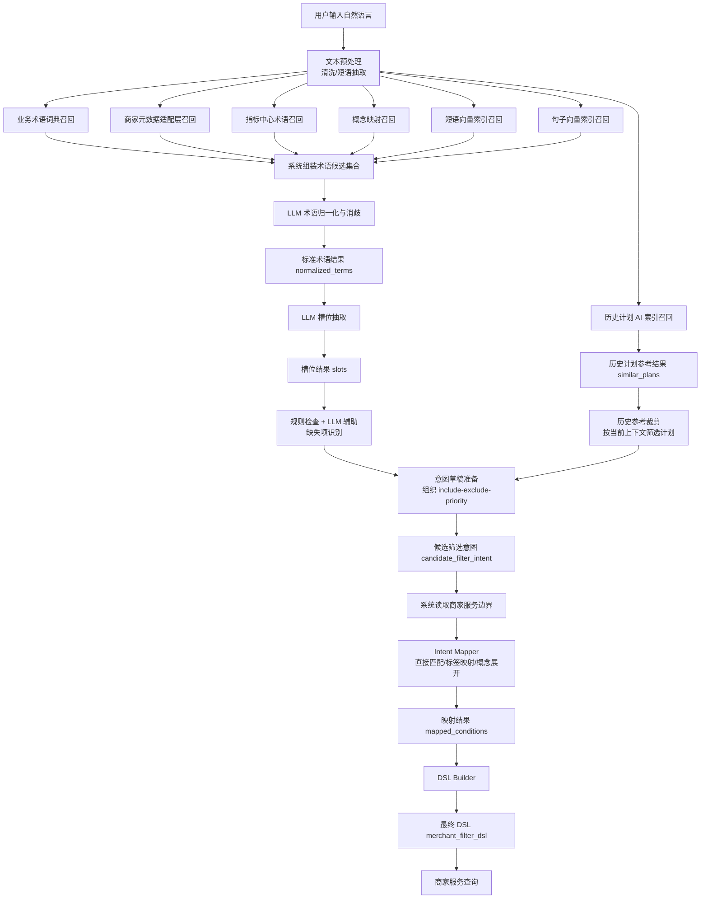
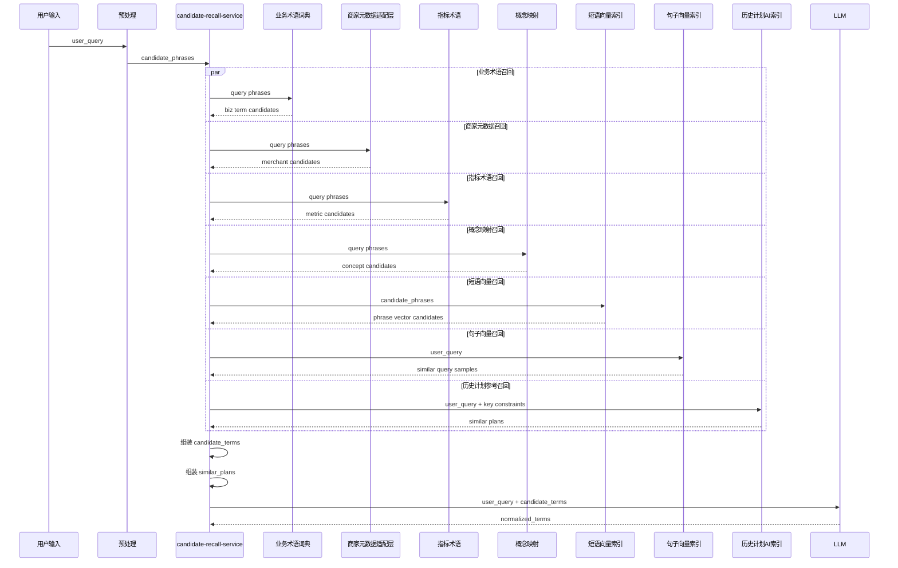
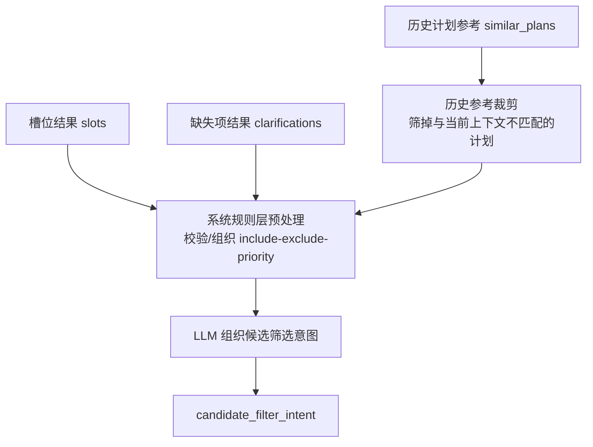

# 意图理解与筛选映射

返回：[总册与导航](/Users/zhouzhixiong/code/zuozhanV2/docs/任务分配与自动检核系统AI方案/02-自然语言计划生成/00-总册与导航.md)

上游：

1. [数据准备与存储设计](/Users/zhouzhixiong/code/zuozhanV2/docs/任务分配与自动检核系统AI方案/02-自然语言计划生成/02-数据与语义底座/01-数据准备与存储设计.md)
2. [数据资产落地实施设计](/Users/zhouzhixiong/code/zuozhanV2/docs/任务分配与自动检核系统AI方案/02-自然语言计划生成/02-数据与语义底座/02-数据资产落地实施设计.md)

下游：

1. [处理流程与时序设计](/Users/zhouzhixiong/code/zuozhanV2/docs/任务分配与自动检核系统AI方案/02-自然语言计划生成/03-工程落地/01-处理流程与时序设计.md)
2. [接口清单与服务拆分](/Users/zhouzhixiong/code/zuozhanV2/docs/任务分配与自动检核系统AI方案/02-自然语言计划生成/03-工程落地/02-接口清单与服务拆分.md)

## 1. 定位

本文件只回答一件事：

自然语言计划生成里，用户一句输入是如何被系统理解，并最终转换为可执行的商家筛选 DSL。

主链路不是：

`用户输入 -> LLM 直接生成 DSL`

而是：

`用户输入 -> 术语归一化 -> 槽位抽取 -> 缺失项识别 -> 候选筛选意图 -> 映射到商家服务边界 -> 最终 DSL`

这份文档以流程为中心组织。每个节点固定回答：

1. 输入是什么
2. 依赖什么数据
3. 系统规则层做什么
4. LLM 做什么
5. 输出是什么
6. 需要注意什么

边界说明：

1. 本文件只讲在线主链路
2. 不展开“术语词典如何离线生产、原始语料如何归一化沉淀”
3. 不展开“每个服务接口的 request/response 契约”
4. 不展开“每个表、索引、缓存的存量和增量作业”

如果你需要继续下钻：

1. 术语词典、Embedding、语义资产准备：
   [数据准备与存储设计](/Users/zhouzhixiong/code/zuozhanV2/docs/任务分配与自动检核系统AI方案/02-自然语言计划生成/02-数据与语义底座/01-数据准备与存储设计.md)
2. 数据表、索引、缓存、存量增量：
   [数据资产落地实施设计](/Users/zhouzhixiong/code/zuozhanV2/docs/任务分配与自动检核系统AI方案/02-自然语言计划生成/02-数据与语义底座/02-数据资产落地实施设计.md)
3. 服务接口：
   [接口清单与服务拆分](/Users/zhouzhixiong/code/zuozhanV2/docs/任务分配与自动检核系统AI方案/02-自然语言计划生成/03-工程落地/02-接口清单与服务拆分.md)

为什么这里还要保留每个节点的细节：

1. 因为主链路不清楚，接口再细也会脱节
2. 因为同一条输入如何一步步演化，是产品、算法、后端共同对齐的核心
3. 因为很多错误并不发生在单个接口，而发生在节点边界之间

## 2. 总流程

### 2.1 流程图



### 2.2 节点总表

| 节点 | 输入 | 依赖数据 | 系统规则层动作 | LLM 动作 | 输出 |
| --- | --- | --- | --- | --- | --- |
| 节点一：术语归一化与参考召回准备 | `user_query`、会话上下文 | 业务术语词典、商家元数据适配层、指标中心术语、概念映射、短语/句子向量索引、历史计划样本和 AI 检索索引 | 预处理、短语抽取、多源召回、候选组装、打分与裁剪、历史计划参考召回 | 术语归一化与消歧 | `candidate_terms`、`normalized_terms`、`similar_plans` |
| 节点二：槽位抽取 | `normalized_terms` | 槽位 schema | 基础校验 | 把标准术语填进固定槽位 | `slots` |
| 节点三：缺失项识别 | `slots` | 必填槽位规则、默认值规则 | 规则检查、可默认项判定 | 辅助判断是否需要澄清 | `missing_slots`、`clarifications`、`is_ready_for_mapping` |
| 节点四：候选筛选意图 | `slots`、`clarifications`、`similar_plans` | 意图 schema、历史计划参考摘要 | 基础结构校验、历史参考裁剪 | 组织业务意图中间层，参考相似历史计划 | `candidate_filter_intent` |
| 节点五：映射到商家服务边界 | `candidate_filter_intent` | 商家服务字段、标签、枚举、概念映射 | 直接匹配、标签映射、概念展开、合法性校验 | 可选辅助解释，不负责最终映射 | `mapped_conditions`、`mapped_exclusions`、`ambiguities` |
| 节点六：最终 DSL 生成 | `mapped_conditions`、`mapped_exclusions` | DSL Schema | 组装、排序、校验、兜底 | 一般不参与 | `merchant_filter_dsl` |

### 2.3 最终产物

整条链路最后会稳定产出三层结果：

1. `normalized_terms`
2. `candidate_filter_intent`
3. `merchant_filter_dsl`

同时会并行产出一层参考增强结果，并在归一化之后进入后续节点：

4. `similar_plans`

## 3. 节点一：术语归一化与参考召回准备

### 3.1 输入

输入对象：

1. `user_query`
2. `user_context`
3. 预处理后的 `candidate_phrases`

示例：

```json
{
  "user_query": "帮我找华东餐饮新商家，优先上海杭州，排除闭店商家，做一个首单提升计划",
  "candidate_phrases": ["华东", "餐饮", "新商家", "上海杭州", "闭店商家", "首单提升"]
}
```

### 3.2 依赖数据

依赖五类数据：

1. `biz_term_dictionary` / `biz_term_dictionary_expanded`
2. `merchant_meta_adapted`
3. `metric_term_adapted`
4. `region_concept_mapping`
5. 向量索引：
   - `term_vector_index`
   - `query_sample_vector_index`
6. 历史计划参考资产：
   - `plan_history_structured_sample`
   - `idx_plan_history_ai_search`

更深入的资产生产和维护方式，见：
[数据准备与存储设计 / 6. 业务术语和别名词典](/Users/zhouzhixiong/code/zuozhanV2/docs/任务分配与自动检核系统AI方案/02-自然语言计划生成/02-数据与语义底座/01-数据准备与存储设计.md)

### 3.3 系统规则层动作

系统规则层做五件事：

1. 文本预处理  
   清洗、分词、短语抽取
2. 多源召回  
   围绕每个短语去多个来源查候选语义
3. 候选组装  
   把不同来源的候选按统一格式组装成 `candidate_terms`
4. 打分与裁剪  
   计算 `source_score`、`final_score`，并决定每个短语保留多少候选
5. 历史计划参考召回  
   基于整句语义和关键条件去历史计划 AI 索引里找相似计划，产出 `similar_plans`

#### 3.3.1 多源召回来源

围绕“术语归一化”这条子链，多源召回至少查六类源：

1. 业务术语词典  
   目标、业务表达、别名
2. 商家元数据适配层  
   商家字段、标签、枚举
3. 指标中心术语  
   指标别名、指标分类
4. 概念映射  
   例如 `华东 -> 城市集合`
5. 短语向量索引  
   例如 `term_vector_index`，用于补充短语级语义相似候选
6. 句子向量索引  
   例如 `query_sample_vector_index`，用于补充整句级历史表达参考，并为术语候选打上下文辅助分

此外，系统还会单独查一类“方案级参考源”：

7. 历史计划 AI 检索索引  
   例如 `idx_plan_history_ai_search`，用于召回相似历史计划摘要

#### 3.3.2 各源返回的数据示例

业务术语词典：

```json
{
  "raw": "首单提升",
  "source": "biz_term_dictionary",
  "candidate": {
    "type": "goal_type",
    "value": "first_order_growth",
    "display_name": "首单提升",
    "source_score": 1.0
  }
}
```

商家元数据适配层：

```json
{
  "raw": "新商家",
  "source": "merchant_meta_adapted",
  "candidate": {
    "type": "merchant_tag",
    "value": "new_merchant",
    "display_name": "新商家",
    "source_score": 1.0
  }
}
```

指标中心术语：

```json
{
  "raw": "首单提升",
  "source": "metric_term_adapted",
  "candidate": {
    "type": "metric_alias",
    "value": "first_order_cnt",
    "display_name": "首单商家数",
    "source_score": 0.88
  }
}
```

概念映射：

```json
{
  "raw": "华东",
  "source": "region_concept_mapping",
  "candidate": {
    "type": "region_concept",
    "value": "华东",
    "display_name": "华东",
    "expanded_values": ["上海", "杭州", "苏州", "南京"],
    "source_score": 1.0
  }
}
```

短语向量索引：

```json
{
  "raw": "首单提升",
  "source": "term_vector_index",
  "candidate": {
    "type": "goal_type",
    "value": "first_order_growth",
    "display_name": "首单提升",
    "source_score": 0.84
  }
}
```

句子向量索引：

```json
{
  "query": "帮我找华东餐饮新商家，优先上海杭州，排除闭店商家，做一个首单提升计划",
  "source": "query_sample_vector_index",
  "candidate": {
    "text": "想做华东餐饮新商家的首单计划",
    "label_goal_type": "first_order_growth",
    "source_score": 0.82
  }
}
```

历史计划参考召回：

```json
{
  "query": "帮我找华东餐饮新商家，优先上海杭州，排除闭店商家，做一个首单提升计划",
  "source": "idx_plan_history_ai_search",
  "candidate": {
    "plan_id": 1001,
    "plan_name": "华东新商家首单提升计划",
    "merchant_filter_summary": "华东餐饮新商家，排除闭店商家",
    "metric_group_summary": "首单商家数>=1，转化率>=0.2",
    "score": 0.91
  }
}
```

#### 3.3.3 系统组装术语候选集合

这里先只组装“术语候选”，不把 `similar_plans` 混进来。

系统以 `raw phrase` 为主键做聚合，每个短语保留统一字段：

1. `type`
2. `value`
3. `display_name`
4. `source`
5. `source_score`
6. `final_score`

这里的候选来源包括：

1. 业务术语词典
2. 商家元数据适配层
3. 指标中心术语
4. 概念映射
5. `term_vector_index`
6. `query_sample_vector_index`

组装结果示例：

```json
{
  "candidate_terms": [
    {
      "raw": "首单提升",
      "candidates": [
        {
          "type": "goal_type",
          "value": "first_order_growth",
          "display_name": "首单提升",
          "source": "biz_term_dictionary",
          "source_score": 1.0,
          "final_score": 1.0
        },
        {
          "type": "metric_alias",
          "value": "first_order_cnt",
          "display_name": "首单商家数",
          "source": "metric_term_adapted",
          "source_score": 0.88,
          "final_score": 0.836
        }
      ]
    }
  ]
}
```

#### 3.3.4 历史计划参考召回与组装

`similar_plans` 不是术语候选集合的一部分，而是单独的“方案级参考集合”。

系统会基于整句语义、关键短语和约束条件，从 `idx_plan_history_ai_search` 里召回相似历史计划，再裁剪成适合当前上下文的摘要。

历史计划参考结果示例：

```json
{
  "similar_plans": [
    {
      "plan_id": 1001,
      "plan_name": "华东新商家首单提升计划",
      "goal_type": "first_order_growth",
      "merchant_filter_summary": "华东餐饮新商家，排除闭店商家",
      "metric_group_summary": "首单商家数>=1，转化率>=0.2",
      "effect_score": 0.83,
      "score": 0.91
    },
    {
      "plan_id": 1057,
      "plan_name": "华东餐饮新商家首单冲刺计划",
      "goal_type": "first_order_growth",
      "merchant_filter_summary": "华东餐饮新商家",
      "metric_group_summary": "首单商家数>=1",
      "effect_score": 0.79,
      "score": 0.88
    }
  ]
}
```

为什么这里要单独准备 `similar_plans`：

1. 因为术语候选回答的是“这句话里的词是什么意思”。
2. 因为历史计划参考回答的是“类似场景以前怎么做”。
3. 这两层信息不能混在一个候选列表里，否则后续很难解释和重排。

#### 3.3.5 多源召回时序图



#### 3.3.6 统一召回结果如何进入主链路

节点一结束时，`candidate-recall-service` 推荐统一产出三块结果：

```json
{
  "candidate_terms": [],
  "similar_query_samples": [],
  "similar_plans": []
}
```

它们进入主链路的方式不同：

1. `candidate_terms`  
   作为术语归一化与消歧的主输入，直接送给 LLM
2. `similar_query_samples`  
   作为整句语义辅助上下文，参与节点一的候选判断和打分，不单独进入后续节点
3. `similar_plans`  
   作为方案级参考结果保留下来，在节点四“候选筛选意图”阶段再进入主链路

这也是为什么：

1. `candidate_terms` 必须和 `similar_plans` 分开组装
2. `similar_query_samples` 可以服务节点一，但不需要像 `similar_plans` 一样单独贯穿到后续节点
3. 三类索引虽然在一次请求里并行召回，但在主链路里承担的是不同角色

### 3.4 LLM 动作

LLM 不直接自由解释原句，而是在 `candidate_terms` 上做两件事：

1. 归一化  
   判断每个短语最终应落到哪个标准术语
2. 消歧  
   当同一个短语同时命中多个来源、多个类型时，结合上下文判断最合理候选

给 LLM 的输入示例：

```json
{
  "user_query": "帮我找华东餐饮新商家，优先上海杭州，排除闭店商家，做一个首单提升计划",
  "candidate_terms": [
    {
      "raw": "首单提升",
      "candidates": [
        {"type": "goal_type", "value": "first_order_growth", "source": "biz_term_dictionary", "final_score": 1.0},
        {"type": "metric_alias", "value": "first_order_cnt", "source": "metric_term_adapted", "final_score": 0.836}
      ]
    }
  ]
}
```

LLM 输出示例：

```json
{
  "normalized_terms": [
    {
      "raw": "首单提升",
      "normalized_code": "first_order_growth",
      "normalized_name": "首单提升",
      "term_type": "goal_type",
      "reason": "当前上下文更像计划目标，而不是单个指标"
    }
  ]
}
```

### 3.5 输出

本节点输出三层数据：

1. `candidate_terms`
2. `normalized_terms`
3. `similar_plans`

最小输出协议：

```json
{
  "candidate_terms": [],
  "normalized_terms": [],
  "similar_plans": []
}
```

### 3.6 打分、歧义和 TopN

#### 3.6.1 单源打分

首期建议用可解释规则：

1. 精确匹配：`1.00`
2. 别名匹配：`0.95`
3. 规则映射：`0.92`
4. 短语 embedding：`0.75 ~ 0.90`
5. 句子 embedding：`0.70 ~ 0.88`

来源权重建议：

1. `biz_term_dictionary`：`1.00`
2. `merchant_meta_adapted`：`0.98`
3. `region_concept_mapping`：`0.96`
4. `metric_term_adapted`：`0.95`

公式：

`final_score = source_score * source_weight`

#### 3.6.2 完整例子

短语：`首单提升`

1. `goal_type=first_order_growth`
   - `source_score = 1.00`
   - `source_weight = 1.00`
   - `final_score = 1.00`
2. `metric_alias=first_order_cnt`
   - `source_score = 0.88`
   - `source_weight = 0.95`
   - `final_score = 0.836`
3. `metric_alias=first_order_rate`
   - `source_score = 0.78`
   - `source_weight = 0.95`
   - `final_score = 0.741`

排序后：

1. `first_order_growth`
2. `first_order_cnt`
3. `first_order_rate`

#### 3.6.3 系统怎么判断高歧义

满足任一条件，可判为高歧义：

1. 候选数 `>= 2`
2. 前两名分差 `< 0.08`
3. 候选跨多个类型  
   例如同时命中 `goal_type` 和 `metric_alias`
4. 命中高歧义词清单  
   例如：`首单`、`第一单`、`活跃`、`转化`

#### 3.6.4 TopN 规则

推荐口径：

1. `top_n_per_source = 2 ~ 3`
2. `top_n_per_phrase = 3 ~ 5`

具体判断：

1. 明确短语  
   前两名分差 `>= 0.15`，一般 `Top2`
2. 歧义短语  
   前两名分差在 `0.08 ~ 0.15`，一般 `Top3`
3. 高歧义短语  
   前两名分差 `< 0.08` 或跨类型，取 `Top5`

#### 3.6.5 真正落地时谁来打分、谁来决定 TopN

真正实现时，打分和 TopN 一般都不交给 LLM，而是由系统规则层完成，推荐放在：

1. `candidate-recall-service`
2. 或 `intent-understanding-service` 里的规则模块

推荐职责分工：

1. 召回层  
   从术语词典、商家元数据、指标术语、概念映射、短语向量、句子向量里召回候选
2. 打分排序层  
   对每个候选计算 `source_score`、`source_weight`、`final_score`，再排序和截断 TopN
3. LLM 消歧层  
   只在已经裁剪过的候选里做最终语义判断，不承担全量打分职责

这样设计的原因是：

1. 可解释
2. 成本低
3. 结果稳定
4. 便于回放和调参

#### 3.6.6 打分和 TopN 的实现示例

示例短语：

`首单提升`

候选召回结果：

1. `goal_type = first_order_growth`
   - 来源：`biz_term_dictionary`
   - 命中方式：精确匹配
   - `source_score = 1.00`
   - `source_weight = 1.00`
   - `final_score = 1.00`
2. `metric_alias = first_order_cnt`
   - 来源：`metric_term_adapted`
   - 命中方式：别名匹配
   - `source_score = 0.88`
   - `source_weight = 0.95`
   - `final_score = 0.836`
3. `goal_type = first_order_growth`
   - 来源：`term_vector_index`
   - 命中方式：短语向量相似
   - `source_score = 0.84`
   - `source_weight = 0.90`
   - `final_score = 0.756`

排序后：

1. `first_order_growth` from `biz_term_dictionary`
2. `first_order_cnt` from `metric_term_adapted`
3. `first_order_growth` from `term_vector_index`

如果前两名分差：

`1.00 - 0.836 = 0.164`

则：

1. 不属于高歧义
2. 一般保留 `Top2`
3. 再交给 LLM 做最终选择

#### 3.6.7 打分与截断的伪代码示意

```python
def score_candidates(candidates):
    scored = []
    for c in candidates:
        source_score = calc_source_score(c)
        source_weight = get_source_weight(c["source"])
        final_score = source_score * source_weight
        scored.append({
            **c,
            "source_score": source_score,
            "source_weight": source_weight,
            "final_score": final_score
        })
    return sorted(scored, key=lambda x: x["final_score"], reverse=True)
```

```python
def choose_topn(scored_candidates):
    if len(scored_candidates) <= 2:
        return scored_candidates

    gap = scored_candidates[0]["final_score"] - scored_candidates[1]["final_score"]
    cross_type = scored_candidates[0]["type"] != scored_candidates[1]["type"]

    if gap >= 0.15 and not cross_type:
        return scored_candidates[:2]
    if gap < 0.08 or cross_type:
        return scored_candidates[:5]
    return scored_candidates[:3]
```

### 3.7 注意事项

1. 不要把全部 tags / enums 一次性塞给 LLM
2. 先由系统做多源召回和裁剪，再让 LLM 只在候选里做选择
3. `candidate_terms` 要保留 `source` 和 `score`
4. 首期没有标注样本时，可以先看：
   - `candidate_coverage`
   - `exact_hit_rate`
   - `high_ambiguity_rate`
   - `dsl_executable_rate`

## 4. 节点二：槽位抽取

### 4.1 输入

输入为 `normalized_terms`。

示例：

```json
{
  "normalized_terms": [
    {"raw": "华东", "normalized_code": "east_china", "term_type": "region_concept"},
    {"raw": "餐饮", "normalized_code": "catering", "term_type": "industry_enum"},
    {"raw": "新商家", "normalized_code": "new_merchant", "term_type": "merchant_tag"}
  ]
}
```

### 4.2 依赖数据

依赖固定槽位 schema，例如：

1. `region`
2. `industry`
3. `merchant_stage`
4. `merchant_status_exclusion`
5. `priority_city`
6. `goal_type`

### 4.3 系统规则层动作

1. 校验 `normalized_terms` 是否完整
2. 过滤明显非法项
3. 把可识别的术语类型映射到可填槽位集合

### 4.4 LLM 动作

LLM 将标准术语填入固定槽位。

输出示例：

```json
{
  "slots": {
    "region": ["华东"],
    "industry": ["餐饮"],
    "merchant_stage": ["新商家"],
    "merchant_status_exclusion": ["闭店商家"],
    "priority_city": ["上海", "杭州"],
    "goal_type": "首单提升"
  }
}
```

### 4.5 输出

最小输出协议：

```json
{
  "slots": {}
}
```

### 4.6 注意事项

1. 这一步不要生成 DSL
2. 槽位必须固定，不要让模型自由扩展字段
3. 允许某些槽位为空，交给下一节点处理

## 5. 节点三：缺失项识别

### 5.1 输入

输入为 `slots`。

### 5.2 依赖数据

依赖：

1. 必填槽位规则
2. 可默认推断规则
3. 澄清问题模板

### 5.3 系统规则层动作

1. 判断哪些槽位缺失
2. 判断哪些可以默认
3. 形成初步 `missing_slots`

### 5.4 LLM 动作

在边界不清晰时，LLM 辅助判断：

1. 缺失项是否关键
2. 是否需要向用户追问
3. 澄清文案怎么写

### 5.5 输出

```json
{
  "missing_slots": [],
  "clarifications": [],
  "is_ready_for_mapping": true
}
```

### 5.6 注意事项

1. 区分“必须补充”和“可默认推断”
2. 首期建议少问问题，只问关键缺失项
3. 如果信息不足，不要硬进入映射

## 6. 节点四：候选筛选意图

### 6.1 输入

输入为：

1. `slots`
2. `clarifications`
3. `similar_plans`

### 6.2 依赖数据

依赖：

1. 固定意图 schema
2. 历史计划参考摘要

### 6.3 系统规则层动作

1. 校验槽位结构
2. 组织 include / exclude / priority 框架
3. 从 `similar_plans` 中裁剪适合当前上下文的历史参考摘要

### 6.3.1 节点四输入汇合图

这一步单独画出来，是为了说明：

1. `slots` 提供当前请求的显式结构
2. `clarifications` 提供缺失项和约束边界
3. `similar_plans` 只提供参考增强，不直接覆盖当前输入



### 6.4 LLM 动作

LLM 将槽位整理为业务语义中间层，并在需要时参考相似历史计划的筛选和指标配置摘要。

示例：

```json
{
  "intent_type": "merchant_filter",
  "goal_type": "首单提升",
  "include": [
    {"slot": "region", "value": "华东", "value_type": "concept"},
    {"slot": "industry", "value": "餐饮", "value_type": "enum"},
    {"slot": "merchant_stage", "value": "新商家", "value_type": "tag"}
  ],
  "exclude": [
    {"slot": "merchant_status", "value": "闭店商家", "value_type": "tag"}
  ],
  "priority": [
    {"slot": "city", "value": ["上海", "杭州"], "value_type": "enum"}
  ]
}
```

### 6.5 输出

最小输出协议：

```json
{
  "intent_type": "merchant_filter",
  "include": [],
  "exclude": [],
  "priority": []
}
```

### 6.6 注意事项

1. 这里还是业务语义层，不要绑定真实字段名
2. 这一步产物主要为了后续 `Intent Mapper`
3. `similar_plans` 只作为参考增强，不直接决定输出

## 7. 节点五：映射到商家服务边界

### 7.1 输入

输入为 `candidate_filter_intent`。

### 7.2 依赖数据

依赖：

1. 商家服务字段
2. 商家服务标签
3. 商家服务枚举
4. 概念映射表

### 7.3 系统规则层动作

这一步必须由系统规则层主导。

核心动作：

1. 直接枚举匹配
2. 标签匹配
3. 概念展开
4. 合法性校验

#### 7.3.1 直接枚举匹配

例如：

`industry = 餐饮`

映射为：

```json
{"field": "industry_code", "operator": "=", "value": "餐饮"}
```

#### 7.3.2 标签匹配

例如：

`merchant_stage = 新商家`

映射为：

```json
{"field": "tag_code", "operator": "in", "value": ["new_merchant"]}
```

#### 7.3.3 概念展开

例如：

`region = 华东`

展开为：

```json
{"field": "region_code", "operator": "in", "value": ["上海", "杭州", "苏州", "南京"]}
```

### 7.4 LLM 动作

默认不负责最终映射。可选只做：

1. 映射解释
2. 歧义提示

### 7.5 输出

```json
{
  "mapped_conditions": [
    {"field": "industry_code", "operator": "=", "value": "餐饮"},
    {"field": "region_code", "operator": "in", "value": ["上海", "杭州", "苏州", "南京"]},
    {"field": "tag_code", "operator": "in", "value": ["new_merchant"]}
  ],
  "mapped_exclusions": [
    {"field": "tag_code", "operator": "in", "value": ["closed_merchant"]}
  ],
  "ambiguities": []
}
```

### 7.6 注意事项

1. 商家服务元数据必须是事实边界
2. 映射失败时要保留 `ambiguities`
3. 不要让 LLM 决定真实字段和枚举

## 8. 节点六：最终 DSL 生成

### 8.1 输入

输入为：

1. `mapped_conditions`
2. `mapped_exclusions`
3. `ambiguities`

### 8.2 依赖数据

依赖：

1. DSL Schema
2. 商家服务查询协议
3. 前端回填结构要求

### 8.3 系统规则层动作

1. 组装 `conditions`
2. 组装 `exclusions`
3. 按约定顺序排序
4. 做 Schema 校验
5. 做兜底修正

### 8.4 LLM 动作

通常不参与。

### 8.5 输出

```json
{
  "conditions": [
    {"field": "industry_code", "operator": "=", "value": "餐饮"},
    {"field": "region_code", "operator": "in", "value": ["上海", "杭州", "苏州", "南京"]},
    {"field": "tag_code", "operator": "in", "value": ["new_merchant"]}
  ],
  "exclusions": [
    {"field": "tag_code", "operator": "in", "value": ["closed_merchant"]}
  ]
}
```

### 8.6 注意事项

1. 最终 DSL 必须可执行
2. 必须能回填前端
3. 必须保留审计和回放能力

## 9. 统一 JSON 演化示例

### 9.1 原始输入

```json
{
  "user_query": "帮我找华东餐饮新商家，优先上海杭州，排除闭店商家，做一个首单提升计划"
}
```

### 9.2 候选短语

```json
{
  "candidate_phrases": ["华东", "餐饮", "新商家", "上海杭州", "闭店商家", "首单提升"]
}
```

### 9.3 候选语义集合

```json
{
  "candidate_terms": [
    {
      "raw": "华东",
      "candidates": [
        {
          "type": "region_concept",
          "value": "华东",
          "source": "region_concept_mapping",
          "final_score": 1.0
        }
      ]
    },
    {
      "raw": "首单提升",
      "candidates": [
        {
          "type": "goal_type",
          "value": "first_order_growth",
          "source": "biz_term_dictionary",
          "final_score": 1.0
        },
        {
          "type": "metric_alias",
          "value": "first_order_cnt",
          "source": "metric_term_adapted",
          "final_score": 0.836
        }
      ]
    }
  ]
}
```

### 9.4 标准术语结果

```json
{
  "normalized_terms": [
    {"raw": "华东", "normalized_code": "east_china", "term_type": "region_concept"},
    {"raw": "餐饮", "normalized_code": "catering", "term_type": "industry_enum"},
    {"raw": "新商家", "normalized_code": "new_merchant", "term_type": "merchant_tag"},
    {"raw": "闭店商家", "normalized_code": "closed_merchant", "term_type": "merchant_tag"},
    {"raw": "首单提升", "normalized_code": "first_order_growth", "term_type": "goal_type"}
  ]
}
```

### 9.5 槽位结果

```json
{
  "slots": {
    "region": ["华东"],
    "industry": ["餐饮"],
    "merchant_stage": ["新商家"],
    "merchant_status_exclusion": ["闭店商家"],
    "priority_city": ["上海", "杭州"],
    "goal_type": "首单提升"
  }
}
```

### 9.6 缺失项识别结果

```json
{
  "missing_slots": [],
  "clarifications": [],
  "is_ready_for_mapping": true
}
```

### 9.7 候选筛选意图

```json
{
  "intent_type": "merchant_filter",
  "goal_type": "首单提升",
  "include": [
    {"slot": "region", "value": "华东"},
    {"slot": "industry", "value": "餐饮"},
    {"slot": "merchant_stage", "value": "新商家"}
  ],
  "exclude": [
    {"slot": "merchant_status", "value": "闭店商家"}
  ],
  "priority": [
    {"slot": "city", "value": ["上海", "杭州"]}
  ]
}
```

### 9.8 映射结果

```json
{
  "mapped_conditions": [
    {"field": "industry_code", "operator": "=", "value": "餐饮"},
    {"field": "region_code", "operator": "in", "value": ["上海", "杭州", "苏州", "南京"]},
    {"field": "tag_code", "operator": "in", "value": ["new_merchant"]}
  ],
  "mapped_exclusions": [
    {"field": "tag_code", "operator": "in", "value": ["closed_merchant"]}
  ],
  "ambiguities": []
}
```

### 9.9 最终 DSL

```json
{
  "conditions": [
    {"field": "industry_code", "operator": "=", "value": "餐饮"},
    {"field": "region_code", "operator": "in", "value": ["上海", "杭州", "苏州", "南京"]},
    {"field": "tag_code", "operator": "in", "value": ["new_merchant"]}
  ],
  "exclusions": [
    {"field": "tag_code", "operator": "in", "value": ["closed_merchant"]}
  ]
}
```

## 10. 异常与降级

### 10.1 节点级异常总表

| 节点 | 典型异常 | 降级策略 |
| --- | --- | --- |
| 术语归一化 | 候选为空、歧义过高、LLM 超时 | 回退关键词精确命中；输出 `partial_terms` |
| 槽位抽取 | 槽位结构不完整 | 用规则填充能确定的槽位，未确定项置空 |
| 缺失项识别 | 无法判断是否可继续 | 标记 `is_ready_for_mapping = false`，进入澄清模式 |
| 候选筛选意图 | LLM 输出结构非法 | 用规则模板重组中间结构 |
| 边界映射 | 字段/枚举映射失败 | 输出 `ambiguities`，不直接生成最终 DSL |
| 最终 DSL | Schema 校验失败 | 退回安全最小 DSL 或待人工确认 |

### 10.2 节点一降级输出示例

```json
{
  "partial_terms": [
    {"raw": "餐饮", "normalized_code": "catering", "term_type": "industry_enum"}
  ],
  "failed_terms": ["第一单"]
}
```

### 10.3 节点五降级输出示例

```json
{
  "mapped_conditions": [
    {"field": "industry_code", "operator": "=", "value": "餐饮"}
  ],
  "ambiguities": [
    {
      "slot": "region",
      "raw_value": "华东",
      "reason": "当前商家服务仅返回城市级枚举，且概念映射缺失"
    }
  ]
}
```

### 10.4 审计建议

每次请求至少记录：

1. `request_id`
2. 原始输入
3. `candidate_terms`
4. `normalized_terms`
5. `candidate_filter_intent`
6. `mapped_conditions`
7. 最终 DSL
8. 异常节点
9. 降级策略

## 11. 职责分工

### 11.1 LLM 负责

1. 术语归一化与消歧
2. 槽位抽取
3. 缺失项识别中的语义判断
4. 候选筛选意图整理

### 11.2 系统规则层负责

1. 预处理
2. 多源召回
3. 打分、TopN、歧义初判
4. 商家边界读取
5. 字段、标签、枚举映射
6. DSL 组装与校验

### 11.3 商家服务负责

1. 提供真实查询边界
2. 执行最终 DSL
3. 返回商家结果

## 12. 设计结论

这条链路最重要的设计原则有四个：

1. 不让 LLM 直接自由生成商家 DSL
2. 先由系统做多源召回，再让 LLM 在候选集合里做归一化和消歧
3. 把“业务理解”和“字段映射”拆成两层
4. 高风险和高歧义场景优先走规则兜底与澄清，不强行自动生成

如果只记住一句话，可以记成：

`LLM 负责理解，系统负责约束，商家服务负责执行。`

## 13. 补充阅读

本文件只保留主链路。

如果要继续看术语词典如何生产、关键词与 Embedding 如何搭配、原始语料如何一步步归一化，请看：

1. [数据准备与存储设计](/Users/zhouzhixiong/code/zuozhanV2/docs/任务分配与自动检核系统AI方案/02-自然语言计划生成/02-数据与语义底座/01-数据准备与存储设计.md)
2. [数据资产落地实施设计](/Users/zhouzhixiong/code/zuozhanV2/docs/任务分配与自动检核系统AI方案/02-自然语言计划生成/02-数据与语义底座/02-数据资产落地实施设计.md)
