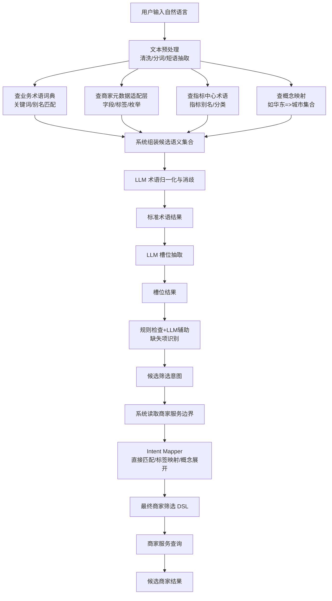
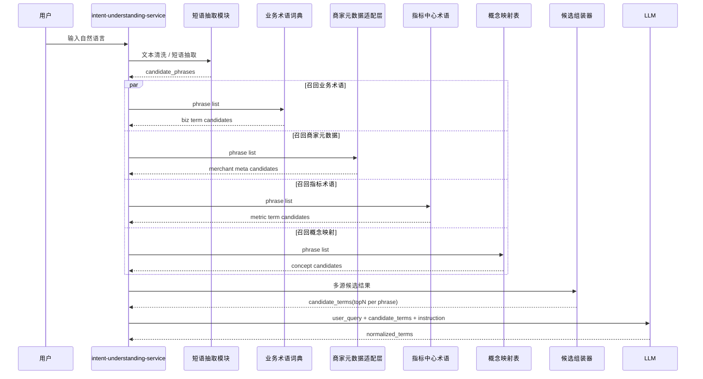
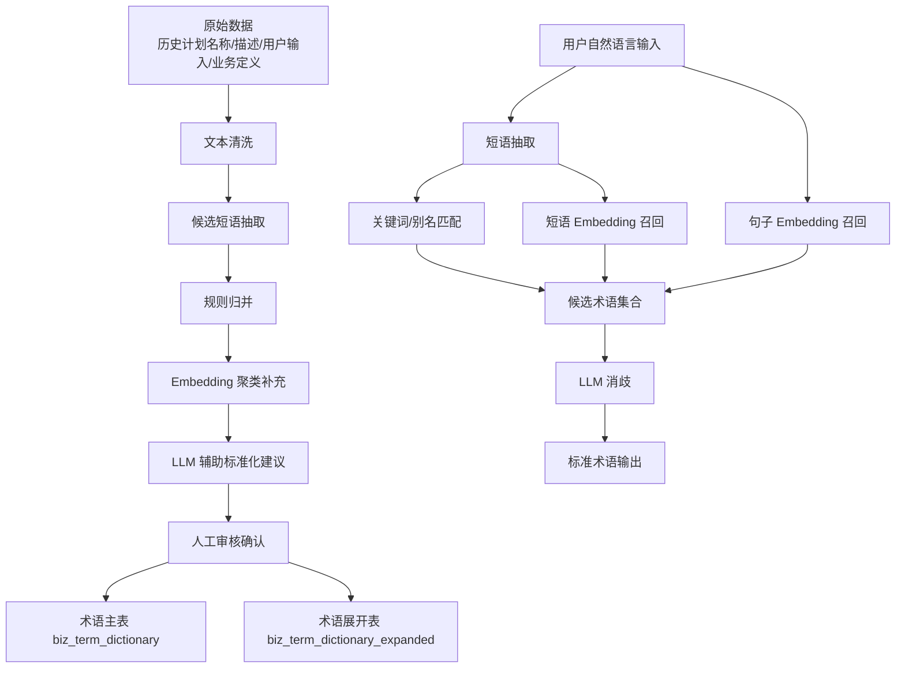

# 意图理解与筛选映射

返回：[专项导航](/Users/zhouzhixiong/code/zuozhanV2/docs/任务分配与自动检核系统AI方案/02-自然语言计划生成/00-专项导航.md)

上游：

1. [数据准备与存储设计](/Users/zhouzhixiong/code/zuozhanV2/docs/任务分配与自动检核系统AI方案/02-自然语言计划生成/01-数据准备与存储设计.md)

下游：

1. [处理流程与时序设计](/Users/zhouzhixiong/code/zuozhanV2/docs/任务分配与自动检核系统AI方案/02-自然语言计划生成/03-处理流程与时序设计.md)

关联：

1. [基于现状的 V2 落地实施方案](/Users/zhouzhixiong/code/zuozhanV2/docs/任务分配与自动检核系统AI方案/01-总体方案与实施/02-V2落地实施方案.md)
2. [自然语言计划生成的数据准备与存储设计](/Users/zhouzhixiong/code/zuozhanV2/docs/任务分配与自动检核系统AI方案/02-自然语言计划生成/01-数据准备与存储设计.md)
3. [处理流程与时序设计](/Users/zhouzhixiong/code/zuozhanV2/docs/任务分配与自动检核系统AI方案/02-自然语言计划生成/03-处理流程与时序设计.md)

## 1. 定位

本文件用于回答一个核心问题：

自然语言计划生成里，“用户一句自然语言”到底如何被系统理解，并最终转换为可执行的商家筛选 DSL。

推荐总链路不是：

`用户输入 -> LLM 直接生成 DSL`

而是：

`用户输入 -> 术语归一化 -> 槽位抽取 -> 缺失项识别 -> 候选筛选意图 -> 映射到商家服务边界 -> 生成 DSL`

这样更稳，也更容易校验。

---

## 2. 章节与流程图对应关系

为了避免“流程图”和“正文结构”不一致，这里先明确两者的对应关系。

| 流程图节点 | 本文对应章节 | 主要产物 |
| --- | --- | --- |
| 用户输入、预处理、候选召回 | [3. 节点一：术语归一化](/Users/zhouzhixiong/code/zuozhanV2/docs/任务分配与自动检核系统AI方案/02-自然语言计划生成/02-意图理解与筛选映射.md) | `candidate_terms`、`normalized_terms` |
| 槽位抽取 | [4. 节点二：槽位抽取](/Users/zhouzhixiong/code/zuozhanV2/docs/任务分配与自动检核系统AI方案/02-自然语言计划生成/02-意图理解与筛选映射.md) | `slots` |
| 缺失项识别 | [5. 节点三：缺失项识别](/Users/zhouzhixiong/code/zuozhanV2/docs/任务分配与自动检核系统AI方案/02-自然语言计划生成/02-意图理解与筛选映射.md) | `missing_slots`、`clarifications` |
| 候选筛选意图生成 | [6. 节点四：候选筛选意图](/Users/zhouzhixiong/code/zuozhanV2/docs/任务分配与自动检核系统AI方案/02-自然语言计划生成/02-意图理解与筛选映射.md) | `candidate_filter_intent` |
| 商家边界映射 | [7. 节点五：映射到商家服务边界](/Users/zhouzhixiong/code/zuozhanV2/docs/任务分配与自动检核系统AI方案/02-自然语言计划生成/02-意图理解与筛选映射.md) | `mapped_conditions`、`mapped_exclusions` |
| 最终 DSL 组装 | [8. 节点六：最终 DSL 生成](/Users/zhouzhixiong/code/zuozhanV2/docs/任务分配与自动检核系统AI方案/02-自然语言计划生成/02-意图理解与筛选映射.md) | `merchant_filter_dsl` |

正文第 3 到第 8 章，按上表与流程图一一对应。

---

## 2.1 详细处理流程图

本节重点回答：

1. 收到用户输入后，系统会去哪些地方召回数据
2. 哪些步骤由系统规则层完成
3. 哪些步骤由大模型完成
4. 每一步输出什么中间结果

### 2.1.1 总体步骤

本文件后续内容不再按“零散步骤”展开，而是严格按流程图中的 6 个核心节点展开：

1. 节点一：术语归一化  
   含：接收输入、文本预处理、从多类数据源召回候选语义、LLM 消歧
2. 节点二：槽位抽取
3. 节点三：缺失项识别
4. 节点四：候选筛选意图生成
5. 节点五：映射到商家服务边界
6. 节点六：最终 DSL 生成

也就是说：

- 流程图里从 `用户输入自然语言` 到 `标准术语结果` 的整段，统一归在“节点一：术语归一化”
- 流程图之后每一个主节点，都在正文里有一节对应章节
- 正文第 3 到第 8 章，就是流程图节点的一一展开

### 2.1.2 各步输入输出说明

这一节不再按零散 8 步说明，而是直接按流程图核心节点给出“输入 / 召回数据 / 处理动作 / 执行方 / 输出 / 注意事项”。

| 流程图节点 | 输入 | 召回 / 依赖数据 | 主要动作 | 执行方 | 输出 | 需要注意的细节 |
| --- | --- | --- | --- | --- | --- | --- |
| 节点一：术语归一化 | `user_query`、会话上下文 | 业务术语词典、商家元数据适配层、指标中心术语、概念映射 | 文本清洗、短语抽取、候选召回、LLM 消歧 | 系统规则层 + LLM | `candidate_terms`、`normalized_terms` | 不要让 LLM 直接自由解释原句，要先给候选；同一短语可能同时命中目标类型和指标别名，需要消歧 |
| 节点二：槽位抽取 | `normalized_terms` | 槽位 schema | 将标准术语填充到固定槽位 | LLM | `slots` | 槽位 schema 要固定；不要在这一步生成 DSL |
| 节点三：缺失项识别 | `slots` | 必填槽位规则、默认值规则 | 判断信息是否足够、是否要追问 | 规则优先，LLM 辅助 | `missing_slots`、`clarifications`、`is_ready_for_mapping` | 缺失项要区分“必须补充”和“可默认推断” |
| 节点四：候选筛选意图生成 | `slots`、`clarifications` | 意图 schema | 组织成标准业务意图中间层 | LLM | `candidate_filter_intent` | 这是业务语义层，不要绑定真实字段名 |
| 节点五：映射到商家服务边界 | `candidate_filter_intent` | 商家服务字段、标签、枚举、概念映射 | 直接匹配、标签映射、概念展开、合法性校验 | 系统规则层 | `mapped_conditions`、`mapped_exclusions`、`ambiguities` | 这一步不要交给 LLM；边界必须与商家服务真实能力一致 |
| 节点六：最终 DSL 生成 | `mapped_conditions`、`mapped_exclusions` | DSL Schema | 组装最终可执行查询结构 | 系统规则层 | `merchant_filter_dsl` | 最终 DSL 必须可执行、可审计、可回填前端 |

下面的第 3 到第 8 章，就是把这张表逐节点展开。

### 2.1.3 细化流程图



### 2.1.4 推荐的职责边界

#### 系统规则层负责

1. 文本预处理
2. 候选术语召回
3. 商家元数据读取
4. 概念映射
5. 最终 DSL 组装和校验

#### LLM 负责

1. 候选术语消歧
2. 槽位抽取
3. 缺失项识别中的语义判断
4. 候选筛选意图整理

### 2.1.5 最终产物有三层

1. `normalized_terms`
   表示系统理解出的标准业务术语
2. `candidate_filter_intent`
   表示标准化后的业务筛选意图
3. `merchant_filter_dsl`
   表示最终可执行的商家查询 DSL

### 2.1.6 如何阅读后续章节

后续正文建议按下面方式阅读：

1. 先看本节流程图和节点总表  
   先建立“整条链路长什么样”的全局视角
2. 再看第 3 到第 8 章  
   每一章都对应流程图里的一个节点
3. 最后看第 9 到第 12 章  
   分别对应职责划分、完整示例和附录扩展

如果后面某一章看起来和流程图不一致，应以本节的“节点总表”为主线理解。

---

## 3. 节点一：术语归一化

## 3.1 目标

术语归一化的目标不是直接写 DSL，而是把用户口语化表达先转成系统更容易理解的标准业务术语。

例如用户输入：

```text
帮我找华东餐饮新商家，优先上海杭州，排除闭店商家，做一个首单提升计划
```

系统要先识别出其中的关键业务词：

1. 华东
2. 餐饮
3. 新商家
4. 上海、杭州
5. 闭店商家
6. 首单提升

---

## 3.2 需要的基础数据

术语归一化通常依赖三类基础数据：

### 3.2.1 业务术语词典

主要来自业务侧沉淀，包括：

1. 历史计划名称
2. 历史计划描述和备注
3. 管理岗和运营岗真实输入的话术
4. 内部业务定义

示例：

```json
{
  "term": "首单提升",
  "term_type": "goal_type",
  "normalized_code": "first_order_growth",
  "normalized_name": "首单提升",
  "aliases": ["拉首单", "冲首单", "首单拉升"]
}
```

### 3.2.2 商家服务元数据

主要来自上游商家服务，表示当前可查的字段、标签、枚举和操作符。

示例：

```json
{
  "field": "industry_code",
  "field_name": "行业",
  "field_type": "enum",
  "operators": ["=", "in"],
  "values": ["餐饮", "零售", "丽人"]
}
```

```json
{
  "tag_code": "new_merchant",
  "tag_name": "新商家",
  "tag_type": "merchant_stage"
}
```

### 3.2.3 指标中心术语

主要来自你们系统的指标中心，用于识别目标和指标相关表达。

示例：

```json
{
  "metric_code": "first_order_cnt",
  "metric_name": "首单商家数",
  "aliases": ["首单", "首单数", "首单提升"],
  "category": "first_order"
}
```

---

## 3.3 系统组装候选语义集合

这一节对应流程图中的：

`查业务术语词典 / 查商家元数据适配层 / 查指标中心术语 / 查概念映射 -> 系统组装候选语义集合`

这一步非常关键，因为它决定了：

1. LLM 看到的候选上下文是什么
2. LLM 是在“受约束地选择”，还是在“自由发挥”
3. 后续术语归一化是否可控、可解释、可回放

### 3.3.1 输入是什么

系统在这一步的直接输入通常有三类：

1. 原始用户输入
2. 文本预处理后的候选短语
3. 当前用户上下文

示例：

```json
{
  "user_query": "帮我找华东餐饮新商家，优先上海杭州，排除闭店商家，做一个首单提升计划",
  "candidate_phrases": ["华东", "餐饮", "新商家", "上海杭州", "闭店商家", "首单提升"],
  "user_context": {
    "role": "manager",
    "org_id": "org_001"
  }
}
```

### 3.3.2 去哪里拿数据

系统会并行从四类语义资产中拿候选解释：

1. 业务术语词典  
   用来召回目标类型、常见业务表达、别名
2. 商家元数据适配层  
   用来召回字段、标签、枚举候选
3. 指标中心术语  
   用来召回指标别名、指标分类候选
4. 概念映射表  
   用来召回区域、大区、概念集合的展开候选

### 3.3.2.1 规则映射、短语 Embedding、句子 Embedding 依赖哪些准备数据

这三类能力不是临时现场算出来的，都依赖前面已经准备好的语义资产。

#### 规则映射依赖的数据

规则映射主要依赖三类表或缓存：

1. 业务术语词典  
   例如：`拉首单 -> first_order_growth`
2. 商家元数据适配层  
   例如：`新商家 -> new_merchant`，`闭店商家 -> closed_merchant`
3. 概念映射表  
   例如：`华东 -> [上海, 杭州, 苏州, 南京]`

规则映射本质上是：

- 精确匹配
- 别名匹配
- 枚举匹配
- 标签别名匹配
- 概念展开

#### 短语 Embedding 依赖的数据

短语 embedding 不是对所有原始文本直接做向量化，而是对“可归一化的语义项”做向量化。

推荐向量化对象：

1. 业务术语主词和别名  
   例如：`首单提升`、`拉首单`、`冲首单`
2. 商家标签名和标签别名  
   例如：`新商家`、`新店`
3. 指标名称和指标别名  
   例如：`首单商家数`、`首单`
4. 概念词  
   例如：`华东`

所以它依赖的准备数据，实际上就是：

- `biz_term_dictionary_expanded`
- `merchant_meta_adapted`
- `metric_term_adapted`
- `region_concept_mapping`

只不过这些数据会额外生成一份向量索引。

#### 句子 Embedding 依赖的数据

句子 embedding 不适合直接查单个术语，而更适合查“历史表达样本”。

推荐向量化对象：

1. 历史计划名称
2. 历史计划描述
3. 真实输入语句
4. 已人工标注的意图样本

例如：

- `帮我圈一批新店先做第一单`
- `想做华东餐饮新商家的首单计划`

句子 embedding 依赖的准备数据，主要是：

- `nl_plan_query_sample`
- `nl_plan_query_label`
- 历史计划文本样本

一句话总结：

- 规则映射依赖“结构化规则资产”
- 短语 embedding 依赖“术语级资产”
- 句子 embedding 依赖“样本级资产”

### 3.3.3 各数据源返回的数据长什么样

#### 来自业务术语词典

例如短语 `首单提升` 命中：

```json
{
  "raw": "首单提升",
  "source": "biz_term_dictionary",
  "candidates": [
    {
      "type": "goal_type",
      "value": "first_order_growth",
      "display_name": "首单提升",
      "score": 1.0
    }
  ]
}
```

#### 来自商家元数据适配层

例如短语 `新商家`、`闭店商家` 命中：

```json
{
  "raw": "新商家",
  "source": "merchant_meta_adapted",
  "candidates": [
    {
      "type": "merchant_tag",
      "value": "new_merchant",
      "display_name": "新商家",
      "score": 1.0
    }
  ]
}
```

```json
{
  "raw": "闭店商家",
  "source": "merchant_meta_adapted",
  "candidates": [
    {
      "type": "merchant_tag",
      "value": "closed_merchant",
      "display_name": "闭店商家",
      "score": 1.0
    }
  ]
}
```

#### 来自指标中心术语

例如短语 `首单提升` 也可能命中指标别名：

```json
{
  "raw": "首单提升",
  "source": "metric_term",
  "candidates": [
    {
      "type": "metric_alias",
      "value": "first_order_cnt",
      "display_name": "首单商家数",
      "score": 0.83
    }
  ]
}
```

#### 来自概念映射表

例如短语 `华东` 命中：

```json
{
  "raw": "华东",
  "source": "region_concept_mapping",
  "candidates": [
    {
      "type": "region_concept",
      "value": "华东",
      "display_name": "华东",
      "expanded_values": ["上海", "杭州", "苏州", "南京"],
      "score": 1.0
    }
  ]
}
```

### 3.3.4 系统怎么把这些数据组装在一起

系统不会把每个数据源的原始返回直接原封不动丢给 LLM，而是会做一次统一整理。

推荐整理规则：

1. 以 `raw phrase` 为主键聚合  
   同一个短语来自不同数据源的候选，合并到同一个候选列表
2. 保留候选来源  
   让后续能解释“为什么会出现这个候选”
3. 保留候选类型  
   区分 `goal_type`、`merchant_tag`、`industry_enum`、`metric_alias`
4. 保留分数  
   供 LLM 消歧时参考
5. 控制候选数量  
   每个短语保留 TopN 候选，避免上下文过大

组装后的统一结构示例：

```json
{
  "candidate_terms": [
    {
      "raw": "华东",
      "candidates": [
        {
          "type": "region_concept",
          "value": "华东",
          "display_name": "华东",
          "source": "region_concept_mapping",
          "score": 1.0,
          "expanded_values": ["上海", "杭州", "苏州", "南京"]
        }
      ]
    },
    {
      "raw": "餐饮",
      "candidates": [
        {
          "type": "industry_enum",
          "value": "餐饮",
          "display_name": "餐饮",
          "source": "merchant_meta_adapted",
          "score": 1.0
        }
      ]
    },
    {
      "raw": "新商家",
      "candidates": [
        {
          "type": "merchant_tag",
          "value": "new_merchant",
          "display_name": "新商家",
          "source": "merchant_meta_adapted",
          "score": 1.0
        }
      ]
    },
    {
      "raw": "首单提升",
      "candidates": [
        {
          "type": "goal_type",
          "value": "first_order_growth",
          "display_name": "首单提升",
          "source": "biz_term_dictionary",
          "score": 1.0
        },
        {
          "type": "metric_alias",
          "value": "first_order_cnt",
          "display_name": "首单商家数",
          "source": "metric_term",
          "score": 0.83
        }
      ]
    }
  ]
}
```

### 3.3.5 怎么送给 LLM 做归一化处理

这一步给 LLM 的输入，不应该只有 `candidate_terms`，还应该同时带上：

1. 原始 query
2. 候选短语
3. 统一后的候选语义集合
4. 归一化任务说明
5. 输出 schema

推荐输入示例：

```json
{
  "user_query": "帮我找华东餐饮新商家，优先上海杭州，排除闭店商家，做一个首单提升计划",
  "candidate_phrases": ["华东", "餐饮", "新商家", "上海杭州", "闭店商家", "首单提升"],
  "candidate_terms": [
    {
      "raw": "华东",
      "candidates": [
        {"type": "region_concept", "value": "华东", "source": "region_concept_mapping", "score": 1.0}
      ]
    },
    {
      "raw": "首单提升",
      "candidates": [
        {"type": "goal_type", "value": "first_order_growth", "source": "biz_term_dictionary", "score": 1.0},
        {"type": "metric_alias", "value": "first_order_cnt", "source": "metric_term", "score": 0.83}
      ]
    }
  ],
  "instruction": "请基于候选解释做归一化和消歧，不要自由发明新的字段或编码，只输出标准术语结果。"
}
```

### 3.3.6 这一步要注意什么

1. 不要把所有商家字段、所有标签、所有枚举一次性全塞给 LLM  
   否则上下文会变大，成本上升，判断也会变差
2. 只传和当前 query 短语相关的候选子集  
   这是控制上下文最有效的办法
3. 同一个短语允许有多种候选类型  
   例如 `首单提升` 既可能是 `goal_type`，也可能命中 `metric_alias`
4. 候选集合必须保留来源和分数  
   方便解释、审计和调试
5. 候选集合最好先由系统完成裁剪和排序  
   不要把“候选召回”也交给 LLM

### 3.3.7 多源召回时序图



### 3.3.8 candidate-recall-service 输入输出协议

#### 输入示例

```json
{
  "request_id": "req_20260412_001",
  "user_query": "帮我找华东餐饮新商家，优先上海杭州，排除闭店商家，做一个首单提升计划",
  "candidate_phrases": ["华东", "餐饮", "新商家", "上海杭州", "闭店商家", "首单提升"],
  "top_n_per_source": 3,
  "top_n_per_phrase": 5
}
```

#### 输出示例

```json
{
  "request_id": "req_20260412_001",
  "candidate_terms": [
    {
      "raw": "首单提升",
      "candidates": [
        {
          "type": "goal_type",
          "value": "first_order_growth",
          "display_name": "首单提升",
          "source": "biz_term_dictionary",
          "match_method": "exact",
          "source_score": 1.0,
          "final_score": 1.0
        },
        {
          "type": "metric_alias",
          "value": "first_order_cnt",
          "display_name": "首单商家数",
          "source": "metric_term",
          "match_method": "alias",
          "source_score": 0.83,
          "final_score": 0.81
        }
      ]
    }
  ]
}
```

### 3.3.9 多源召回怎么打分

这一步的打分，不建议做成一个复杂黑盒模型。首期更推荐“来源分层 + 匹配方式分层 + 规则加权”的可解释方案。

#### 1. 单源内先打 `source_score`

每个数据源先按自己的匹配方式给基础分。这里的关键不是“拍脑袋给分”，而是让每个来源内部都能解释：

- 为什么这个候选被召回
- 这个候选为什么排前面
- 哪些候选虽然命中了，但可信度更低

推荐首期做法是“分段打分”，而不是复杂模型。

推荐首期分档：

1. 精确匹配：`1.00`
2. 别名匹配：`0.95`
3. 规则映射命中：`0.92`
4. 短语 embedding 召回：`0.75 ~ 0.90`
5. 句子 embedding 辅助召回：`0.70 ~ 0.88`

例如：

- `首单提升` 精确命中业务术语词典中的标准词，`source_score = 1.00`
- `首单提升` 命中指标别名，`source_score = 0.83`

#### 1.1 单源打分具体怎么打

首期建议每个来源都拆成“召回方式分层 + 细节修正分”。

##### A. 业务术语词典

公式示意：

```text
source_score =
  base(match_method)
  + alias_bonus
  + term_type_bonus
  - ambiguity_penalty
```

其中：

- `base(exact) = 1.00`
- `base(alias) = 0.95`
- `base(phrase_embedding) = 0.80`
- `base(sentence_embedding) = 0.76`

可选修正：

- 如果该术语是高频标准主词，`term_type_bonus = +0.02`
- 如果一个短语命中多个类型且分差很小，`ambiguity_penalty = 0.03 ~ 0.08`

##### B. 商家元数据适配层

更强调规则和精确性，首期不建议把它做得太“语义化”。

公式示意：

```text
source_score =
  base(match_method)
  + field_exact_bonus
  - deprecated_penalty
```

示例分档：

- 标签名精确命中：`1.00`
- 标签别名命中：`0.96`
- 枚举值精确命中：`0.95`
- 展示名模糊匹配：`0.88`

##### C. 指标中心术语

因为指标词更容易和目标词混淆，所以默认略低于业务术语词典。

示例分档：

- 指标名精确命中：`0.95`
- 指标别名命中：`0.88`
- 指标分类命中：`0.82`

##### D. 概念映射表

主要靠规则展开：

- 概念精确命中：`1.00`
- 概念别名命中：`0.95`
- 上级概念映射命中：`0.90`

#### 1.2 什么叫“歧义”，LLM 怎么判断歧义

这里的“歧义”不是泛指难理解，而是指：

**同一个短语，能被系统合法映射成两个及以上不同语义类型，且这些候选在当前上下文下都看起来成立。**

典型例子：

- `首单提升`
  既可能是：
  - `goal_type = first_order_growth`
  也可能是：
  - `metric_alias = first_order_cnt`

系统先判断“有歧义”的条件：

1. 同一个 `raw phrase` 有多个候选
2. 候选来自不同类型
3. 前两名候选分差小于阈值  
   例如：`abs(score1 - score2) < 0.08`

满足这三个条件，就把该短语标为“高歧义短语”，交给 LLM 消歧。

LLM 的任务不是自由猜，而是：

1. 读取原始 query
2. 读取该短语的候选集合
3. 根据上下文判断当前更像哪一类

例如：

- 输入里有“做一个...计划”“冲刺”“提升”  
  更偏 `goal_type`
- 输入里有“指标”“口径”“达标值”  
  更偏 `metric_alias`

#### 1.3 系统怎么用规则判断“是否高歧义”

首期不需要训练分类模型，直接用规则就能把大部分高歧义短语筛出来。

推荐规则：

1. 候选数量条件  
   同一个 `raw phrase` 至少有 `2` 个及以上合法候选
2. 类型冲突条件  
   候选分属不同类型，例如同时命中：
   - `goal_type`
   - `metric_alias`
   - `merchant_tag`
3. 分数接近条件  
   前两名候选分差小于阈值，例如：
   - `abs(score1 - score2) < 0.08`
4. 历史高风险词命中  
   命中你们自己维护的高歧义词清单，例如：
   - `首单`
   - `第一单`
   - `活跃`
   - `转化`

满足规则建议：

- 满足 `1 + 2 + 3`：判为高歧义
- 满足 `1 + 4`：直接判为高歧义
- 只有多个候选但都属于同一类型，且第一名分数明显高：不判高歧义

示例 A：

短语：`首单提升`

候选：

1. `goal_type=first_order_growth`，分数 `1.00`
2. `metric_alias=first_order_cnt`，分数 `0.95`

判断：

- 候选数 >= 2
- 类型不同
- 分差 = `0.05 < 0.08`

结论：

- 判为高歧义，交给 LLM 消歧

示例 B：

短语：`餐饮`

候选：

1. `industry_enum=餐饮`，分数 `1.00`
2. `industry_alias=餐饮行业`，分数 `0.82`

判断：

- 虽然候选数 >= 2
- 但都属于行业类
- 第一名分数明显更高

结论：

- 不判高歧义，直接按第一名进入候选集

#### 2. 再做跨源统一加权，得到 `final_score`

因为不同来源的可信度不同，可以再乘一个 `source_weight`。

推荐首期权重：

1. `biz_term_dictionary`：`1.00`
2. `merchant_meta_adapted`：`0.98`
3. `region_concept_mapping`：`0.96`
4. `metric_term`：`0.95`

简单公式：

```text
final_score = source_score * source_weight
```

例如：

- `goal_type=first_order_growth`
  `1.00 * 1.00 = 1.00`
- `metric_alias=first_order_cnt`
  `0.85 * 0.95 = 0.81`

#### 3. 必要时加上下文修正分

如果某个候选类型与当前任务更匹配，可以再加一个 `context_bonus`。

例如用户输入里有“计划”“提升”“冲刺”这类目标词时：

- `goal_type` 候选可以 `+0.03 ~ +0.05`
- `metric_alias` 候选不加分

首期如果想先简单落地，这一层也可以先不做。

### 3.3.10 怎么评判召回质量

多源召回的质量，不应该只看“召回多不多”，而应该至少看三类指标。

而且评估最好同时做：

1. 离线自动评估
2. 人工抽样评估
3. 线上行为评估

#### 0. 自动和人工分别做什么

##### 自动评估

适合回答：

1. 正确答案有没有被召回到 TopN
2. 不同 TopN 的召回率差异有多大
3. 规则改动前后是否变好

前提：

- 你有带标准答案的标注样本

如果当前还没有标准答案标注样本，可以先用“弱监督 + 人工抽样”的过渡方案。

#### 0.1 没有标注样本时怎么评估

可以分三步走：

##### 第一步：用现有结构化资产生成弱标签

例如：

1. 如果历史计划里已经记录了 `merchant_filter_dsl`
   那么用户输入中与该 DSL 明确对应的词，可以拿来反推出一部分标准答案
2. 如果历史计划标题里有明确标准词  
   例如 `首单提升计划`
   可以把 `首单提升 -> first_order_growth` 作为弱标签
3. 如果商家标签或指标别名是精确命中  
   例如 `新商家 -> new_merchant`
   也可以作为弱标签

这类标签不一定 100% 准，但足够先评估第一版效果。

##### 第二步：先做自动统计

没有人工金标准时，先看这些自动指标：

1. `candidate_coverage`
   有候选的短语占比
2. `exact_hit_rate`
   精确 / 别名命中的短语占比
3. `high_ambiguity_rate`
   被判定为高歧义的短语占比
4. `dsl_executable_rate`
   最终生成的 DSL 可执行占比

##### 第三步：补人工抽样

建议每周抽 30~50 条样本人工看：

1. 候选召回是否明显偏
2. 高歧义判断是否合理
3. LLM 最终选择是否符合业务理解

等积累到一定数量后，再沉淀为正式标注集。

例如在 `nl_plan_query_label` 里，标好：

- `首单提升 -> first_order_growth`
- `新店 -> new_merchant`

然后自动跑批：

1. 抽样本
2. 跑 candidate recall
3. 对比正确答案是否在 Top1 / Top3 / Top5 中
4. 输出统计报表

##### 人工评估

适合回答：

1. 候选里有没有“看起来相关但其实业务不对”的脏结果
2. LLM 消歧理由是否合理
3. 自动指标没覆盖到的边界问题

推荐做法：

- 每周抽 50~100 条低置信度或高歧义样本人工复核

##### 线上评估

适合回答：

1. 真实用户输入下系统是否稳定
2. 最终 DSL 是否可执行
3. 用户是否频繁改写或推翻系统理解

#### 1. 候选覆盖率

定义：

- 用户输入中的关键短语，有多少能召回至少一个合法候选

示例指标：

- `phrase_recall_coverage = 有候选的短语数 / 关键短语总数`

#### 2. 正确候选命中率

定义：

- 正确标准答案是否出现在 TopN 候选中

常见指标：

1. `Recall@1`
2. `Recall@3`
3. `Recall@5`

例如：

- `首单提升` 的正确答案是 `first_order_growth`
- 如果它出现在 Top3 中，则该样本记为 `Recall@3 = 1`

#### 3. 候选噪声率

定义：

- TopN 候选里有多少明显不相关项

这个指标很重要，因为候选太脏会直接拖垮 LLM 消歧。

示例指标：

- `noise_rate = 不相关候选数 / TopN 候选数`

#### 4. 线上辅助指标

上线后还可以看：

1. LLM 二次消歧通过率
2. 人工改写率
3. 低置信度触发率
4. 最终 DSL 可执行率

### 3.3.11 TopN 怎么选

TopN 不是越大越好，核心要平衡：

1. 正确候选别被截掉
2. 不要把上下文塞得太大
3. 不要给 LLM 太多噪声

推荐分两层控制：

#### 1. 每个来源先取 TopN

首期建议：

- `top_n_per_source = 2 ~ 3`

原因：

- 单个来源通常不会需要太多候选
- 太多只会增加噪声

#### 2. 每个短语合并后再取 TopN

首期建议：

- `top_n_per_phrase = 3 ~ 5`

经验建议：

1. 如果短语语义很明确，如 `餐饮`、`新商家`，通常保留 `Top1 ~ Top2` 就够
2. 如果短语有明显歧义，如 `首单提升`、`第一单`，可以保留 `Top3 ~ Top5`

#### 2.1 具体怎么区分“明确短语”“歧义短语”“高歧义短语”

首期建议直接用规则分类，不要先上复杂模型。

##### 明确短语

满足以下任一条件即可：

1. 只有 1 个合法候选
2. 前两名分差大于等于 `0.15`
3. 候选都属于同一类型，且第一名来源为精确匹配

处理建议：

- `top_n_per_phrase = 1 ~ 2`

##### 歧义短语

满足以下条件：

1. 有 2 个及以上候选
2. 前两名分差在 `0.08 ~ 0.15`
3. 候选类型不同，或者同类型但来源不同

处理建议：

- `top_n_per_phrase = 3`

##### 高歧义短语

满足以下任一条件：

1. 前三名候选分差都很小  
   例如第一名与第三名分差小于 `0.10`
2. 同时命中 `goal_type`、`metric_alias`、`merchant_tag` 这类跨类型候选
3. 是历史高误判词  
   例如 `首单`、`第一单`、`活跃`

处理建议：

- `top_n_per_phrase = 5`

#### 2.2 `top_n_per_source` 和 `top_n_per_phrase` 的区别

这个区别要明确，不然很容易混。

##### `top_n_per_source`

表示：

- 单个短语，在单个来源里最多保留多少候选

例如短语 `首单提升`：

- 在 `biz_term_dictionary` 中保留 Top2
- 在 `metric_term` 中保留 Top2

##### `top_n_per_phrase`

表示：

- 单个短语，把所有来源候选合并后，最终最多保留多少候选送给 LLM

例如：

- 业务术语 2 条
- 指标术语 2 条
- 概念映射 1 条

合并后不可能全送，而要再统一裁剪成 `Top3` 或 `Top5`

#### 2.3 一个完整打分到 TopN 的例子

下面用短语 `首单提升` 举一个完整例子。

##### 第一步：各来源先召回

假设召回结果如下：

来自 `biz_term_dictionary`：

1. `goal_type=first_order_growth`
   - 匹配方式：精确匹配
   - `source_score = 1.00`

来自 `metric_term`：

1. `metric_alias=first_order_cnt`
   - 匹配方式：别名匹配
   - `source_score = 0.88`
2. `metric_alias=first_order_rate`
   - 匹配方式：embedding 召回
   - `source_score = 0.78`

##### 第二步：乘来源权重

设：

- `biz_term_dictionary` 的 `source_weight = 1.00`
- `metric_term` 的 `source_weight = 0.95`

那么：

1. `goal_type=first_order_growth`

```text
final_score = 1.00 * 1.00 = 1.00
```

2. `metric_alias=first_order_cnt`

```text
final_score = 0.88 * 0.95 = 0.836
```

3. `metric_alias=first_order_rate`

```text
final_score = 0.78 * 0.95 = 0.741
```

##### 第三步：按 final_score 排序

排序后：

1. `goal_type=first_order_growth`，`1.00`
2. `metric_alias=first_order_cnt`，`0.836`
3. `metric_alias=first_order_rate`，`0.741`

##### 第四步：判断是否高歧义

看前两名：

1. 候选类型不同
2. 分差：

```text
1.00 - 0.836 = 0.164
```

如果你们当前阈值设为：

- 分差 `< 0.08` 才算高歧义

那么这里：

- `0.164 > 0.08`

结论：

- 不是高歧义
- 可以直接保留 `Top2` 送给 LLM，甚至只送第一名也可以

再看一个高歧义例子。

短语：`第一单`

召回结果：

1. `goal_type=first_order_growth`
   - `source_score = 0.86`
   - `source_weight = 1.00`
   - `final_score = 0.86`
2. `metric_alias=first_order_cnt`
   - `source_score = 0.90`
   - `source_weight = 0.95`
   - `final_score = 0.855`

分差：

```text
0.86 - 0.855 = 0.005
```

结论：

- 候选数 >= 2
- 类型不同
- 分差极小

所以：

- 判为高歧义
- `top_n_per_phrase` 放宽到 `Top5`
- 这两个候选都必须送给 LLM 做最终判断

#### 2.4 一个“明确短语”的例子

短语：`新商家`

召回结果：

1. `merchant_tag=new_merchant`
   - 标签精确命中
   - `source_score = 1.00`
   - `source_weight = 0.98`
   - `final_score = 0.98`
2. `merchant_tag=new_store`
   - 标签别名命中
   - `source_score = 0.84`
   - `source_weight = 0.98`
   - `final_score = 0.823`

分差：

```text
0.98 - 0.823 = 0.157
```

而且两者都属于同一类型。

结论：

- 这类属于“明确短语”
- 最终 `Top1 ~ Top2` 即可

#### 2.5 首期推荐的具体规则

如果现在就要落代码，建议先定成：

1. `top_n_per_source = 3`
2. 默认 `top_n_per_phrase = 3`
3. 如果满足“明确短语”规则：
   - `top_n_per_phrase = 2`
4. 如果满足“高歧义短语”规则：
   - `top_n_per_phrase = 5`
5. 如果不高歧义但也不够明确：
   - 保持 `top_n_per_phrase = 3`

#### 3. 怎么选最终阈值

最稳的方法是离线标注一批样本，比较：

1. `Recall@1`
2. `Recall@3`
3. `Recall@5`
4. LLM 输入 token 成本
5. 最终意图理解准确率

通常会出现一个拐点：

- 从 `Top1` 到 `Top3`，召回质量提升明显
- 从 `Top3` 到 `Top5`，提升开始变小
- 超过 `Top5`，噪声和上下文成本开始快速增加

所以首期默认建议：

- 明确短语：`Top2`
- 歧义短语：`Top3`
- 极少数高歧义短语：`Top5`

### 3.3.12 推荐首期落地方案

如果你们现在要先做第一版，我建议这样落：

1. 关键词 / 别名 / 规则命中优先
2. embedding 只做补召回，不直接拍板
3. 单源内先打 `source_score`
4. 跨源再乘 `source_weight`
5. 每个来源保留 `Top3`
6. 每个短语合并后保留 `Top3`
7. 高歧义短语允许放宽到 `Top5`

这样能在：

- 召回质量
- 上下文大小
- 系统可解释性

之间取得一个比较稳的平衡。

## 3.4 输入、模型动作与输出

### 输入

```text
帮我找华东餐饮新商家，优先上海杭州，排除闭店商家，做一个首单提升计划
```

### 系统预处理

系统先做分词或短语提取，拿到候选短语：

1. 华东
2. 餐饮
3. 新商家
4. 上海杭州
5. 闭店商家
6. 首单提升

然后系统基于三类基础数据，为每个短语召回候选解释。

### 给 LLM 的输入

```json
{
  "user_query": "帮我找华东餐饮新商家，优先上海杭州，排除闭店商家，做一个首单提升计划",
  "candidate_terms": [
    {"raw": "华东", "candidates": [{"type": "region_concept", "value": "华东"}]},
    {"raw": "餐饮", "candidates": [{"type": "industry_enum", "value": "餐饮"}]},
    {"raw": "新商家", "candidates": [{"type": "merchant_tag", "value": "new_merchant"}]},
    {"raw": "闭店商家", "candidates": [{"type": "merchant_tag", "value": "closed_merchant"}]},
    {"raw": "首单提升", "candidates": [{"type": "goal_type", "value": "first_order_growth"}]}
  ]
}
```

### LLM 做的动作

LLM 在这一步不做自由生成，而是做两件事：

1. 候选选择
2. 歧义消解

也就是帮系统判断：

1. 哪个候选解释更符合上下文
2. 某个词到底是在表达商家条件、目标类型还是别的意思

### LLM 输出

```json
{
  "normalized_terms": [
    {"raw": "华东", "type": "region_concept", "normalized": "华东"},
    {"raw": "餐饮", "type": "industry_enum", "normalized": "餐饮"},
    {"raw": "新商家", "type": "merchant_tag", "normalized": "new_merchant"},
    {"raw": "闭店商家", "type": "merchant_tag", "normalized": "closed_merchant"},
    {"raw": "首单提升", "type": "goal_type", "normalized": "first_order_growth"}
  ]
}
```

### 这一步的本质

`用户自然语言 -> 标准业务术语`

---

## 4. 节点二：槽位抽取

## 4.1 目标

槽位抽取的目标是把归一化后的业务术语，填充到预定义的业务槽位中。

推荐首期槽位：

1. `region`
2. `industry`
3. `merchant_stage`
4. `merchant_status_exclusion`
5. `priority_city`
6. `goal_type`

---

## 4.2 节点总览

### 4.2.1 输入是什么

节点二的输入是节点一输出的：

1. `normalized_terms`
2. 可选补充的 `user_query`
3. 固定槽位 schema

### 4.2.2 依赖什么数据

这一步主要依赖：

1. 槽位 schema
2. 术语类型到槽位的映射规则
3. 少量上下文约束规则

### 4.2.3 系统规则层做什么

系统规则层负责：

1. 提供固定槽位定义
2. 校验输出字段必须落在合法槽位里
3. 约束模型不能生成 DSL 或额外字段

### 4.2.4 LLM 做什么

LLM 负责：

1. 将标准术语映射到对应槽位
2. 处理一词多槽位时的上下文判断
3. 输出结构化 `slots`

### 4.2.5 输出是什么

输出是：

- `slots`

它会直接进入缺失项识别节点。

### 4.2.6 这一步要注意什么

1. 槽位 schema 必须固定
2. 不要在这一步生成真实字段名
3. 一词多义如果仍未解决，优先保留主语义，不要强行塞多个槽位

### 4.2.7 节点二最小输入输出协议

| 项目 | 内容 |
| --- | --- |
| 输入 | `normalized_terms`、`slot_schema` |
| 输出 | `slots` |
| 调用方 | `intent-understanding-service` |
| 执行方 | `LLM + schema 校验器` |
| 失败处理 | 槽位不合法则返回结构错误，不进入下一节点 |

## 4.3 输入、模型动作与输出

### 输入

术语归一化结果：

```json
{
  "normalized_terms": [
    {"raw": "华东", "type": "region_concept", "normalized": "华东"},
    {"raw": "餐饮", "type": "industry_enum", "normalized": "餐饮"},
    {"raw": "新商家", "type": "merchant_tag", "normalized": "new_merchant"},
    {"raw": "闭店商家", "type": "merchant_tag", "normalized": "closed_merchant"},
    {"raw": "首单提升", "type": "goal_type", "normalized": "first_order_growth"}
  ]
}
```

### 给 LLM 的任务

告诉模型：

1. 请将这些术语填充到指定槽位
2. 只输出 JSON
3. 不要生成 DSL

### LLM 输出

```json
{
  "slots": {
    "region": ["华东"],
    "industry": ["餐饮"],
    "merchant_stage": ["new_merchant"],
    "merchant_status_exclusion": ["closed_merchant"],
    "priority_city": ["上海", "杭州"],
    "goal_type": "first_order_growth"
  }
}
```

### 这一步的本质

`标准业务术语 -> 结构化业务槽位`

---

## 5. 节点三：缺失项识别

## 5.1 目标

并不是所有用户输入都足够完整。缺失项识别的目的是判断：

1. 哪些槽位已经有值
2. 哪些关键槽位还缺失
3. 是否需要追问用户
4. 是否已经可以进入商家映射

---

## 5.2 节点总览

### 5.2.1 输入是什么

节点三的输入是：

1. `slots`
2. 必填槽位规则
3. 默认值和可选槽位规则

### 5.2.2 依赖什么数据

主要依赖：

1. 计划生成必填槽位定义
2. 默认值策略
3. 可自动推断与必须确认的规则

### 5.2.3 系统规则层做什么

系统规则层优先负责：

1. 必填槽位检查
2. 低风险缺失项标记
3. 默认值可否自动补齐的判断

### 5.2.4 LLM 做什么

LLM 负责：

1. 对模糊缺失场景生成自然语言澄清问题
2. 辅助判断某些缺失是否会阻断下一步映射

### 5.2.5 输出是什么

输出包括：

1. `missing_slots`
2. `clarifications`
3. `is_ready_for_mapping`

### 5.2.6 这一步要注意什么

1. 不是所有缺失项都要追问
2. 要区分“必须补充”和“可默认推断”
3. 澄清问题应尽量少

### 5.2.7 节点三最小输入输出协议

| 项目 | 内容 |
| --- | --- |
| 输入 | `slots`、`required_slot_rules`、`default_rules` |
| 输出 | `missing_slots`、`clarifications`、`is_ready_for_mapping` |
| 调用方 | `intent-understanding-service` |
| 执行方 | `规则引擎优先，LLM 辅助` |
| 失败处理 | 如果关键槽位缺失且无法默认，进入澄清或待确认状态 |

## 5.3 输入、模型动作与输出

### 输入

槽位结果：

```json
{
  "slots": {
    "region": ["华东"],
    "industry": ["餐饮"],
    "merchant_stage": ["new_merchant"],
    "merchant_status_exclusion": ["closed_merchant"],
    "priority_city": ["上海", "杭州"],
    "goal_type": "first_order_growth"
  }
}
```

### LLM 或规则层动作

根据预定义规则判断：

1. 商家筛选是否已有足够条件
2. 是否缺少关键限定项
3. 是否存在表达模糊

例如：

1. 如果没有行业、区域、标签中的任何一类，通常不够
2. 如果目标类型清楚但计划周期缺失，可以先生成草案，同时保留待确认项

### 输出

信息足够时：

```json
{
  "missing_slots": [],
  "clarifications": [],
  "is_ready_for_mapping": true
}
```

信息不足时：

```json
{
  "missing_slots": ["region"],
  "clarifications": [
    "请确认计划区域范围，是全国还是某个大区"
  ],
  "is_ready_for_mapping": false
}
```

### 这一步的本质

`结构化槽位 -> 判断是否足够进入映射`

---

## 6. 节点四：候选筛选意图

## 6.1 定义

候选筛选意图是一个中间层，它不是用户原话，也不是最终 DSL，而是：

一份已经标准化、但还没有绑定到商家服务真实字段的业务筛选意图。

它的价值是把：

1. 业务理解
2. 商家服务字段映射

这两件事解耦。

---

## 6.2 节点总览

### 6.2.1 输入是什么

节点四的输入是：

1. `slots`
2. `clarifications`
3. 候选筛选意图 schema

### 6.2.2 依赖什么数据

主要依赖：

1. 候选筛选意图 schema
2. 槽位到意图结构的组织规则

### 6.2.3 系统规则层做什么

系统规则层负责：

1. 定义意图结构
2. 校验字段合法性
3. 保证这里仍停留在业务语义层

### 6.2.4 LLM 做什么

LLM 负责：

1. 将 slots 整理成 `include / exclude / priority`
2. 生成标准中间层结构

### 6.2.5 输出是什么

输出是：

- `candidate_filter_intent`

### 6.2.6 这一步要注意什么

1. 不要出现真实字段名
2. 不要做概念展开
3. 这是“打算怎么筛”，不是“已经能执行”

### 6.2.7 节点四最小输入输出协议

| 项目 | 内容 |
| --- | --- |
| 输入 | `slots`、`clarifications`、`filter_intent_schema` |
| 输出 | `candidate_filter_intent` |
| 调用方 | `intent-understanding-service` |
| 执行方 | `LLM + schema 校验器` |
| 失败处理 | 结构不合法则回退到重新组织意图或进入人工确认 |

## 6.3 示例结构

```json
{
  "intent_type": "merchant_filter",
  "goal_type": "first_order_growth",
  "include": [
    {"slot": "region", "value": "华东", "value_type": "concept"},
    {"slot": "industry", "value": "餐饮", "value_type": "enum"},
    {"slot": "merchant_stage", "value": "new_merchant", "value_type": "tag"}
  ],
  "exclude": [
    {"slot": "merchant_status", "value": "closed_merchant", "value_type": "tag"}
  ],
  "priority": [
    {"slot": "city", "value": ["上海", "杭州"], "value_type": "enum"}
  ]
}
```

### 这一步的本质

`槽位结果 -> 可映射的标准筛选意图`

---

## 7. 节点五：映射到商家服务边界

## 7.1 目标

这一步的目标是把候选筛选意图，映射成商家服务真正支持的查询条件。

推荐由系统规则层完成，不建议完全交给 LLM。

---

## 7.2 节点总览

### 7.2.1 输入是什么

节点五的输入是：

1. `candidate_filter_intent`
2. 商家服务字段 / 标签 / 枚举边界
3. 概念映射规则

### 7.2.2 依赖什么数据

主要依赖：

1. `merchant_meta_adapted`
2. `region_concept_mapping`
3. 字段组合限制规则

### 7.2.3 系统规则层做什么

系统规则层负责：

1. 直接枚举匹配
2. 标签映射
3. 概念展开
4. 合法性校验
5. 记录未映射项和歧义项

### 7.2.4 LLM 做什么

首期建议：

- 不参与主映射判断

后续如需增强，也只用于生成解释或待确认建议。

### 7.2.5 输出是什么

输出包括：

1. `mapped_conditions`
2. `mapped_exclusions`
3. `priority_hints`
4. `unmapped_conditions`
5. `ambiguities`

### 7.2.6 这一步要注意什么

1. 必须与商家服务真实边界一致
2. 未映射项不能静默丢弃
3. 概念展开必须可追溯

### 7.2.7 节点五最小输入输出协议

| 项目 | 内容 |
| --- | --- |
| 输入 | `candidate_filter_intent`、`merchant_meta_adapted`、`region_concept_mapping` |
| 输出 | `mapped_conditions`、`mapped_exclusions`、`priority_hints`、`unmapped_conditions`、`ambiguities` |
| 调用方 | `intent-mapper-service` |
| 执行方 | `系统规则层` |
| 失败处理 | 有未映射条件时返回待确认结果，不直接生成最终 DSL |

## 7.3 商家服务边界示例

```json
{
  "fields": [
    {
      "field": "industry_code",
      "name": "行业",
      "operators": ["=", "in"],
      "values": ["餐饮", "零售", "丽人"]
    },
    {
      "field": "region_code",
      "name": "城市",
      "operators": ["=", "in"],
      "values": ["上海", "杭州", "苏州", "南京"]
    }
  ],
  "tags": [
    {
      "tag_code": "new_merchant",
      "tag_name": "新商家"
    },
    {
      "tag_code": "closed_merchant",
      "tag_name": "闭店商家"
    }
  ]
}
```

---

## 7.4 映射规则

### 7.4.1 直接枚举匹配

如果候选意图值和商家服务字段枚举直接一致，则直接映射。

示例：

- 候选意图：`industry = 餐饮`
- 映射结果：`industry_code = 餐饮`

### 7.4.2 标签匹配

如果候选意图表达的是标签语义，则映射到商家服务标签。

示例：

- 候选意图：`merchant_stage = new_merchant`
- 映射结果：`tag_code in [new_merchant]`

### 7.4.3 概念展开

如果候选意图表达的是大区、概念集合或抽象概念，而商家服务只支持更细粒度值，则先展开再映射。

示例：

- 候选意图：`region = 华东`
- 展开结果：`[上海, 杭州, 苏州, 南京]`
- 映射结果：`region_code in [上海, 杭州, 苏州, 南京]`

---

## 7.5 输入、系统动作与输出

### 输入

候选筛选意图：

```json
{
  "intent_type": "merchant_filter",
  "goal_type": "first_order_growth",
  "include": [
    {"slot": "region", "value": "华东", "value_type": "concept"},
    {"slot": "industry", "value": "餐饮", "value_type": "enum"},
    {"slot": "merchant_stage", "value": "new_merchant", "value_type": "tag"}
  ],
  "exclude": [
    {"slot": "merchant_status", "value": "closed_merchant", "value_type": "tag"}
  ]
}
```

### 系统动作

系统中的 `Intent Mapper` 做以下事情：

1. 读取当前商家服务元数据
2. 对每个候选条件进行直接匹配、标签匹配或概念展开
3. 产出已映射条件、未映射条件和歧义项

### 输出

```json
{
  "mapped_conditions": [
    {
      "slot": "industry",
      "field": "industry_code",
      "operator": "=",
      "value": "餐饮",
      "match_type": "direct_enum"
    },
    {
      "slot": "region",
      "field": "region_code",
      "operator": "in",
      "value": ["上海", "杭州", "苏州", "南京"],
      "match_type": "concept_expand"
    },
    {
      "slot": "merchant_stage",
      "field": "tag_code",
      "operator": "in",
      "value": ["new_merchant"],
      "match_type": "tag_mapping"
    }
  ],
  "mapped_exclusions": [
    {
      "slot": "merchant_status",
      "field": "tag_code",
      "operator": "in",
      "value": ["closed_merchant"],
      "match_type": "tag_mapping"
    }
  ],
  "priority_hints": [
    {
      "slot": "city",
      "field": "region_code",
      "value": ["上海", "杭州"]
    }
  ],
  "unmapped_conditions": [],
  "ambiguities": []
}
```

---

## 8. 节点六：最终 DSL 生成

系统在映射完成后，组装最终商家查询 DSL。

## 8.1 节点总览

### 8.1.1 输入是什么

节点六的输入是：

1. `mapped_conditions`
2. `mapped_exclusions`
3. `priority_hints`
4. DSL schema

### 8.1.2 依赖什么数据

主要依赖：

1. 商家服务 DSL schema
2. 组合校验规则
3. 可执行性校验规则

### 8.1.3 系统规则层做什么

系统规则层负责：

1. 组装最终 DSL
2. 校验 schema
3. 做可执行性检查
4. 必要时做格式归一化

### 8.1.4 LLM 做什么

首期建议：

- 不参与 DSL 组装

### 8.1.5 输出是什么

输出是：

- `merchant_filter_dsl`

### 8.1.6 这一步要注意什么

1. 最终 DSL 必须可执行、可追溯、可回填前端
2. 失败时要明确报错
3. 最终 DSL 应能追溯回候选筛选意图

### 8.1.7 节点六最小输入输出协议

| 项目 | 内容 |
| --- | --- |
| 输入 | `mapped_conditions`、`mapped_exclusions`、`priority_hints`、`dsl_schema` |
| 输出 | `merchant_filter_dsl` |
| 调用方 | `dsl-builder` |
| 执行方 | `系统规则层` |
| 失败处理 | schema 校验失败则返回不可执行错误，不调用商家服务 |

## 8.2 示例

```json
{
  "conditions": [
    {"field": "industry_code", "operator": "=", "value": "餐饮"},
    {"field": "region_code", "operator": "in", "value": ["上海", "杭州", "苏州", "南京"]},
    {"field": "tag_code", "operator": "in", "value": ["new_merchant"]}
  ],
  "exclusions": [
    {"field": "tag_code", "operator": "in", "value": ["closed_merchant"]}
  ]
}
```

这时才进入商家服务查询。

---

## 8.3 统一 JSON 演化示例

下面用同一条输入，把从“用户原话”到“最终 DSL”的关键 JSON 形态串起来。

### 8.3.1 原始输入

```json
{
  "user_query": "帮我找华东餐饮新商家，优先上海杭州，排除闭店商家，做一个首单提升计划"
}
```

### 8.3.2 候选短语

```json
{
  "candidate_phrases": ["华东", "餐饮", "新商家", "上海杭州", "闭店商家", "首单提升"]
}
```

### 8.3.3 候选语义集合

```json
{
  "candidate_terms": [
    {
      "raw": "华东",
      "candidates": [
        {"type": "region_concept", "value": "华东", "source": "region_concept_mapping", "final_score": 1.0}
      ]
    },
    {
      "raw": "餐饮",
      "candidates": [
        {"type": "industry_enum", "value": "餐饮", "source": "merchant_meta_adapted", "final_score": 0.98}
      ]
    },
    {
      "raw": "新商家",
      "candidates": [
        {"type": "merchant_tag", "value": "new_merchant", "source": "merchant_meta_adapted", "final_score": 0.98}
      ]
    },
    {
      "raw": "闭店商家",
      "candidates": [
        {"type": "merchant_tag", "value": "closed_merchant", "source": "merchant_meta_adapted", "final_score": 0.98}
      ]
    },
    {
      "raw": "首单提升",
      "candidates": [
        {"type": "goal_type", "value": "first_order_growth", "source": "biz_term_dictionary", "final_score": 1.0},
        {"type": "metric_alias", "value": "first_order_cnt", "source": "metric_term", "final_score": 0.836}
      ]
    }
  ]
}
```

### 8.3.4 标准术语结果

```json
{
  "normalized_terms": [
    {"raw": "华东", "type": "region_concept", "normalized": "华东"},
    {"raw": "餐饮", "type": "industry_enum", "normalized": "餐饮"},
    {"raw": "新商家", "type": "merchant_tag", "normalized": "new_merchant"},
    {"raw": "闭店商家", "type": "merchant_tag", "normalized": "closed_merchant"},
    {"raw": "首单提升", "type": "goal_type", "normalized": "first_order_growth"}
  ]
}
```

### 8.3.5 槽位结果

```json
{
  "slots": {
    "region": ["华东"],
    "industry": ["餐饮"],
    "merchant_stage": ["new_merchant"],
    "merchant_status_exclusion": ["closed_merchant"],
    "priority_city": ["上海", "杭州"],
    "goal_type": "first_order_growth"
  }
}
```

### 8.3.6 缺失项识别结果

```json
{
  "missing_slots": [],
  "clarifications": [],
  "is_ready_for_mapping": true
}
```

### 8.3.7 候选筛选意图

```json
{
  "intent_type": "merchant_filter",
  "goal_type": "first_order_growth",
  "include": [
    {"slot": "region", "value": "华东", "value_type": "concept"},
    {"slot": "industry", "value": "餐饮", "value_type": "enum"},
    {"slot": "merchant_stage", "value": "new_merchant", "value_type": "tag"}
  ],
  "exclude": [
    {"slot": "merchant_status", "value": "closed_merchant", "value_type": "tag"}
  ],
  "priority": [
    {"slot": "city", "value": ["上海", "杭州"], "value_type": "enum"}
  ]
}
```

### 8.3.8 映射结果

```json
{
  "mapped_conditions": [
    {"field": "industry_code", "operator": "=", "value": "餐饮", "match_type": "direct_enum"},
    {"field": "region_code", "operator": "in", "value": ["上海", "杭州", "苏州", "南京"], "match_type": "concept_expand"},
    {"field": "tag_code", "operator": "in", "value": ["new_merchant"], "match_type": "tag_mapping"}
  ],
  "mapped_exclusions": [
    {"field": "tag_code", "operator": "in", "value": ["closed_merchant"], "match_type": "tag_mapping"}
  ],
  "priority_hints": [
    {"field": "region_code", "value": ["上海", "杭州"]}
  ],
  "unmapped_conditions": [],
  "ambiguities": []
}
```

### 8.3.9 最终 DSL

```json
{
  "conditions": [
    {"field": "industry_code", "operator": "=", "value": "餐饮"},
    {"field": "region_code", "operator": "in", "value": ["上海", "杭州", "苏州", "南京"]},
    {"field": "tag_code", "operator": "in", "value": ["new_merchant"]}
  ],
  "exclusions": [
    {"field": "tag_code", "operator": "in", "value": ["closed_merchant"]}
  ]
}
```

---

## 8.4 异常与降级设计

本节回答一个上线时一定会遇到的问题：

如果某个节点失败、超时、候选为空、结果不可信，这条链路应该怎么处理。

设计原则：

1. 规则优先于模型
2. 没有候选就不要硬让 LLM 猜
3. 不能执行的 DSL 不允许落到商家服务
4. 所有降级都要可追溯、可告警、可人工接管

### 8.4.1 节点级异常与降级总表

| 节点 | 典型异常 | 判断条件 | 降级策略 | 最终状态 |
| --- | --- | --- | --- | --- |
| 节点一：术语归一化 | 候选为空、候选过多、LLM 超时 | `candidate_terms` 为空；或单短语候选数超阈值；或 LLM 超时 | 先回退到精确/别名命中；无候选则进入待确认；LLM 超时则仅保留高置信规则候选 | `partial_terms` 或 `need_confirmation` |
| 节点二：槽位抽取 | 槽位结构不合法、关键术语未入槽 | schema 校验失败；必填槽位全部为空 | 重新约束 prompt 重试 1 次；仍失败则回退规则填槽；不够则待确认 | `partial_slots` 或 `need_confirmation` |
| 节点三：缺失项识别 | 缺失过多、无法判断是否可继续 | 必填槽位缺失；规则与 LLM 判断冲突 | 规则优先；生成最少澄清问题；不继续往下游执行 | `await_clarification` |
| 节点四：候选筛选意图 | 意图结构不合法、字段越界 | schema 校验失败；出现真实字段名 | 用规则模板重组一次；仍失败则回退人工确认 | `intent_invalid` |
| 节点五：映射到商家服务边界 | 未映射条件、概念展开失败、组合非法 | `unmapped_conditions` 非空；字段组合不支持 | 保留已映射项并显式返回未映射项；禁止自动生成 DSL；提示用户确认 | `mapping_partial` 或 `need_confirmation` |
| 节点六：最终 DSL 生成 | schema 不合法、可执行性检查失败 | DSL 校验失败；调用前预校验失败 | 不调用商家服务；返回可解释错误和待处理项 | `dsl_invalid` |

### 8.4.2 节点一：术语归一化异常与降级

#### 常见异常

1. 候选短语抽取后，某些短语没有任何候选
2. 某个短语召回候选过多，导致上下文过大
3. LLM 归一化超时或返回结构不合法

#### 降级策略

1. 候选为空  
   不让 LLM 自由猜，直接把该短语标记为 `unresolved_phrase`
2. 候选过多  
   只保留：
   - 精确匹配
   - 别名匹配
   - 每类来源最高分 1 条
3. LLM 超时  
   回退到“规则高置信候选直出”

#### 降级输出示例

```json
{
  "normalized_terms": [
    {"raw": "餐饮", "type": "industry_enum", "normalized": "餐饮", "confidence": "high"}
  ],
  "unresolved_phrases": ["第一波商家"],
  "status": "partial_terms"
}
```

### 8.4.3 节点二：槽位抽取异常与降级

#### 常见异常

1. LLM 输出不符合槽位 schema
2. 关键术语没有进入任何槽位
3. 同一个术语被塞进多个冲突槽位

#### 降级策略

1. 先做 schema 校验，不通过则重试 1 次
2. 重试仍失败时，用规则兜底填充明显槽位  
   例如：
   - `industry_enum -> industry`
   - `merchant_tag(new_merchant) -> merchant_stage`
3. 兜底后仍缺关键槽位，则进入澄清

### 8.4.4 节点三：缺失项识别异常与降级

#### 常见异常

1. 规则判断和 LLM 判断冲突
2. 缺失项过多，继续执行风险高
3. 生成了过多澄清问题

#### 降级策略

1. 规则优先
2. 一次最多保留 1 到 2 个澄清问题
3. 如果关键缺失超过阈值，停止后续链路，不进入映射

### 8.4.5 节点四：候选筛选意图异常与降级

#### 常见异常

1. 意图结构不符合 schema
2. 中间层里出现真实字段名
3. `include / exclude / priority` 结构混乱

#### 降级策略

1. 用固定模板重组一次
2. 仍不合法则进入人工确认
3. 不允许带着非法意图进入映射节点

### 8.4.6 节点五：映射到商家服务边界异常与降级

#### 常见异常

1. 某些条件无法映射
2. 概念展开后值集为空
3. 字段组合不被商家服务支持

#### 降级策略

1. 已映射条件保留，未映射条件显式返回
2. 概念展开失败时，不默认替换为全国或空集
3. 组合非法时，阻断 DSL 生成，并返回组合冲突说明

#### 降级输出示例

```json
{
  "mapped_conditions": [
    {"field": "industry_code", "operator": "=", "value": "餐饮"}
  ],
  "unmapped_conditions": [
    {"slot": "merchant_level", "value": "高潜腰部商家", "reason": "上游无对应标签"}
  ],
  "status": "mapping_partial"
}
```

### 8.4.7 节点六：最终 DSL 生成异常与降级

#### 常见异常

1. DSL schema 校验失败
2. 字段和值都合法，但组合后不可执行
3. 商家服务调用前预校验失败

#### 降级策略

1. DSL 非法时直接阻断
2. 返回结构化错误和待确认项
3. 不允许“猜一个差不多的 DSL”发给商家服务

### 8.4.8 统一告警与审计建议

每次异常或降级都建议记录：

1. `request_id`
2. 当前节点
3. 原始输入
4. 中间结果快照
5. 失败原因
6. 降级策略
7. 最终状态

推荐状态枚举：

1. `success`
2. `partial_terms`
3. `partial_slots`
4. `await_clarification`
5. `intent_invalid`
6. `mapping_partial`
7. `dsl_invalid`

### 8.4.9 首期推荐落地方式

如果首期要尽快上线，建议最少先做这 5 条：

1. 节点一候选为空时，不让 LLM 自由猜
2. 节点二输出必须做 schema 校验
3. 节点三关键缺失时直接停止链路
4. 节点五未映射条件必须显式返回
5. 节点六 DSL 校验失败时禁止调用商家服务

这样即使能力还不够强，至少链路是可控和可回溯的。

---

## 9. 职责分工

推荐分工如下：

### LLM 负责

1. 术语归一化中的候选选择和歧义消解
2. 槽位抽取
3. 缺失项识别
4. 候选筛选意图生成

### 系统规则层负责

1. 从商家服务获取字段、标签、枚举和操作符边界
2. 做概念展开
3. 将候选筛选意图映射成真实查询条件
4. 组装 DSL
5. 做合法性校验

### 商家服务负责

1. 执行 DSL 查询
2. 返回商家结果

---

## 10. 一条完整链路示例

### 用户输入

```text
帮我找华东餐饮新商家，优先上海杭州，排除闭店商家
```

### 术语归一化输出

```json
{
  "normalized_terms": [
    {"raw": "华东", "type": "region_concept", "normalized": "华东"},
    {"raw": "餐饮", "type": "industry_enum", "normalized": "餐饮"},
    {"raw": "新商家", "type": "merchant_tag", "normalized": "new_merchant"},
    {"raw": "闭店商家", "type": "merchant_tag", "normalized": "closed_merchant"}
  ]
}
```

### 槽位抽取输出

```json
{
  "slots": {
    "region": ["华东"],
    "industry": ["餐饮"],
    "merchant_stage": ["new_merchant"],
    "priority_city": ["上海", "杭州"],
    "merchant_status_exclusion": ["closed_merchant"]
  }
}
```

### 缺失项识别输出

```json
{
  "missing_slots": [],
  "clarifications": [],
  "is_ready_for_mapping": true
}
```

### 候选筛选意图输出

```json
{
  "intent_type": "merchant_filter",
  "include": [
    {"slot": "region", "value": "华东"},
    {"slot": "industry", "value": "餐饮"},
    {"slot": "merchant_stage", "value": "new_merchant"}
  ],
  "exclude": [
    {"slot": "merchant_status", "value": "closed_merchant"}
  ],
  "priority": [
    {"slot": "city", "value": ["上海", "杭州"]}
  ]
}
```

### 映射结果输出

```json
{
  "mapped_conditions": [
    {"field": "industry_code", "operator": "=", "value": "餐饮"},
    {"field": "region_code", "operator": "in", "value": ["上海", "杭州", "苏州", "南京"]},
    {"field": "tag_code", "operator": "in", "value": ["new_merchant"]}
  ],
  "mapped_exclusions": [
    {"field": "tag_code", "operator": "in", "value": ["closed_merchant"]}
  ]
}
```

### 最终 DSL

```json
{
  "conditions": [
    {"field": "industry_code", "operator": "=", "value": "餐饮"},
    {"field": "region_code", "operator": "in", "value": ["上海", "杭州", "苏州", "南京"]},
    {"field": "tag_code", "operator": "in", "value": ["new_merchant"]}
  ],
  "exclusions": [
    {"field": "tag_code", "operator": "in", "value": ["closed_merchant"]}
  ]
}
```

---

## 11. 设计结论

---

## 12. 附录：术语与语义资产扩展设计

意图理解最重要的设计原则是：

1. 不让 LLM 直接自由生成最终 DSL
2. 先做术语归一化，再做槽位抽取
3. 生成“候选筛选意图”作为中间层
4. 再由系统规则层将其映射到商家服务的真实字段、标签和枚举

这条链路既保留了 LLM 的理解能力，也保留了系统的可控性和可校验性。

---

## 12.1 业务术语词典生成流程

## 12.1.1 目标

业务术语词典不是让模型凭空生成，而是从历史计划数据、真实用户输入和内部业务定义中沉淀出来的一份“标准术语库”。

它的核心目标是：

1. 把历史上分散的自然语言说法沉淀下来
2. 给术语归一化提供稳定的标准答案
3. 为后续槽位抽取和意图理解提供输入

---

## 12.1.2 原始数据来源

推荐从以下四类数据中抽取候选术语：

1. 历史计划名称
2. 历史计划描述和备注
3. 管理岗和运营岗真实输入的话术
4. 内部业务定义

这些数据的角色分别是：

1. 历史计划名称：沉淀高频目标词和主题词
2. 历史计划描述和备注：沉淀口语化表达
3. 真实输入话术：沉淀未来真实查询表达
4. 内部业务定义：给出标准名称和标准编码

---

## 12.1.3 生成步骤

建议按以下流程生成业务术语词典：

### 12.1.3.1 候选短语抽取

从原始文本中抽取候选术语，常用做法：

1. 分词
2. n-gram 切片
3. 高频短语统计
4. 基于规则抽业务关键词

例如从以下文本中抽取：

```text
首单提升计划
拉首单
冲首单
首单拉升
```

得到候选短语：

1. 首单提升
2. 拉首单
3. 冲首单
4. 首单拉升

### 12.1.3.2 候选归并

把可能表达同一概念的词归成一组。

这一步可以采用：

1. 规则归并
2. 关键词相似归并
3. embedding 相似聚类
4. LLM 辅助判断是否属于同一概念

给 LLM 的输入可以是：

```json
{
  "candidate_group": [
    "首单提升",
    "拉首单",
    "冲首单",
    "首单拉升"
  ],
  "task": "判断这些表达是否属于同一业务目标，如果是，请给出标准术语名称和标准编码建议"
}
```

LLM 输出可以是：

```json
{
  "is_same_concept": true,
  "term_type": "goal_type",
  "normalized_name": "首单提升",
  "normalized_code": "first_order_growth",
  "aliases": ["拉首单", "冲首单", "首单拉升"]
}
```

### 12.1.3.3 标准项确认

建议前期加入人工确认环节，确认：

1. 是否属于同一概念
2. 标准名称是什么
3. 标准编码是什么
4. 哪些别名可以保留

### 12.1.3.4 入库

确认通过后，生成标准词典记录。

示例：

```json
{
  "term": "首单提升",
  "term_type": "goal_type",
  "normalized_code": "first_order_growth",
  "normalized_name": "首单提升",
  "aliases": ["拉首单", "冲首单", "首单拉升"]
}
```

---

## 12.1.4 推荐存储设计

推荐采用“两层存储”：

### 12.1.4.1 标准术语主表

表名建议：`biz_term_dictionary`

字段建议：

1. `id`
2. `term`
3. `term_type`
4. `normalized_code`
5. `normalized_name`
6. `aliases_json`
7. `description`
8. `source`
9. `status`
10. `created_at`
11. `updated_at`

### 12.1.4.2 展开匹配表

表名建议：`biz_term_dictionary_expanded`

作用：

把一条术语记录展开成多条可直接匹配的记录，方便查询。

例如：

| match_text | term_type | normalized_code | normalized_name |
| --- | --- | --- | --- |
| 首单提升 | goal_type | first_order_growth | 首单提升 |
| 拉首单 | goal_type | first_order_growth | 首单提升 |
| 冲首单 | goal_type | first_order_growth | 首单提升 |
| 首单拉升 | goal_type | first_order_growth | 首单提升 |

字段建议：

1. `id`
2. `match_text`
3. `term_type`
4. `normalized_code`
5. `normalized_name`
6. `source_term_id`
7. `status`

---

## 12.1.5 查询使用方式

用户输入一句话后，系统先做短语抽取，再去查术语词典展开表。

例如用户输入：

```text
帮我做个拉首单的计划
```

系统抽到候选短语：

1. 拉首单

然后查：

```sql
select normalized_code, normalized_name, term_type
from biz_term_dictionary_expanded
where match_text = '拉首单'
```

返回：

```json
{
  "normalized_code": "first_order_growth",
  "normalized_name": "首单提升",
  "term_type": "goal_type"
}
```

---

## 12.2 关键词匹配与 Embedding 的选择

## 12.2.1 核心问题

业务术语词典在查询归一化时，既可以走关键词匹配，也可以走 embedding 召回。

这两种方式不是绝对互斥的，更推荐采用分层组合，而不是只选一种。

---

## 12.2.2 关键词匹配的优势和劣势

### 优势

1. 结果可解释
2. 性能好
3. 成本低
4. 命中标准别名时准确率高
5. 适合做精确归一化

### 劣势

1. 对表达变化敏感
2. 对未登录词不友好
3. 对口语化改写覆盖有限
4. 难以处理语义相近但字面不同的表达

示例：

- “拉首单” 和 “首单提升” 可以靠别名表解决
- 但“让新商家尽快出第一单”这种说法，纯关键词匹配就更容易漏掉

---

## 12.2.3 Embedding 的优势和劣势

### 优势

1. 能识别语义相近但字面不同的表达
2. 对口语化表达更友好
3. 对长句子理解更强
4. 可以提高召回率

### 劣势

1. 可解释性较弱
2. 需要向量存储和召回能力
3. 成本更高
4. 容易召回“看起来相似但业务不完全一样”的结果
5. 不适合作为最终唯一归一化依据

示例：

- “让新商家尽快出第一单” 可能会召回 “首单提升”
- 但也可能误召回“转化提升”这类语义相近但不完全一致的概念

---

## 12.2.4 推荐策略

推荐采用“关键词优先 + embedding 补召回 + LLM 消歧”的组合策略。

推荐链路：

1. 先走关键词 / 别名精确匹配
2. 命不中或置信度低时，再走 embedding 召回
3. 将关键词候选和 embedding 候选一起交给 LLM 做最终选择
4. 最终结果仍要回落到标准术语编码

这样做的好处是：

1. 保留关键词匹配的稳定性
2. 同时利用 embedding 提高召回率
3. 让 LLM 负责做上下文消歧，而不是自由生成

---

## 12.3 原始数据统一梳理方案

## 12.3.1 问题定义

术语归一化会查很多原始数据，包括：

1. 历史计划名称
2. 历史计划描述和备注
3. 管理岗真实输入
4. 业务定义
5. 商家服务元数据
6. 指标中心术语

如果这些数据直接分散查，后续会出现：

1. 链路复杂
2. 查询成本高
3. 规则不一致
4. 难以回放和审计

所以推荐建设一层“语义底座整理层”。

---

## 12.3.2 推荐落地分层

### 12.3.2.1 原始采集层

采集以下原始数据：

1. 历史计划文本
2. 用户输入日志
3. 商家服务元数据
4. 指标中心定义
5. 业务定义文档

建议先落到：

1. `ods_plan_text`
2. `ods_user_query_text`
3. `ods_merchant_meta`
4. `ods_metric_meta`
5. `ods_biz_definition`

### 12.3.2.2 语义标准化层

对原始数据做清洗、抽取和归并，形成统一语义资产。

建议产物：

1. `dim_biz_term_dictionary`
2. `dim_biz_term_dictionary_expanded`
3. `dim_merchant_meta_adapted`
4. `dim_metric_term_adapted`
5. `dim_region_concept_mapping`

### 12.3.2.3 在线服务层

为意图理解提供统一查询能力。

建议服务：

1. `term-normalization-service`
2. `merchant-meta-adapter-service`
3. `intent-mapper-service`

---

## 12.3.3 推荐落地流程

### 第一步：离线整理

定时任务处理：

1. 从历史计划和用户输入中抽候选术语
2. 聚类归并
3. 借助 LLM 生成标准项建议
4. 人工审核后入词典

### 第二步：元数据同步

定时同步商家服务元数据和指标中心元数据到本地适配层。

### 第三步：在线查询

当用户发起自然语言计划生成时：

1. 查询术语词典
2. 查询商家元数据适配结果
3. 查询指标术语
4. 统一组装给 LLM 的候选上下文

---

## 12.3.4 推荐表与服务关系

推荐最小落地组合：

### 12.3.4.1 表

1. `biz_term_dictionary`
2. `biz_term_dictionary_expanded`
3. `merchant_meta_cache`
4. `metric_term_cache`
5. `region_concept_mapping`

### 12.3.4.2 服务

1. `term-normalization-service`
负责：
- 候选术语匹配
- 关键词召回
- embedding 召回
- 归一化输出

2. `merchant-meta-adapter-service`
负责：
- 拉取商家服务元数据
- 适配字段 / 标签 / 枚举
- 输出给 LLM 和校验服务使用

3. `intent-understanding-service`
负责：
- 术语归一化
- 槽位抽取
- 缺失项识别
- 候选筛选意图生成

---

## 12.3.5 建议实施顺序

第一阶段：

1. 建 `biz_term_dictionary`
2. 建 `biz_term_dictionary_expanded`
3. 做关键词精确匹配
4. 打通术语归一化链路

第二阶段：

1. 引入 embedding 召回
2. 建立 LLM 消歧流程
3. 增加用户输入日志沉淀和词典迭代机制

第三阶段：

1. 完善商家元数据适配层
2. 完善区域 / 概念映射
3. 形成统一语义底座

---

## 12.3.6 最终建议

落地上最稳的方案不是“全靠关键词”，也不是“全靠 embedding”，而是：

1. 先用历史计划和用户输入沉淀标准词典
2. 用关键词匹配提供稳定命中
3. 用 embedding 做补召回
4. 用 LLM 做歧义消解
5. 用统一语义底座服务后续所有意图理解能力

---

## 12.4 原始数据如何一步步做到归一化

本节重点回答：

从现有原始数据出发，系统如何一步步把分散的自然语言说法，沉淀成可在线使用的标准术语。

---

## 12.4.1 原始数据示例

假设当前系统已有如下原始数据：

### 数据 A：历史计划名称

```text
华东新商家首单提升
新店拉首单
餐饮首单冲刺
```

### 数据 B：历史计划描述和备注

```text
针对华东区域新开商家，提升首单转化
拉一批新商家尽快出第一单
聚焦餐饮新店，冲首单
```

### 数据 C：管理岗和运营岗真实输入

```text
帮我找一批新商家拉首单
想做华东餐饮新商家的首单计划
帮我圈新店，先把第一单做出来
```

### 数据 D：内部业务定义

```json
[
  {
    "goal_type": "first_order_growth",
    "goal_name": "首单提升",
    "description": "提升首次下单相关结果"
  }
]
```

---

## 12.4.2 第一步：原始文本采集与清洗

### 目标

把散落在不同系统和字段里的文本，先整理成统一可处理的文本源。

### 做法

1. 从历史计划表提取名称、描述、备注
2. 从用户输入日志提取真实自然语言输入
3. 对文本做基础清洗：
   - 去特殊符号
   - 统一空格
   - 统一全角半角
   - 去无意义前后缀

### 示例

原始：

```text
【4月重点】华东新店拉首单！！！
```

清洗后：

```text
4月重点 华东新店拉首单
```

### 产出

建议落到原始采集表：

1. `ods_plan_text`
2. `ods_user_query_text`

---

## 12.4.3 第二步：候选短语抽取

### 目标

从整句文本中，抽出可能有业务意义的短语。

### 用什么做

优先用轻量规则和文本工具，不必一开始就依赖大模型：

1. 分词
2. n-gram
3. 高频短语统计
4. 业务停用词过滤

### 示例

输入：

```text
华东新店拉首单
```

抽取结果可能是：

1. 华东
2. 新店
3. 拉首单
4. 首单

输入：

```text
帮我圈新店，先把第一单做出来
```

抽取结果可能是：

1. 新店
2. 第一单
3. 做出来

### 这一步改变了什么

从“整句文本”变成“候选短语集合”。

### 产出

建议落到临时中间表：

1. `tmp_candidate_terms`

---

## 12.4.4 第三步：候选归并

### 目标

把不同文本中表达同一含义的候选短语归并成同一个概念簇。

### 示例

候选词里可能出现：

1. 首单提升
2. 拉首单
3. 冲首单
4. 第一单
5. 首单拉升

这些词很多是在表达同一个业务目标。

### 推荐做法

分两段做：

#### 12.4.4.1 规则归并

先用规则合并明显同义项：

1. 新店 -> 新商家
2. 第一单 -> 首单
3. 拉首单 -> 首单提升

#### 12.4.4.2 Embedding / LLM 辅助归并

对规则归不出来的候选，先用 embedding 找相近短语，再让 LLM 判断是否真的属于同一个概念。

给 LLM 的输入：

```json
{
  "candidate_group": [
    "拉首单",
    "首单提升",
    "第一单拉升",
    "让商家出第一单"
  ],
  "task": "这些表达是否属于同一个业务目标？如果是，请给出标准名称和标准编码建议。"
}
```

LLM 输出：

```json
{
  "is_same_concept": true,
  "term_type": "goal_type",
  "normalized_name": "首单提升",
  "normalized_code": "first_order_growth",
  "aliases": ["拉首单", "第一单拉升", "让商家出第一单"]
}
```

### 这一步改变了什么

从“很多零散词”变成“同义表达簇”。

### 产出

建议落到：

1. `tmp_term_clusters`

---

## 12.4.5 第四步：标准化确认

### 目标

把词簇变成正式可入库的标准术语。

### 示例

词簇：

1. 首单提升
2. 拉首单
3. 冲首单
4. 第一单拉升

确认后生成：

```json
{
  "term": "首单提升",
  "term_type": "goal_type",
  "normalized_code": "first_order_growth",
  "normalized_name": "首单提升",
  "aliases": ["拉首单", "冲首单", "第一单拉升"]
}
```

### 做法

1. LLM 给标准化建议
2. 产品 / 业务做审核
3. 确认后入正式词典

### 这一步改变了什么

从“相似词集合”变成“正式词典项”。

---

## 12.4.6 第五步：展开成可查词典

### 目标

把术语主记录展开为可直接匹配的别名明细，方便在线查询。

### 示例

主记录：

```json
{
  "term": "首单提升",
  "aliases": ["拉首单", "冲首单", "第一单拉升"]
}
```

展开后：

| match_text | normalized_code | normalized_name | term_type |
| --- | --- | --- | --- |
| 首单提升 | first_order_growth | 首单提升 | goal_type |
| 拉首单 | first_order_growth | 首单提升 | goal_type |
| 冲首单 | first_order_growth | 首单提升 | goal_type |
| 第一单拉升 | first_order_growth | 首单提升 | goal_type |

### 这一步改变了什么

从“存储友好”变成“查询友好”。

---

## 12.4.7 第六步：在线归一化查询

### 示例

用户输入：

```text
帮我圈一批新店先做第一单
```

系统先抽短语：

1. 新店
2. 第一单

再查展开词典，得到候选：

1. 新店 -> 新商家
2. 第一单 -> 首单提升 / 首单相关

然后结合上下文，由 LLM 做消歧，输出：

```json
{
  "normalized_terms": [
    {
      "raw": "新店",
      "normalized_code": "new_merchant",
      "normalized_name": "新商家",
      "term_type": "merchant_tag"
    },
    {
      "raw": "第一单",
      "normalized_code": "first_order_growth",
      "normalized_name": "首单提升",
      "term_type": "goal_type"
    }
  ]
}
```

### 这一步的本质

`用户输入 -> 查词典候选 -> LLM 消歧 -> 标准术语`

---

## 12.5 关键词匹配、短语向量和句子向量

## 12.5.1 不建议只做单词向量

如果只对单个词做向量化，容易出现语义偏差。

例如：

- “第一单” 单独看，可能召回：
  - 首单提升
  - 首单商家数
  - 下单率
  - 转化提升

原因是单词上下文太弱，无法判断用户到底在表达：

1. 目标类型
2. 指标
3. 执行动作

---

## 12.5.2 推荐分层方式

### 12.5.2.1 第一层：关键词 / 别名匹配

适合：

1. 单词
2. 固定短语
3. 明确别名

例如：

1. 拉首单
2. 新店
3. 闭店商家

### 12.5.2.2 第二层：短语级向量

适合：

1. 口语化短语
2. 表达变体

例如：

1. 让商家出第一单
2. 把首单做起来
3. 拉一批新店做第一单

### 12.5.2.3 第三层：句子级向量

适合：

1. 整句理解
2. 利用上下文做语义补召回

例如：

1. 帮我圈一批新店先做第一单
2. 想做华东餐饮新商家的首单计划

---

## 12.5.3 推荐策略

推荐链路：

1. 先走关键词 / 别名精确匹配
2. 对未命中短语，再走短语 embedding 召回
3. 对整句，再走句子 embedding 召回
4. 把关键词候选、短语候选、句子候选一起交给 LLM 做最终消歧

### 12.5.3.1 角色分工

1. 关键词：保精度
2. embedding：补召回
3. LLM：做上下文判断
4. 规则：做类型和边界约束

---

## 12.5.4 如果 embedding 查偏了怎么办

不建议让 embedding 直接决定最终结果，而是只让它负责候选召回。

推荐兜底方式：

1. embedding 只召回 Top N 候选
2. 加类型约束，例如目标类型只在 `goal_type` 词典里召回
3. 结合整句上下文做重排
4. 低置信度时进入 LLM 消歧或待确认

---

## 12.6 术语归一化处理链路图



---

## 12.7 关键词 + Embedding + LLM 消歧接口示例

## 12.7.1 输入示例

```json
{
  "user_query": "帮我圈一批新店先做第一单",
  "candidate_phrases": ["新店", "第一单"],
  "keyword_matches": [
    {
      "raw": "新店",
      "candidates": [
        {
          "normalized_code": "new_merchant",
          "normalized_name": "新商家",
          "term_type": "merchant_tag",
          "score": 1.0,
          "source": "keyword"
        }
      ]
    }
  ],
  "phrase_embedding_matches": [
    {
      "raw": "第一单",
      "candidates": [
        {
          "normalized_code": "first_order_growth",
          "normalized_name": "首单提升",
          "term_type": "goal_type",
          "score": 0.86,
          "source": "phrase_embedding"
        },
        {
          "normalized_code": "first_order_cnt",
          "normalized_name": "首单商家数",
          "term_type": "metric",
          "score": 0.79,
          "source": "phrase_embedding"
        }
      ]
    }
  ],
  "sentence_embedding_matches": [
    {
      "raw": "帮我圈一批新店先做第一单",
      "candidates": [
        {
          "normalized_code": "first_order_growth",
          "normalized_name": "首单提升",
          "term_type": "goal_type",
          "score": 0.91,
          "source": "sentence_embedding"
        }
      ]
    }
  ]
}
```

## 12.7.2 LLM 输出示例

```json
{
  "normalized_terms": [
    {
      "raw": "新店",
      "normalized_code": "new_merchant",
      "normalized_name": "新商家",
      "term_type": "merchant_tag",
      "reason": "关键词精确命中"
    },
    {
      "raw": "第一单",
      "normalized_code": "first_order_growth",
      "normalized_name": "首单提升",
      "term_type": "goal_type",
      "reason": "短语召回和整句召回均更偏向业务目标，而非具体指标"
    }
  ]
}
```
