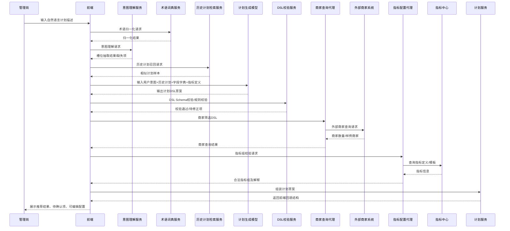
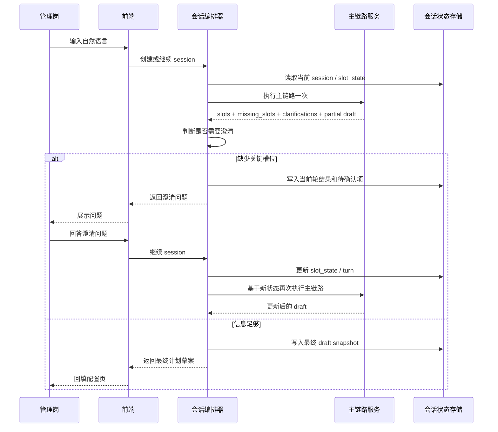

# 处理流程与时序设计

返回：[总册与导航](/Users/zhouzhixiong/code/zuozhanV2/docs/任务分配与自动检核系统AI方案/02-自然语言计划生成/00-总册与导航.md)

上游：

1. [数据准备与存储设计](/Users/zhouzhixiong/code/zuozhanV2/docs/任务分配与自动检核系统AI方案/02-自然语言计划生成/02-数据与语义底座/01-数据准备与存储设计.md)
2. [意图理解与筛选映射](/Users/zhouzhixiong/code/zuozhanV2/docs/任务分配与自动检核系统AI方案/02-自然语言计划生成/01-总方案/02-意图理解与筛选映射.md)

关联：

1. [基于现状的 V2 落地实施方案](/Users/zhouzhixiong/code/zuozhanV2/docs/任务分配与自动检核系统AI方案/01-总体方案与实施/02-V2落地实施方案.md)
2. [数据准备与存储设计](/Users/zhouzhixiong/code/zuozhanV2/docs/任务分配与自动检核系统AI方案/02-自然语言计划生成/02-数据与语义底座/01-数据准备与存储设计.md)
3. [意图理解与筛选映射](/Users/zhouzhixiong/code/zuozhanV2/docs/任务分配与自动检核系统AI方案/02-自然语言计划生成/01-总方案/02-意图理解与筛选映射.md)

## 1. 定位

本文件描述自然语言计划生成的推荐系统链路，重点是“不是单段 Prompt，而是一条可校验、可追踪、可降级的业务流程”。

边界说明：

1. 本文件只回答“跨服务怎么编排”
2. 不重复解释节点一到节点六内部如何做语义理解
3. 不展开每类数据资产如何生产
4. 不展开每个接口字段定义

如果你需要：

1. 看节点内的输入输出和推理逻辑：
   [意图理解与筛选映射](/Users/zhouzhixiong/code/zuozhanV2/docs/任务分配与自动检核系统AI方案/02-自然语言计划生成/01-总方案/02-意图理解与筛选映射.md)
2. 看资产如何落表、落索引、跑存量增量：
   [数据资产落地实施设计](/Users/zhouzhixiong/code/zuozhanV2/docs/任务分配与自动检核系统AI方案/02-自然语言计划生成/02-数据与语义底座/02-数据资产落地实施设计.md)
3. 看接口 request/response：
   [接口清单与服务拆分](/Users/zhouzhixiong/code/zuozhanV2/docs/任务分配与自动检核系统AI方案/02-自然语言计划生成/03-工程落地/02-接口清单与服务拆分.md)

为什么这些细节要放在本文件：

1. 因为系统上线时最容易出问题的是“服务之间怎么串”，不是概念定义
2. 因为校验点、依赖顺序、降级点天然属于编排层，而不属于单个节点
3. 因为研发排查问题时通常先看时序，再回头看节点细节

## 2. 主链路目标

1. 先理解用户意图
2. 再完成多源召回和主链路推理
3. 再做商家边界映射和 DSL 组装
4. 再校验和降级
5. 最后调用外部商家接口并回填前端

## 3. 推荐主链路步骤

这一节不再重复节点内的语义细节，而是用“服务编排”视角描述主链路。

1. 前端接收用户输入并生成 `request_id`
2. 编排层调用 `candidate-recall-service`，完成短语抽取、多源召回和候选裁剪
3. 编排层调用 `term-normalization-service`，产出 `normalized_terms`
4. 编排层调用 `slot-extraction-service`，产出 `slots`、`missing_slots` 和 `clarifications`
5. 如果缺失关键槽位，则转入澄清模式，不继续往下编排
6. 如果信息足够，则进入 `intent-mapper-service`，生成 `candidate_filter_intent` 并映射到商家服务真实边界
7. 编排层调用 `dsl-builder`，生成最终 `merchant_filter_dsl`
8. 对 DSL 做 Schema 校验和规则校验
9. 校验通过后，再调用商家查询代理和外部商家服务
10. 将商家结果、待确认项、可编辑条件一起回填前端
11. 用户确认后，计划服务保存正式计划

### 3.2 单轮推荐与多轮澄清的分流策略

为什么这里要单独说明：

1. 因为你们原有成熟方案本质是单轮推荐回显
2. 因为自然语言输入会引入更多信息缺失场景
3. 因为多轮不应替代单轮，而应作为兜底分支

推荐分流策略：

1. 信息足够  
   直接走单轮主链路，生成计划草案并回填前端
2. 信息不足  
   进入澄清式多轮，由会话编排器提出关键问题
3. 澄清完成  
   复用同一条主链路重新生成草案

建议的判断条件：

1. 关键槽位完整度
2. 歧义程度
3. DSL 可执行性
4. 是否存在必须人工确认项

结论：

1. 多轮是主链路的补充分支
2. 不是另一套完全独立链路
3. 也不要求当前阶段引入重型 Agent

### 3.1 与主链路节点的对应关系

| 编排步骤 | 节点文档对应位置 | 为什么要单独看这一层 |
| --- | --- | --- |
| 候选召回 + 归一化 | [意图理解与筛选映射 / 3. 节点一](/Users/zhouzhixiong/code/zuozhanV2/docs/任务分配与自动检核系统AI方案/02-自然语言计划生成/01-总方案/02-意图理解与筛选映射.md) | 节点文档负责解释语义，本文负责解释服务依赖顺序 |
| 槽位抽取 | [意图理解与筛选映射 / 4. 节点二](/Users/zhouzhixiong/code/zuozhanV2/docs/任务分配与自动检核系统AI方案/02-自然语言计划生成/01-总方案/02-意图理解与筛选映射.md) | 节点文档讲槽位怎么抽，本文讲什么时候该停下来澄清 |
| 缺失项识别 | [意图理解与筛选映射 / 5. 节点三](/Users/zhouzhixiong/code/zuozhanV2/docs/任务分配与自动检核系统AI方案/02-自然语言计划生成/01-总方案/02-意图理解与筛选映射.md) | 节点文档讲判断逻辑，本文讲它如何影响流程分支 |
| 意图映射与 DSL | [意图理解与筛选映射 / 6-8 节点](/Users/zhouzhixiong/code/zuozhanV2/docs/任务分配与自动检核系统AI方案/02-自然语言计划生成/01-总方案/02-意图理解与筛选映射.md) | 节点文档讲怎么映射，本文讲映射失败如何降级 |

## 4. Mermaid 时序图

### 4.1 澄清式多轮会话时序图

下面这条时序只在“缺少关键槽位”时触发。

### 4.2 为什么当前阶段不用重型 Agent

这里的推荐是：

1. 使用会话编排器 `session-orchestrator`
2. 不使用自治型 Agent runtime

原因是：

1. 当前问题的核心是“补齐信息”，不是“开放式自主规划”
2. 主链路节点已经清楚，只需要按轮次复用
3. 会话编排器更容易解释、审计和降级

所以更准确的实现方式是：

1. 单轮优先
2. 多轮澄清兜底
3. 会话编排器驱动主链路复用

## 5. 关键校验点

1. 术语归一化后，是否存在无法识别的关键业务词
2. 意图理解后，是否缺少关键槽位
3. DSL 生成后，是否满足 Schema
4. 商家查询前，字段和枚举是否合法
5. 指标组生成后，是否存在冲突或不可检核指标
6. 保存正式计划前，是否存在必须人工确认项

## 6. 降级策略

1. 历史计划检索失败：
降级为基于用户输入和基础模板生成

2. 模型生成失败：
降级为推荐历史计划模板，不做自动结构化生成

3. DSL 校验失败：
提示用户修正，不进入商家查询

4. 商家接口失败：
展示条件草案，但不展示商家结果

5. 指标校验失败：
展示候选指标，但标记为待确认

## 7. 实施建议

首期建议按以下顺序落地：

1. 先完成术语归一化、意图理解、历史计划召回
2. 再完成 DSL 生成和校验
3. 再接商家查询代理
4. 再接指标配置代理
5. 再补会话状态和澄清式多轮
6. 最后再评估是否需要演进到 Agent

## 8. 与数据设计的关系

本时序文件依赖的数据资产定义见：
[数据准备与存储设计](/Users/zhouzhixiong/code/zuozhanV2/docs/任务分配与自动检核系统AI方案/02-自然语言计划生成/02-数据与语义底座/01-数据准备与存储设计.md)

涉及“术语归一化、槽位抽取、缺失项识别、候选筛选意图、映射到商家服务字段”的详细设计，见：
[意图理解与筛选映射](/Users/zhouzhixiong/code/zuozhanV2/docs/任务分配与自动检核系统AI方案/02-自然语言计划生成/01-总方案/02-意图理解与筛选映射.md)
