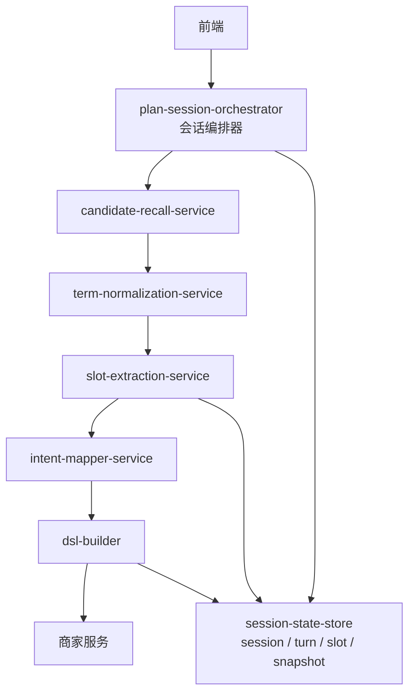

# 接口清单与服务拆分

返回：[总册与导航](/Users/zhouzhixiong/code/zuozhanV2/docs/任务分配与自动检核系统AI方案/02-自然语言计划生成/00-总册与导航.md)

上游：

1. [数据准备与存储设计](/Users/zhouzhixiong/code/zuozhanV2/docs/任务分配与自动检核系统AI方案/02-自然语言计划生成/02-数据与语义底座/01-数据准备与存储设计.md)
2. [意图理解与筛选映射](/Users/zhouzhixiong/code/zuozhanV2/docs/任务分配与自动检核系统AI方案/02-自然语言计划生成/01-总方案/02-意图理解与筛选映射.md)
3. [处理流程与时序设计](/Users/zhouzhixiong/code/zuozhanV2/docs/任务分配与自动检核系统AI方案/02-自然语言计划生成/03-工程落地/01-处理流程与时序设计.md)
4. [数据资产落地实施设计](/Users/zhouzhixiong/code/zuozhanV2/docs/任务分配与自动检核系统AI方案/02-自然语言计划生成/02-数据与语义底座/02-数据资产落地实施设计.md)

## 1. 定位

本文件只回答一个问题：

如果开始真正拆研发任务，自然语言计划生成这一条链路建议拆成哪些服务和接口，每个接口收什么、吐什么、失败时怎么处理。

本文件不重复解释为什么这么设计，重点放在：

1. 服务边界
2. 接口输入输出
3. 失败处理
4. 首期推荐拆分

边界说明：

1. 本文件只负责“接口和服务边界”
2. 不重复解释节点内为什么要这样做语义理解
3. 不重复解释表、索引、缓存如何建设

如果你需要：

1. 先看节点逻辑：
   [意图理解与筛选映射](/Users/zhouzhixiong/code/zuozhanV2/docs/任务分配与自动检核系统AI方案/02-自然语言计划生成/01-总方案/02-意图理解与筛选映射.md)
2. 先看跨服务编排：
   [处理流程与时序设计](/Users/zhouzhixiong/code/zuozhanV2/docs/任务分配与自动检核系统AI方案/02-自然语言计划生成/03-工程落地/01-处理流程与时序设计.md)
3. 看依赖的数据资产：
   [数据资产落地实施设计](/Users/zhouzhixiong/code/zuozhanV2/docs/任务分配与自动检核系统AI方案/02-自然语言计划生成/02-数据与语义底座/02-数据资产落地实施设计.md)

为什么这里要保留接口级细节：

1. 因为研发联调时最需要的是 request/response 和失败约定
2. 因为同一个语义节点在服务边界上往往要拆成多个接口
3. 因为没有接口级契约，时序设计很容易只停留在图上

## 2. 总体服务拆分

推荐首期拆成 5 个核心服务：

1. `candidate-recall-service`
2. `term-normalization-service`
3. `slot-extraction-service`
4. `intent-mapper-service`
5. `dsl-builder`

如果想更省事，首期也可以先把 `term-normalization-service` 和 `slot-extraction-service` 合并到一个 `intent-understanding-service` 中。

### 2.1 会话式多轮为什么先用 orchestrator，而不是 Agent

如果要支持多轮澄清，首期建议新增：

1. `plan-session-orchestrator`

而不是直接新增：

1. 通用 Agent runtime
2. 自主 planner
3. 自主 executor

原因是：

1. 当前场景主要是补齐缺失槽位
2. 不需要开放式自主规划
3. 主链路已经存在，只需要按轮次复用
4. orchestrator 更适合承接：
   - session 管理
   - turn 管理
   - 澄清问题选择
   - 状态推进

## 3. 服务关系

```text
用户输入
  -> candidate-recall-service
  -> term-normalization-service
  -> slot-extraction-service
  -> intent-mapper-service
  -> dsl-builder
  -> 商家服务查询
```

如果启用多轮澄清，推荐关系扩展为：

```text
用户输入
  -> plan-session-orchestrator
  -> candidate-recall-service
  -> term-normalization-service
  -> slot-extraction-service
  -> intent-mapper-service
  -> dsl-builder
  -> 商家服务查询
```

### 3.0.1 六个服务在多轮场景里的总关系图

为什么这里要画这张图：

1. 因为单看服务名，不容易理解谁是“总控”、谁是“能力服务”
2. 因为 `plan-session-orchestrator` 和其余 5 个服务不在同一个层次
3. 因为多轮场景里最重要的是“谁决定继续问，谁负责真正处理一轮请求”



这张图表达的是：

1. `plan-session-orchestrator` 不负责理解细节，它负责“编排一轮”和“决定是否继续下一轮”
2. 其余 5 个服务负责真正处理每一轮请求
3. `session-state-store` 负责把多轮会话沉淀下来

### 3.1 与主链路节点的对应关系

| 服务 | 对应主链路节点 | 为什么单独拆成服务 |
| --- | --- | --- |
| `candidate-recall-service` | 节点一前半段 | 因为多源召回、打分、TopN 裁剪通常独立演进 |
| `term-normalization-service` | 节点一后半段 | 因为 LLM 归一化和消歧是单独模型调用边界 |
| `slot-extraction-service` | 节点二、三 | 因为槽位抽取与缺失项识别经常一起迭代 |
| `intent-mapper-service` | 节点四、五 | 因为业务意图中间层和商家边界映射强相关 |
| `dsl-builder` | 节点六 | 因为 DSL 生成、校验、回填属于稳定系统层能力 |

### 3.2 多轮澄清相关服务边界

| 服务 | 作用 | 为什么当前阶段需要 |
| --- | --- | --- |
| `plan-session-orchestrator` | 创建/继续会话，驱动每一轮主链路执行，决定是否继续澄清 | 多轮能力的核心不是“更强模型”，而是“会话状态管理” |
| `session-state-store` | 保存 session、turn、slot_state、draft snapshot | 不把多轮状态只留在 Prompt 里 |

推荐关系：

1. `plan-session-orchestrator` 负责编排
2. 现有 5 个核心服务继续负责节点能力
3. 不新增重型 Agent 服务

## 3.3 plan-session-orchestrator

### 3.3.1 职责

负责：

1. 创建 session
2. 读取和更新当前 slot_state
3. 选择本轮是否继续澄清
4. 决定返回问题还是返回计划草案

为什么这个服务要单独存在：

1. 因为多轮能力的难点不是“模型更强”，而是“会话状态怎么推进”
2. 因为如果没有它，前端就要自己判断什么时候继续问、什么时候结束
3. 因为 5 个核心服务更适合保持“单轮处理能力”，不适合直接负责多轮状态机

### 3.3.2 输入

```json
{
  "session_id": "sess_001",
  "user_input": "先做华东餐饮新商家首单提升",
  "user_context": {
    "user_id": "u_01",
    "role": "manager"
  }
}
```

### 3.3.3 输出

```json
{
  "session_id": "sess_001",
  "turn_id": "turn_003",
  "session_status": "AWAITING_USER" ,
  "next_action": "ASK_CLARIFICATION",
  "clarifications": [
    {
      "slot": "priority_city",
      "question": "是否需要优先某几个城市？"
    }
  ],
  "partial_draft": {
    "goal_type": "first_order_growth"
  }
}
```

### 3.3.4 失败处理

1. session 不存在：创建新 session
2. slot_state 不一致：回退最近一次快照
3. 本轮结果不稳定：只返回澄清问题，不直接生成草案

### 3.3.5 和五个核心服务的边界

| 服务 | 负责什么 | 不负责什么 |
| --- | --- | --- |
| `plan-session-orchestrator` | 控制会话生命周期、决定下一轮动作、读写状态表 | 不负责术语理解、槽位抽取、DSL 生成细节 |
| `candidate-recall-service` | 召回候选术语、相似样本、历史计划 | 不负责决定下一轮是否继续 |
| `term-normalization-service` | 把候选术语归一化成标准语义 | 不负责会话状态推进 |
| `slot-extraction-service` | 生成槽位、缺失项、澄清建议 | 不负责保存整段会话生命周期 |
| `intent-mapper-service` | 把业务意图映射成系统边界条件 | 不负责决定是否要再问用户 |
| `dsl-builder` | 生成当前轮可执行 DSL 草案 | 不负责多轮交互策略 |

## 4. candidate-recall-service

### 4.1 职责

负责：

1. 文本预处理
2. 短语抽取
3. 多源候选召回
4. 候选打分
5. TopN 裁剪

### 4.2 输入

```json
{
  "request_id": "req_20260413_001",
  "user_query": "帮我找华东餐饮新商家，优先上海杭州，排除闭店商家，做一个首单提升计划",
  "user_context": {
    "role": "manager",
    "org_id": "org_001"
  }
}
```

### 4.3 输出

```json
{
  "request_id": "req_20260413_001",
  "candidate_phrases": ["华东", "餐饮", "新商家", "上海杭州", "闭店商家", "首单提升"],
  "candidate_terms": [
    {
      "raw": "首单提升",
      "candidates": [
        {
          "type": "goal_type",
          "value": "first_order_growth",
          "source": "biz_term_dictionary",
          "final_score": 1.0
        },
        {
          "type": "metric_alias",
          "value": "first_order_cnt",
          "source": "metric_term",
          "final_score": 0.836
        }
      ]
    }
  ]
}
```

### 4.4 失败处理

1. 候选为空：返回 `unresolved_phrases`
2. 单短语候选过多：裁剪到 `TopN`
3. 上游某个源不可用：其余来源继续召回，并记录降级状态

## 5. term-normalization-service

### 5.1 职责

负责：

1. 读取 `candidate_terms`
2. 调用 LLM 做归一化和消歧
3. 输出 `normalized_terms`

### 5.2 输入

```json
{
  "request_id": "req_20260413_001",
  "user_query": "帮我找华东餐饮新商家，优先上海杭州，排除闭店商家，做一个首单提升计划",
  "candidate_terms": [
    {
      "raw": "首单提升",
      "candidates": [
        {"type": "goal_type", "value": "first_order_growth", "final_score": 1.0},
        {"type": "metric_alias", "value": "first_order_cnt", "final_score": 0.836}
      ]
    }
  ]
}
```

### 5.3 输出

```json
{
  "request_id": "req_20260413_001",
  "normalized_terms": [
    {"raw": "华东", "type": "region_concept", "normalized": "华东"},
    {"raw": "餐饮", "type": "industry_enum", "normalized": "餐饮"},
    {"raw": "新商家", "type": "merchant_tag", "normalized": "new_merchant"},
    {"raw": "闭店商家", "type": "merchant_tag", "normalized": "closed_merchant"},
    {"raw": "首单提升", "type": "goal_type", "normalized": "first_order_growth"}
  ]
}
```

### 5.4 失败处理

1. LLM 超时：回退高置信规则候选
2. 输出结构非法：按 schema 重试 1 次
3. 仍失败：返回 `partial_terms`

## 6. slot-extraction-service

### 6.1 职责

负责：

1. 基于 `normalized_terms` 生成 `slots`
2. 做槽位 schema 校验
3. 做缺失项识别

### 6.2 输入

```json
{
  "request_id": "req_20260413_001",
  "normalized_terms": [
    {"raw": "华东", "type": "region_concept", "normalized": "华东"},
    {"raw": "餐饮", "type": "industry_enum", "normalized": "餐饮"},
    {"raw": "新商家", "type": "merchant_tag", "normalized": "new_merchant"},
    {"raw": "闭店商家", "type": "merchant_tag", "normalized": "closed_merchant"},
    {"raw": "首单提升", "type": "goal_type", "normalized": "first_order_growth"}
  ]
}
```

### 6.3 输出

```json
{
  "request_id": "req_20260413_001",
  "slots": {
    "region": ["华东"],
    "industry": ["餐饮"],
    "merchant_stage": ["new_merchant"],
    "merchant_status_exclusion": ["closed_merchant"],
    "priority_city": ["上海", "杭州"],
    "goal_type": "first_order_growth"
  },
  "missing_slots": [],
  "clarifications": [],
  "is_ready_for_mapping": true
}
```

### 6.4 失败处理

1. 槽位结构非法：重试 1 次
2. 关键槽位缺失：返回 `await_clarification`
3. 规则和 LLM 冲突：规则优先

## 7. intent-mapper-service

### 7.1 职责

负责：

1. 把 `slots` 组织成 `candidate_filter_intent`
2. 把 `candidate_filter_intent` 映射到商家服务边界
3. 产出映射结果

### 7.2 输入

```json
{
  "request_id": "req_20260413_001",
  "slots": {
    "region": ["华东"],
    "industry": ["餐饮"],
    "merchant_stage": ["new_merchant"],
    "merchant_status_exclusion": ["closed_merchant"],
    "priority_city": ["上海", "杭州"],
    "goal_type": "first_order_growth"
  }
}
```

### 7.3 输出

```json
{
  "request_id": "req_20260413_001",
  "candidate_filter_intent": {
    "intent_type": "merchant_filter",
    "goal_type": "first_order_growth",
    "include": [
      {"slot": "region", "value": "华东", "value_type": "concept"},
      {"slot": "industry", "value": "餐饮", "value_type": "enum"},
      {"slot": "merchant_stage", "value": "new_merchant", "value_type": "tag"}
    ],
    "exclude": [
      {"slot": "merchant_status", "value": "closed_merchant", "value_type": "tag"}
    ]
  },
  "mapped_conditions": [
    {"field": "industry_code", "operator": "=", "value": "餐饮"},
    {"field": "region_code", "operator": "in", "value": ["上海", "杭州", "苏州", "南京"]},
    {"field": "tag_code", "operator": "in", "value": ["new_merchant"]}
  ],
  "mapped_exclusions": [
    {"field": "tag_code", "operator": "in", "value": ["closed_merchant"]}
  ],
  "unmapped_conditions": [],
  "ambiguities": []
}
```

### 7.4 失败处理

1. 出现未映射条件：返回 `mapping_partial`
2. 概念展开失败：阻断下游
3. 组合非法：返回冲突详情

## 8. dsl-builder

### 8.1 职责

负责：

1. 按 schema 组装最终 `merchant_filter_dsl`
2. 做可执行性校验
3. 输出最终调用载荷

### 8.2 输入

```json
{
  "request_id": "req_20260413_001",
  "mapped_conditions": [
    {"field": "industry_code", "operator": "=", "value": "餐饮"},
    {"field": "region_code", "operator": "in", "value": ["上海", "杭州", "苏州", "南京"]},
    {"field": "tag_code", "operator": "in", "value": ["new_merchant"]}
  ],
  "mapped_exclusions": [
    {"field": "tag_code", "operator": "in", "value": ["closed_merchant"]}
  ]
}
```

### 8.3 输出

```json
{
  "request_id": "req_20260413_001",
  "merchant_filter_dsl": {
    "conditions": [
      {"field": "industry_code", "operator": "=", "value": "餐饮"},
      {"field": "region_code", "operator": "in", "value": ["上海", "杭州", "苏州", "南京"]},
      {"field": "tag_code", "operator": "in", "value": ["new_merchant"]}
    ],
    "exclusions": [
      {"field": "tag_code", "operator": "in", "value": ["closed_merchant"]}
    ]
  }
}
```

### 8.4 失败处理

1. schema 非法：直接失败，不调用商家服务
2. 可执行性检查失败：返回 `dsl_invalid`
3. 字段和值都合法但组合不可执行：返回冲突说明

## 9. 首期推荐合并方式

如果团队当前人力有限，建议首期按下面方式合并：

1. `candidate-recall-service`
2. `intent-understanding-service`
   包含：
   - `term-normalization-service`
   - `slot-extraction-service`
3. `intent-mapper-service`
4. `dsl-builder`

这样服务数量不会太多，但边界仍然清晰。

## 10. 调用顺序建议

```text
用户输入
  -> candidate-recall-service
  -> intent-understanding-service
  -> intent-mapper-service
  -> dsl-builder
  -> 商家服务
```

## 11. 首期必须落的接口能力

如果只做第一版，建议至少先落这 4 个接口：

1. 候选召回接口
2. 术语归一化 + 槽位抽取接口
3. 意图映射接口
4. DSL 生成接口

这样已经足够把“自然语言 -> 商家筛选 DSL”这条链路跑通。
