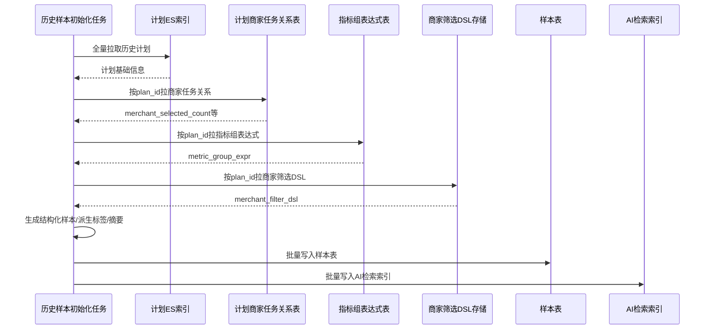
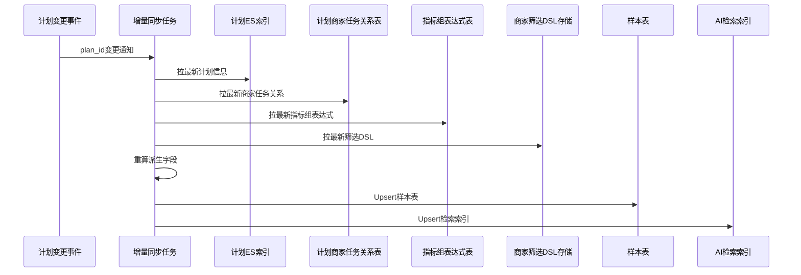
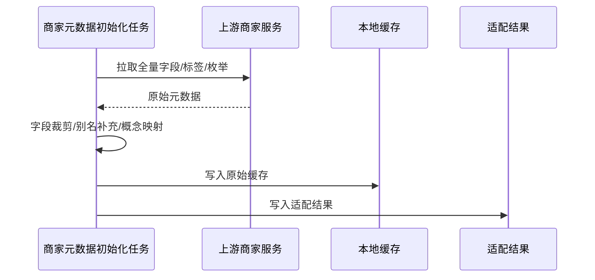
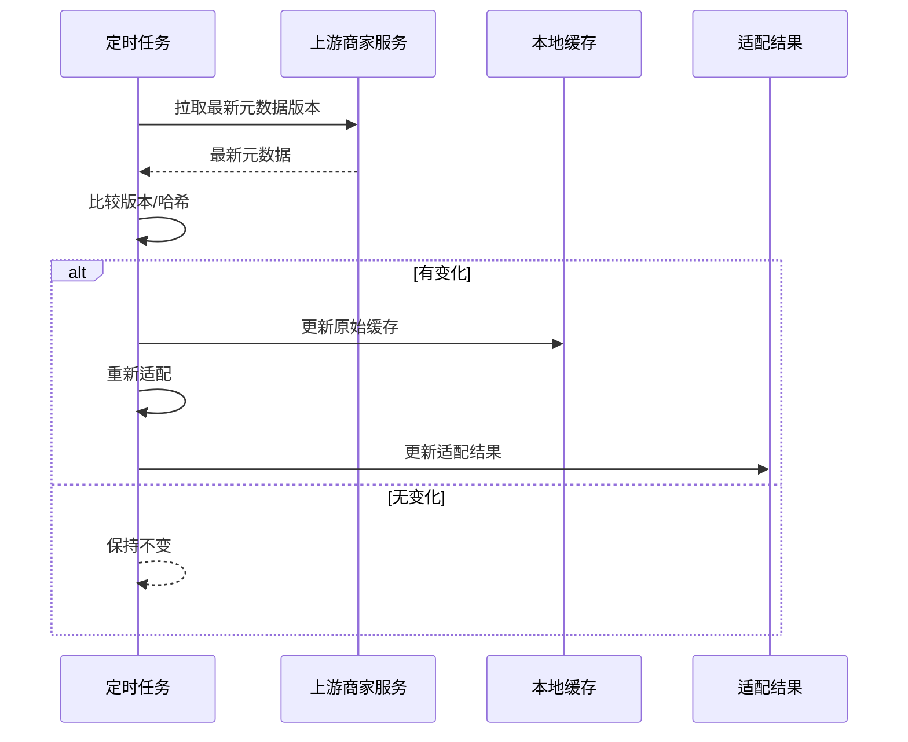
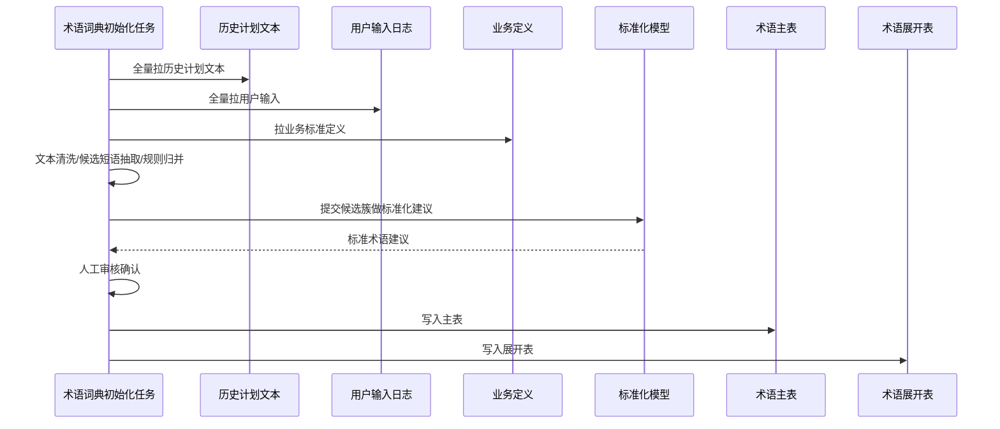
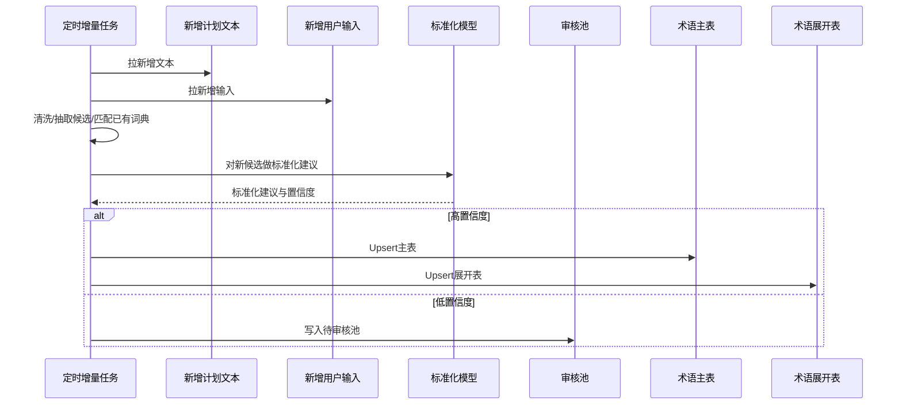

# 数据资产落地实施设计

返回：[专项导航](/Users/zhouzhixiong/code/zuozhanV2/docs/任务分配与自动检核系统AI方案/02-自然语言计划生成/00-专项导航.md)

上游：

1. [数据准备与存储设计](/Users/zhouzhixiong/code/zuozhanV2/docs/任务分配与自动检核系统AI方案/02-自然语言计划生成/01-数据准备与存储设计.md)

下游：

1. [意图理解与筛选映射](/Users/zhouzhixiong/code/zuozhanV2/docs/任务分配与自动检核系统AI方案/02-自然语言计划生成/02-意图理解与筛选映射.md)
2. [处理流程与时序设计](/Users/zhouzhixiong/code/zuozhanV2/docs/任务分配与自动检核系统AI方案/02-自然语言计划生成/03-处理流程与时序设计.md)

## 1. 文档定位

本文件只回答一个问题：

自然语言计划生成依赖的数据资产，如何从现有系统真实落地出来。

重点讲清楚：

1. 原始数据现在长什么样
2. 每类数据需要经过几轮加工
3. 加工后落到什么表、什么索引、什么缓存
4. 存量怎么初始化
5. 增量怎么持续更新

---

## 2. 先给结论

从落地角度，建议把这 5 类数据拆成三种处理策略：

1. 直接复用原始事实源，再补派生层
   适用：
   - 历史计划结构化样本
   - 商家查询元数据

2. 复用现有主表，再补语义扩展层
   适用：
   - 指标中心标准定义

3. 新建专用语义资产
   适用：
   - 业务术语和别名词典
   - 真实输入语句和人工标注结果

也就是说，不是所有东西都要新建主表，但基本都需要增加一层“面向 AI 的派生层”。

---

## 3. 五类数据的落地策略总表

| 数据资产 | 当前是否已有事实源 | 首期是否新建正式表 | 首期落地方式 | 后续演进 |
| --- | --- | --- | --- | --- |
| 历史计划结构化样本 | 有，ES + 关系表 | 建议新建派生样本层 | 全量初始化 + 增量同步到样本表/索引 | 增加重排特征和评估快照 |
| 商家查询元数据 | 有，上游商家服务 | 首期不强制 | 上游元数据 + 本地缓存/适配 | 演进到本地派生字典 |
| 指标中心标准定义 | 有，指标中心 | 不重建主表 | 复用指标中心 + 扩展别名/模板表 | 增加模板和业务分类 |
| 业务术语和别名词典 | 没有完整现成资产 | 建议新建 | 从历史文本和用户输入生成主表+展开表 | 增量迭代和回归评估 |
| 真实输入语句和人工标注结果 | 可能部分有日志 | 建议新建 | 用户输入日志采集 + 标注表 | 建立低置信度闭环 |

---

## 4. 历史计划结构化样本

## 4.1 当前原始数据长什么样

你们当前已有的事实源大致包括：

### 原始源 A：计划 ES 索引

示意：

```json
{
  "plan_id": 1001,
  "plan_name": "华东新商家首单提升计划",
  "plan_desc": "针对华东区域新商家，做首单提升",
  "start_time": "2026-04-01",
  "end_time": "2026-04-30",
  "status": "FINISHED",
  "completion_rate": 0.71
}
```

### 原始源 B：计划与商家任务关系表

示意：

```json
{
  "plan_id": 1001,
  "merchant_id": 50123,
  "task_id": 88771,
  "task_status": "FINISHED"
}
```

### 原始源 C：计划与指标组表达式关系表

示意：

```json
{
  "plan_id": 1001,
  "metric_group_expr": "(first_order_cnt>=1) AND (conversion_rate>=0.2)"
}
```

### 原始源 D：计划创建时保存的商家筛选 DSL

如果已经保存，示意：

```json
{
  "plan_id": 1001,
  "merchant_filter_dsl": {
    "conditions": [
      {"field": "region_code", "operator": "in", "value": ["上海", "杭州"]},
      {"field": "industry_code", "operator": "=", "value": "餐饮"},
      {"field": "tag_code", "operator": "in", "value": ["new_merchant"]}
    ]
  }
}
```

---

## 4.2 需要经过几轮变化

### 第一轮：原始事实收集

把计划 ES、商家任务关系、指标组表达式、商家筛选 DSL 拉到同一条加工链路中。

这一步不改语义，只做聚合。

### 第二轮：结构化抽取

从原始事实中抽出 AI 真正要用的结构字段：

1. 计划基础信息
2. `merchant_filter_dsl`
3. `merchant_selected_count`
4. 指标组摘要
5. `industry_tags`
6. `region_tags`
7. `completion_rate`
8. `is_success_case`

### 第三轮：检索增强

为检索和模型上下文新增派生字段：

1. `merchant_filter_summary`
2. `metric_group_summary`
3. `effect_score`
4. `plan_summary_for_llm`

### 最终形态

落到：

1. 派生样本表
2. AI 检索索引

---

## 4.3 首期落地到什么地方

推荐两层：

### 层 1：派生样本表

表名建议：

`plan_history_structured_sample`

核心字段建议：

1. `plan_id`
2. `plan_name`
3. `plan_desc`
4. `plan_start_time`
5. `plan_end_time`
6. `plan_status`
7. `merchant_filter_dsl`
8. `merchant_selected_count`
9. `industry_tags`
10. `region_tags`
11. `metric_group_expr`
12. `metric_group_summary`
13. `completion_rate`
14. `is_success_case`
15. `effect_score`
16. `source_snapshot_time`

### 层 2：AI 检索索引

索引名建议：

`idx_plan_history_ai_search`

用于：

1. 关键词召回
2. 向量召回
3. 重排
4. 给 LLM 提供历史计划摘要

---

## 4.3.1 派生样本表结构建议

表名建议：

`plan_history_structured_sample`

字段建议：

| 字段名 | 类型 | 说明 |
| --- | --- | --- |
| `id` | bigint | 主键 |
| `plan_id` | bigint | 计划 ID |
| `plan_name` | varchar(256) | 计划名称 |
| `plan_desc` | text | 计划描述 |
| `plan_start_time` | datetime | 计划开始时间 |
| `plan_end_time` | datetime | 计划结束时间 |
| `plan_status` | varchar(64) | 计划状态 |
| `merchant_filter_dsl` | json | 计划创建时保存的商家筛选 DSL |
| `merchant_selected_count` | int | 最终进入计划并生成任务的商家数 |
| `industry_tags` | json | 从筛选 DSL 派生的行业标签 |
| `region_tags` | json | 从筛选 DSL 派生的区域标签 |
| `metric_group_expr` | text | 原始指标组表达式 |
| `metric_group_summary` | text | 便于检索和给 LLM 使用的指标组摘要 |
| `completion_rate` | decimal(8,4) | 达标率 |
| `is_success_case` | tinyint | 是否成功案例 |
| `effect_score` | decimal(8,4) | 供重排使用的效果分 |
| `source_snapshot_time` | datetime | 本次加工快照时间 |
| `updated_at` | datetime | 更新时间 |

示例数据：

```json
{
  "id": 1,
  "plan_id": 1001,
  "plan_name": "华东新商家首单提升计划",
  "plan_desc": "针对华东区域新商家，做首单提升",
  "plan_start_time": "2026-04-01 00:00:00",
  "plan_end_time": "2026-04-30 23:59:59",
  "plan_status": "FINISHED",
  "merchant_filter_dsl": {
    "conditions": [
      {"field": "region_code", "operator": "in", "value": ["上海", "杭州"]},
      {"field": "industry_code", "operator": "=", "value": "餐饮"},
      {"field": "tag_code", "operator": "in", "value": ["new_merchant"]}
    ],
    "exclusions": [
      {"field": "tag_code", "operator": "in", "value": ["closed_merchant"]}
    ]
  },
  "merchant_selected_count": 1280,
  "industry_tags": ["餐饮"],
  "region_tags": ["华东"],
  "metric_group_expr": "(first_order_cnt>=1) AND (conversion_rate>=0.2)",
  "metric_group_summary": "主目标为首单商家数达标，同时要求转化率达到0.2",
  "completion_rate": 0.7125,
  "is_success_case": 1,
  "effect_score": 0.83,
  "source_snapshot_time": "2026-04-12 00:30:00",
  "updated_at": "2026-04-12 00:30:00"
}
```

## 4.3.2 AI 检索索引结构建议

索引名建议：

`idx_plan_history_ai_search`

核心字段建议：

1. `plan_id`
2. `plan_name`
3. `plan_desc`
4. `merchant_filter_summary`
5. `metric_group_summary`
6. `industry_tags`
7. `region_tags`
8. `completion_rate`
9. `is_success_case`
10. `effect_score`
11. `plan_summary_vector`

示例文档：

```json
{
  "plan_id": 1001,
  "plan_name": "华东新商家首单提升计划",
  "plan_desc": "针对华东区域新商家，做首单提升",
  "merchant_filter_summary": "华东区域餐饮新商家，排除闭店商家",
  "metric_group_summary": "首单商家数>=1，转化率>=0.2",
  "industry_tags": ["餐饮"],
  "region_tags": ["华东"],
  "completion_rate": 0.7125,
  "is_success_case": 1,
  "effect_score": 0.83
}
```

---

## 4.3.3 为什么样本表和 AI 检索索引需要分层

这里的 “AI 检索索引” 指的是：

1. 用于关键词检索
2. 用于向量召回
3. 用于 filter / boost / 重排
4. 用于给 LLM 提供历史计划候选

从实现角度，优先建议它是一个独立的 ES 索引，而不是数据库索引。

之所以不建议“全部都只放 ES”，原因如下：

### 原因 1：样本表更适合作为稳定事实层

样本表适合承接：

1. 回放
2. 审计
3. 离线分析
4. 增量幂等更新
5. 派生字段重算

这些事情用关系库表达会更稳。

### 原因 2：检索字段和事实字段不是一回事

样本表更关注：

1. 原始商家筛选 DSL
2. 原始指标表达式
3. 快照时间
4. 原始效果字段

而 AI 检索索引更关注：

1. 文本摘要
2. 检索标签
3. 向量字段
4. 重排分数

所以更合理的结构是：

`业务源数据 -> 派生样本表 -> AI 检索索引`

### 原因 3：避免污染原业务检索

建议 AI 检索索引独立建设，不要和原业务计划索引混用。

如果混在一个 ES 索引里，容易出现：

1. 字段权重互相干扰
2. 摘要字段影响原始计划搜索
3. AI 检索策略影响业务检索稳定性

结论：

1. 样本表负责“存”
2. ES AI 检索索引负责“找”
3. AI 检索索引建议独立于原业务索引

---

## 4.4 存量初始化怎么做

### 存量步骤

1. 从 ES 全量扫历史计划
2. 按 `plan_id` 关联商家任务关系表
3. 按 `plan_id` 关联指标组表达式表
4. 关联计划创建时的商家筛选 DSL
5. 生成结构化样本
6. 写入派生样本表
7. 再同步到 AI 检索索引

### 存量时序图



---

## 4.5 增量更新怎么做

### 增量触发源

1. 新计划创建
2. 计划配置修改
3. 计划结束
4. 达标率等效果字段刷新

### 增量步骤

1. 捕捉计划变更事件
2. 按 `plan_id` 拉取最新基础信息
3. 补齐商家数量、指标表达式、筛选 DSL
4. 重算派生摘要和效果分
5. Upsert 到样本表
6. Upsert 到 AI 检索索引

### 增量时序图



---

## 4.5 相似样本治理

## 4.5.1 为什么相似样本不能完全不管

如果历史计划中存在大量非常相似的样本，而检索阶段完全不做处理，会出现以下问题：

1. TopN 结果高度重复，缺乏多样性
2. LLM 上下文被重复样本占满
3. 某类被频繁复制的计划会被误以为“更优”

所以：

1. 存储层通常保留相似样本
2. 检索层和返回层需要做去冗余

## 4.5.2 哪些情况需要区分

### 情况 A：同一个计划重复同步

例如：

1. 存量初始化处理过一次
2. 增量任务又处理了一次

这种情况不是“相似”，而是“同一条业务记录重复写入”。

处理方式：

1. 样本表用 `plan_id` 或 `plan_id + version` 做幂等 upsert
2. 检索索引同样按 `plan_id` 覆盖写入

### 情况 B：不同计划内容很像

例如：

1. 华东新商家首单提升计划
2. 华东餐饮新店首单冲刺计划

这类样本业务上都是真实存在的，不能因为相似就删除。

正确做法：

1. 样本层保留
2. 检索层识别近重复
3. 返回层折叠或限额

---

## 4.5.3 `content_fingerprint` 怎么计算

`content_fingerprint` 用于表示一条计划样本的“核心内容指纹”。

推荐基于以下字段计算：

1. `goal_type`
2. `merchant_filter_dsl`
3. `metric_group_expr`

计算前要先做 canonical 归一化：

### 对 `merchant_filter_dsl` 做归一化

1. 条件排序
2. 枚举值排序
3. 统一 operator 写法
4. 去无意义空格

### 对 `metric_group_expr` 做归一化

1. 去空格
2. 统一逻辑连接符格式
3. 统一指标顺序

### 计算方式示意

```text
canonical_content =
  normalize(goal_type) +
  "|" +
  normalize(merchant_filter_dsl) +
  "|" +
  normalize(metric_group_expr)

content_fingerprint = sha256(canonical_content)
```

示意结果：

```json
{
  "plan_id": 1001,
  "content_fingerprint": "2f24a9f4d98f1b12f0f5c3c6d2e16e7d9e0c42a0..."
}
```

## 4.5.4 `duplicate_group_id` 怎么计算

首期最简单的做法：

1. 直接令 `duplicate_group_id = content_fingerprint`

也就是说：

1. 核心内容完全一致的计划样本，归到同一组

后续如果要做“近似但不完全一样”的聚类，再单独扩展：

1. 根据相似度聚类
2. 聚类结果生成新的 `duplicate_group_id`

首期不建议一上来做复杂聚类。

---

## 4.5.5 样本表中建议增加的字段

为支持相似样本治理，建议在 `plan_history_structured_sample` 中增加：

| 字段名 | 类型 | 说明 |
| --- | --- | --- |
| `content_fingerprint` | varchar(128) | 样本核心内容指纹 |
| `duplicate_group_id` | varchar(128) | 相似样本分组 ID |

示例：

```json
{
  "plan_id": 1001,
  "content_fingerprint": "2f24a9f4d98f1b12f0f5c3c6d2e16e7d9e0c42a0",
  "duplicate_group_id": "2f24a9f4d98f1b12f0f5c3c6d2e16e7d9e0c42a0"
}
```

---

## 4.5.6 重排层的近重复降权

相似样本不建议在存储层删除，而是在检索和返回阶段做去冗余。

首期最推荐的方法：

### 方法 A：同组限额

步骤：

1. 检索得到 TopN 结果
2. 按原始分数排序
3. 同一个 `duplicate_group_id` 最多保留 1 条

伪代码：

```python
result = []
group_count = {}

for doc in sorted_docs:
    gid = doc["duplicate_group_id"]
    if group_count.get(gid, 0) >= 1:
        continue
    result.append(doc)
    group_count[gid] = group_count.get(gid, 0) + 1
```

### 方法 B：指数降权

如果不想硬过滤，也可以做降权：

```text
final_score = base_score * (0.85 ^ dup_rank)
```

其中：

1. `base_score` 是原始召回分数
2. `dup_rank` 是同组内第几条结果

首期建议先做方法 A，稳定且易解释。

---

## 4.6 串联样例：历史计划样本从原始到派生

### 原始数据

计划 ES：

```json
{
  "plan_id": 1001,
  "plan_name": "华东新商家首单提升计划",
  "plan_desc": "针对华东区域新商家，做首单提升",
  "start_time": "2026-04-01",
  "end_time": "2026-04-30",
  "status": "FINISHED",
  "completion_rate": 0.7125
}
```

商家任务关系：

```json
[
  {"plan_id": 1001, "merchant_id": 50123, "task_id": 88771, "task_status": "FINISHED"},
  {"plan_id": 1001, "merchant_id": 50124, "task_id": 88772, "task_status": "FINISHED"}
]
```

指标组表达式：

```json
{
  "plan_id": 1001,
  "metric_group_expr": "(first_order_cnt>=1) AND (conversion_rate>=0.2)"
}
```

商家筛选 DSL：

```json
{
  "plan_id": 1001,
  "merchant_filter_dsl": {
    "conditions": [
      {"field": "region_code", "operator": "in", "value": ["上海", "杭州"]},
      {"field": "industry_code", "operator": "=", "value": "餐饮"},
      {"field": "tag_code", "operator": "in", "value": ["new_merchant"]}
    ],
    "exclusions": [
      {"field": "tag_code", "operator": "in", "value": ["closed_merchant"]}
    ]
  }
}
```

### 第一轮加工后

抽出结构化字段：

```json
{
  "plan_id": 1001,
  "plan_name": "华东新商家首单提升计划",
  "merchant_filter_dsl": { "...": "..." },
  "merchant_selected_count": 1280,
  "metric_group_expr": "(first_order_cnt>=1) AND (conversion_rate>=0.2)"
}
```

### 第二轮加工后

补派生字段：

```json
{
  "plan_id": 1001,
  "industry_tags": ["餐饮"],
  "region_tags": ["华东"],
  "metric_group_summary": "首单商家数>=1，转化率>=0.2",
  "effect_score": 0.83
}
```

### 最终落表

写入 `plan_history_structured_sample`，再同步到 `idx_plan_history_ai_search`。

---

## 5. 商家查询元数据

## 5.1 当前原始数据长什么样

上游商家服务如果提供元数据，示意可能是：

```json
{
  "fields": [
    {
      "field": "industry_code",
      "name": "行业",
      "operators": ["=", "in"],
      "values": ["餐饮", "零售", "丽人"]
    },
    {
      "field": "region_code",
      "name": "城市",
      "operators": ["=", "in"],
      "values": ["上海", "杭州", "苏州", "南京"]
    }
  ],
  "tags": [
    {
      "tag_code": "new_merchant",
      "tag_name": "新商家",
      "tag_type": "merchant_stage"
    }
  ]
}
```

---

## 5.2 需要经过几轮变化

### 第一轮：直接拉取上游元数据

保持上游字段、标签、枚举的原始形态。

### 第二轮：本地适配

补充本地需要的字段：

1. 中文别名
2. 概念展开
3. 过滤不对外展示的字段
4. 标记哪些字段可用于 LLM

### 第三轮：本地缓存 / 派生字典

如果进入稳定期，再固化到本地缓存或字典表。

---

## 5.3 首期落地方案

### 首期

不强制新建正式表，推荐：

1. 上游元数据接口
2. 本地缓存
3. 本地适配结果 JSON

推荐缓存产物：

1. `merchant_meta_cache`
2. `merchant_meta_adapted_cache`

## 5.3.1 原始缓存结构建议

缓存 Key 建议：

`merchant_meta_cache:current`

缓存 Value 示例：

```json
{
  "version": "2026-04-12T00:00:00",
  "fields": [
    {
      "field": "industry_code",
      "name": "行业",
      "field_type": "enum",
      "operators": ["=", "in"],
      "values": ["餐饮", "零售", "丽人"]
    },
    {
      "field": "region_code",
      "name": "城市",
      "field_type": "enum",
      "operators": ["=", "in"],
      "values": ["上海", "杭州", "苏州", "南京"]
    }
  ],
  "tags": [
    {
      "tag_code": "new_merchant",
      "tag_name": "新商家",
      "tag_type": "merchant_stage"
    },
    {
      "tag_code": "closed_merchant",
      "tag_name": "闭店商家",
      "tag_type": "merchant_status"
    }
  ]
}
```

## 5.3.2 适配结果结构建议

缓存 Key 建议：

`merchant_meta_adapted_cache:current`

缓存 Value 示例：

```json
{
  "version": "2026-04-12T00:00:00",
  "llm_exposed_fields": [
    {
      "slot": "industry",
      "field": "industry_code",
      "field_name": "行业",
      "operators": ["=", "in"],
      "values": ["餐饮", "零售", "丽人"],
      "aliases": ["行业", "品类"]
    },
    {
      "slot": "city",
      "field": "region_code",
      "field_name": "城市",
      "operators": ["=", "in"],
      "values": ["上海", "杭州", "苏州", "南京"],
      "aliases": ["区域", "城市"]
    }
  ],
  "llm_exposed_tags": [
    {
      "slot": "merchant_stage",
      "tag_code": "new_merchant",
      "tag_name": "新商家",
      "aliases": ["新店", "新开商家"]
    },
    {
      "slot": "merchant_status",
      "tag_code": "closed_merchant",
      "tag_name": "闭店商家",
      "aliases": ["关店商家", "已闭店"]
    }
  ],
  "concept_mapping": {
    "华东": ["上海", "杭州", "苏州", "南京"]
  }
}
```

## 5.3.3 稳定期表结构建议

如果后续演进到本地字典表，建议：

### 表：`merchant_filter_field`

| 字段名 | 类型 | 说明 |
| --- | --- | --- |
| `id` | bigint | 主键 |
| `field_code` | varchar(64) | 字段编码 |
| `field_name` | varchar(128) | 字段中文名 |
| `slot_name` | varchar(64) | 对应业务槽位 |
| `field_type` | varchar(32) | enum/tag/text |
| `operators_json` | json | 支持的操作符 |
| `aliases_json` | json | 别名 |
| `status` | varchar(32) | 状态 |

示例数据：

```json
{
  "field_code": "industry_code",
  "field_name": "行业",
  "slot_name": "industry",
  "field_type": "enum",
  "operators_json": ["=", "in"],
  "aliases_json": ["行业", "品类"],
  "status": "active"
}
```

### 表：`merchant_filter_tag`

| 字段名 | 类型 | 说明 |
| --- | --- | --- |
| `id` | bigint | 主键 |
| `tag_code` | varchar(64) | 标签编码 |
| `tag_name` | varchar(128) | 标签中文名 |
| `slot_name` | varchar(64) | 对应业务槽位 |
| `aliases_json` | json | 别名 |
| `status` | varchar(32) | 状态 |

示例数据：

```json
{
  "tag_code": "new_merchant",
  "tag_name": "新商家",
  "slot_name": "merchant_stage",
  "aliases_json": ["新店", "新开商家"],
  "status": "active"
}
```

### 后续

演进到本地表：

1. `merchant_filter_field`
2. `merchant_filter_enum`
3. `merchant_filter_tag`
4. `merchant_filter_constraint`

---

## 5.4 存量初始化怎么做

1. 首次从上游全量拉字段、标签、枚举、操作符
2. 写入本地缓存
3. 生成适配版元数据

### 存量时序图



---

## 5.5 增量更新怎么做

1. 定时轮询上游元数据
2. 比较版本或哈希
3. 有变化时更新缓存和适配结果

### 增量时序图



---

## 6. 指标中心标准定义

## 6.1 当前原始数据长什么样

如果你们已有指标中心，原始数据通常类似：

```json
{
  "metric_code": "first_order_cnt",
  "metric_name": "首单商家数",
  "metric_desc": "统计周期内首次完成下单的商家数量",
  "metric_type": "offline",
  "can_auto_check": true
}
```

---

## 6.2 需要经过几轮变化

### 第一轮：复用指标中心主数据

保留原始标准定义。

### 第二轮：补语义扩展

新增：

1. 指标别名
2. 指标分类
3. 指标模板

### 最终形态

1. 主定义继续在指标中心
2. 新增语义扩展表

---

## 6.3 首期落地方案

不重建主定义表，只新增扩展表：

1. `metric_alias`
2. `metric_category`
3. `metric_template`

## 6.3.1 指标别名表示例

表：`metric_alias`

| 字段名 | 类型 | 说明 |
| --- | --- | --- |
| `id` | bigint | 主键 |
| `metric_code` | varchar(64) | 指标编码 |
| `alias_text` | varchar(128) | 别名 |
| `alias_type` | varchar(32) | 业务别名/口语别名 |
| `status` | varchar(32) | 状态 |

示例数据：

```json
{
  "metric_code": "first_order_cnt",
  "alias_text": "首单",
  "alias_type": "business_alias",
  "status": "active"
}
```

## 6.3.2 指标模板表示例

表：`metric_template`

| 字段名 | 类型 | 说明 |
| --- | --- | --- |
| `id` | bigint | 主键 |
| `template_code` | varchar(64) | 模板编码 |
| `template_name` | varchar(128) | 模板名 |
| `goal_type` | varchar(64) | 对应目标类型 |
| `metric_codes_json` | json | 推荐指标编码列表 |
| `status` | varchar(32) | 状态 |

示例数据：

```json
{
  "template_code": "tmpl_first_order_growth",
  "template_name": "首单提升模板",
  "goal_type": "first_order_growth",
  "metric_codes_json": ["first_order_cnt", "conversion_rate"],
  "status": "active"
}
```

---

## 6.4 存量和增量

### 存量

1. 从指标中心全量拉标准定义
2. 导入别名和分类
3. 生成模板映射

### 增量

1. 指标中心有新增或变更时同步
2. 别名和模板由运营或产品补充后入库

---

## 7. 业务术语和别名词典

## 7.1 当前原始数据长什么样

### 原始源 A：历史计划名称

```text
华东新商家首单提升
新店拉首单
餐饮首单冲刺
```

### 原始源 B：历史计划描述和备注

```text
拉一批新商家尽快出第一单
聚焦餐饮新店，冲首单
```

### 原始源 C：真实用户输入

```text
帮我圈新店，先把第一单做出来
帮我找一批新商家拉首单
```

### 原始源 D：内部业务定义

```json
{
  "goal_type": "first_order_growth",
  "goal_name": "首单提升"
}
```

---

## 7.2 需要经过几轮变化

### 第一轮：文本清洗

把原始句子清洗成统一文本。

### 第二轮：候选短语抽取

例如抽到：

1. 新店
2. 拉首单
3. 第一单

### 第三轮：候选归并

把：

1. 首单提升
2. 拉首单
3. 冲首单
4. 第一单拉升

归成同一概念簇。

### 第四轮：标准化确认

生成：

```json
{
  "term": "首单提升",
  "term_type": "goal_type",
  "normalized_code": "first_order_growth",
  "normalized_name": "首单提升",
  "aliases": ["拉首单", "冲首单", "第一单拉升"]
}
```

### 第五轮：展开成可查别名表

生成：

| match_text | normalized_code | normalized_name |
| --- | --- | --- |
| 首单提升 | first_order_growth | 首单提升 |
| 拉首单 | first_order_growth | 首单提升 |

---

## 7.3 首期落地方案

新增两张表：

1. `biz_term_dictionary`
2. `biz_term_dictionary_expanded`

## 7.3.1 主表结构建议

表：`biz_term_dictionary`

| 字段名 | 类型 | 说明 |
| --- | --- | --- |
| `id` | bigint | 主键 |
| `term` | varchar(128) | 标准术语名称 |
| `term_type` | varchar(64) | 术语类型 |
| `normalized_code` | varchar(128) | 标准编码 |
| `normalized_name` | varchar(128) | 标准名称 |
| `aliases_json` | json | 别名数组 |
| `description` | text | 描述 |
| `source` | varchar(64) | 来源 |
| `status` | varchar(32) | 状态 |
| `created_at` | datetime | 创建时间 |
| `updated_at` | datetime | 更新时间 |

示例数据：

```json
{
  "id": 10001,
  "term": "首单提升",
  "term_type": "goal_type",
  "normalized_code": "first_order_growth",
  "normalized_name": "首单提升",
  "aliases_json": ["拉首单", "冲首单", "第一单拉升"],
  "description": "提升首次下单相关结果",
  "source": "history_plan+user_query",
  "status": "active",
  "created_at": "2026-04-12 00:00:00",
  "updated_at": "2026-04-12 00:00:00"
}
```

## 7.3.2 展开表结构建议

表：`biz_term_dictionary_expanded`

| 字段名 | 类型 | 说明 |
| --- | --- | --- |
| `id` | bigint | 主键 |
| `source_term_id` | bigint | 主表 ID |
| `match_text` | varchar(128) | 可直接匹配的词或短语 |
| `term_type` | varchar(64) | 术语类型 |
| `normalized_code` | varchar(128) | 标准编码 |
| `normalized_name` | varchar(128) | 标准名称 |
| `match_type` | varchar(32) | 主词/别名 |
| `status` | varchar(32) | 状态 |

示例数据：

```json
[
  {
    "source_term_id": 10001,
    "match_text": "首单提升",
    "term_type": "goal_type",
    "normalized_code": "first_order_growth",
    "normalized_name": "首单提升",
    "match_type": "primary",
    "status": "active"
  },
  {
    "source_term_id": 10001,
    "match_text": "拉首单",
    "term_type": "goal_type",
    "normalized_code": "first_order_growth",
    "normalized_name": "首单提升",
    "match_type": "alias",
    "status": "active"
  }
]
```

---

## 7.4 存量初始化怎么做

1. 全量抽历史计划名称、描述、备注
2. 全量抽用户输入日志
3. 文本清洗
4. 候选短语抽取
5. 规则归并
6. embedding 聚类补充
7. LLM 标准化建议
8. 人工确认
9. 入主表和展开表

### 存量时序图



---

## 7.5 增量更新怎么做

1. 每日或每小时拉新增用户输入
2. 拉新增计划名称和备注
3. 抽新候选词
4. 对未收录词做归并
5. 低置信度进入审核池
6. 审核通过后更新主表和展开表

### 增量时序图



---

## 8. 真实输入语句和人工标注结果

## 8.1 当前原始数据长什么样

输入日志示意：

```json
{
  "query_id": "q_10001",
  "user_id": "u_01",
  "query_text": "帮我圈一批新店先做第一单",
  "created_at": "2026-04-12 10:00:00"
}
```

---

## 8.2 需要经过几轮变化

### 第一轮：采集原始查询

只记录原句和时间。

### 第二轮：标注

标注：

1. 目标类型
2. 商家条件
3. 缺失项
4. 正确 DSL 草案

### 第三轮：沉淀评估集

把高质量标注样本沉淀成训练/评估集。

---

## 8.3 首期落地方案

新增两张表：

1. `nl_plan_query_sample`
2. `nl_plan_query_label`

## 8.3.1 查询样本表示例

表：`nl_plan_query_sample`

| 字段名 | 类型 | 说明 |
| --- | --- | --- |
| `id` | bigint | 主键 |
| `query_id` | varchar(64) | 查询 ID |
| `user_id` | varchar(64) | 用户 ID |
| `query_text` | text | 原始输入 |
| `scene_type` | varchar(64) | 场景类型 |
| `created_at` | datetime | 创建时间 |

示例数据：

```json
{
  "id": 1,
  "query_id": "q_10001",
  "user_id": "u_01",
  "query_text": "帮我圈一批新店先做第一单",
  "scene_type": "plan_create",
  "created_at": "2026-04-12 10:00:00"
}
```

## 8.3.2 标注结果表示例

表：`nl_plan_query_label`

| 字段名 | 类型 | 说明 |
| --- | --- | --- |
| `id` | bigint | 主键 |
| `query_id` | varchar(64) | 查询 ID |
| `goal_type` | varchar(64) | 目标类型 |
| `merchant_intent_json` | json | 商家筛选意图 |
| `clarification_json` | json | 缺失项和澄清问题 |
| `expected_dsl_json` | json | 期望 DSL |
| `label_status` | varchar(32) | 标注状态 |
| `labeled_by` | varchar(64) | 标注人 |
| `labeled_at` | datetime | 标注时间 |

示例数据：

```json
{
  "query_id": "q_10001",
  "goal_type": "first_order_growth",
  "merchant_intent_json": {
    "include": [
      {"slot": "merchant_stage", "value": "new_merchant"}
    ]
  },
  "clarification_json": {
    "missing_slots": ["region", "industry"]
  },
  "expected_dsl_json": {
    "conditions": [
      {"field": "tag_code", "operator": "in", "value": ["new_merchant"]}
    ]
  },
  "label_status": "approved",
  "labeled_by": "pm_a",
  "labeled_at": "2026-04-12 14:00:00"
}
```

---

## 10. 串联样例：同一条输入如何落到多类资产

用户输入：

```text
帮我圈一批新店先做第一单
```

在不同资产中的表现如下：

### 10.1 进入查询样本表

`nl_plan_query_sample`

```json
{
  "query_id": "q_10001",
  "query_text": "帮我圈一批新店先做第一单"
}
```

### 10.2 进入标注结果表

`nl_plan_query_label`

```json
{
  "query_id": "q_10001",
  "goal_type": "first_order_growth",
  "merchant_intent_json": {
    "include": [
      {"slot": "merchant_stage", "value": "new_merchant"}
    ]
  }
}
```

### 10.3 影响业务术语词典

从这条输入中抽出：

1. 新店
2. 第一单

归并后写入：

`biz_term_dictionary_expanded`

```json
[
  {
    "match_text": "新店",
    "normalized_code": "new_merchant",
    "normalized_name": "新商家",
    "term_type": "merchant_tag"
  },
  {
    "match_text": "第一单",
    "normalized_code": "first_order_growth",
    "normalized_name": "首单提升",
    "term_type": "goal_type"
  }
]
```

### 10.4 影响商家元数据适配层

为了把“新店”映射到可执行 DSL，需要在 `merchant_meta_adapted_cache` 中有：

```json
{
  "slot": "merchant_stage",
  "tag_code": "new_merchant",
  "tag_name": "新商家",
  "aliases": ["新店", "新开商家"]
}
```

### 10.5 在线生成时形成最终 DSL

```json
{
  "conditions": [
    {"field": "tag_code", "operator": "in", "value": ["new_merchant"]}
  ]
}
```

---

## 8.4 存量和增量

### 存量

1. 从已有用户输入日志中抽样
2. 人工标注 100 到 300 条
3. 建第一版评估集

### 增量

1. 持续收集线上新增查询
2. 低置信度样本优先进入标注池
3. 周期性回灌评估集

---

## 9. 最终推荐实施顺序

第一阶段先落：

1. 历史计划结构化样本派生层
2. 商家元数据本地适配缓存
3. 指标中心语义扩展层
4. 业务术语主表和展开表
5. 首批人工标注集

第二阶段再补：

1. embedding 检索层
2. 审核池
3. 低置信度闭环
4. 更完整的版本管理和审计能力
