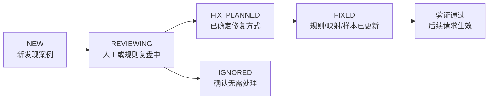

# 歧义与错误闭环方案（评审稿）

本文件是独立评审稿，专门回答一个问题：

当自然语言生成 DSL 的过程中出现歧义、错误理解、错误映射或不可执行结果时，系统应该如何：

1. 记录错误案例
2. 沉淀错误分类
3. 回流修复规则、映射和样本
4. 形成可持续迭代的闭环

当前不嵌入既有主文档，目的是先把闭环机制评审清楚，再决定后续归入正式方案文档的位置。

和另一份评审稿的关系如下：

1. [90-歧义判断与修正策略（评审稿）](/Users/zhouzhixiong/code/zuozhanV2/docs/任务分配与自动检核系统AI方案/02-自然语言计划生成/90-歧义判断与修正策略（评审稿）.md)
回答“当前请求在线上如何判断歧义、如何自动修正、如何分流”

2. 本文
回答“在线已经识别出问题之后，如何把问题沉淀成错误案例，并回流修复系统”

## 1. 为什么需要这份闭环方案

即使当前项目已经假设具备：

1. 历史计划样本和索引
2. 术语词典
3. 商家字段/标签/枚举元数据
4. 指标定义和别名
5. 区域概念映射

系统仍然可能在在线生成过程中出现以下问题：

1. 某个词有多个都像正确答案的候选解释
2. 某个字段或枚举值语义合理，但不符合系统真实边界
3. 某个输入信息不够完整，导致无法安全落成 DSL
4. 历史计划参考对当前理解产生偏置
5. 模型输出结构看起来完整，但最终不可执行

如果没有一套闭环，系统只能：

1. 靠 Prompt 临时修补
2. 反复在同类错误上踩坑
3. 把问题留在日志里，无法持续修复

所以，需要一套面向工程落地的：

1. 错误案例沉淀机制
2. 错误分类机制
3. 规则/映射/样本回流机制
4. 持续迭代机制

## 2. 这份方案要解决什么问题

这份方案不解决：

1. 怎么从零构建术语词典
2. 怎么从零构建历史样本索引
3. 怎么设计主链路节点

这份方案只解决：

1. 在线系统已经发现问题之后，错误案例如何结构化记录
2. 错误案例如何分类，方便统计和修复
3. 记录下来的错误如何反过来修复系统
4. 如何把一次错误处理沉淀成持续迭代机制

## 3. 在线判断与在线分流，本文只保留最小前提

在线阶段如何判断高歧义、业务语义不明确，以及如何在“自动修正 / 澄清 / 拒绝”之间分流，统一以
[90-歧义判断与修正策略（评审稿）](/Users/zhouzhixiong/code/zuozhanV2/docs/任务分配与自动检核系统AI方案/02-自然语言计划生成/90-歧义判断与修正策略（评审稿）.md)
为准。

### 3.1 本文只承接三种在线分流结果

#### 3.1.1 可自动修正

表示：

1. 在线规则层已经完成自动修正
2. 当前请求可以继续主链路
3. 但需要记录“本次发生过修正”

#### 3.1.2 需要澄清

表示：

1. 在线系统不能安全拍板
2. 当前请求进入下一轮澄清
3. 需要记录“为什么没有直接生成”

#### 3.1.3 必须拒绝

表示：

1. 在线系统已经判定当前结果不可继续
2. 本次请求被拒绝执行
3. 需要记录“拒绝原因”并进入错误闭环

## 4. 错误案例怎么记录

建议不要只把错误留在普通日志里，而是单独沉淀一张错误案例主表。

### 4.1 建议新增主表：`nl2dsl_error_case`

用途：

1. 沉淀可复盘的错误案例
2. 支持按错误类型聚类分析
3. 支持后续回流到规则、映射和样本

### 4.2 建议字段

| 字段名 | 类型 | 说明 |
| --- | --- | --- |
| `id` | bigint | 主键 |
| `case_id` | varchar(64) | 错误案例 ID |
| `session_id` | varchar(64) | 会话 ID |
| `turn_id` | varchar(64) | 轮次 ID |
| `user_query` | text | 原始输入 |
| `error_stage` | varchar(64) | 出错阶段 |
| `error_type` | varchar(64) | 错误类型 |
| `candidate_json` | json | 当前候选集合 |
| `model_output_json` | json | 模型原始输出 |
| `normalized_output_json` | json | 系统修正后的输出 |
| `final_result_json` | json | 最终采用或最终判定结果 |
| `resolution_status` | varchar(32) | NEW / REVIEWING / FIXED / IGNORED |
| `created_at` | datetime | 创建时间 |
| `updated_at` | datetime | 更新时间 |

### 4.2.1 字段分组理解

为了方便实施和后续排障，建议把这张表里的字段按 4 组理解：

1. 基本定位字段
- `case_id`
- `session_id`
- `turn_id`
- `created_at`
- `updated_at`

作用：
- 唯一定位这条错误案例
- 能够回放到具体会话和具体轮次

2. 原始上下文字段
- `user_query`
- `candidate_json`
- `model_output_json`

作用：
- 还原“模型当时看到了什么、选了什么”

3. 系统处理结果字段
- `normalized_output_json`
- `final_result_json`

作用：
- 记录系统自动修正后的结果
- 记录最终采用结果或最终拒绝结果

4. 问题分类与流转字段
- `error_stage`
- `error_type`
- `resolution_status`

作用：
- 说明问题出在哪个阶段
- 说明问题属于哪一类
- 说明当前修复处理走到了哪一步

### 4.2.2 为什么这些字段不能省

这张表最容易被删掉的，通常是下面几个字段，但它们其实不能省：

1. `candidate_json`
如果没有它，后面很难判断：
- 是召回本身有问题
- 还是模型在候选里选错了

2. `model_output_json`
如果没有它，后面很难区分：
- 模型原始输出就错了
- 还是系统修正环节出了问题

3. `normalized_output_json`
如果没有它，后面看不出：
- 系统有没有自动修正
- 自动修正之后是否仍然失败

4. `resolution_status`
如果没有它，后面这张表只能当日志，不能当闭环工作清单

### 4.2.3 建议的字段取值口径

建议统一以下字段取值口径，避免后面统计时出现脏数据：

1. `error_stage`
建议只允许以下枚举：
- `RECALL`
- `NORMALIZATION`
- `SLOT_EXTRACTION`
- `INTENT_MAPPING`
- `DSL_BUILDING`
- `SESSION_ORCHESTRATION`

2. `resolution_status`
建议只允许以下枚举：
- `NEW`
- `REVIEWING`
- `FIX_PLANNED`
- `FIXED`
- `IGNORED`

### 4.2.4 一条错误案例样例

```json
{
  "case_id": "case_20260416_0001",
  "session_id": "sess_001",
  "turn_id": "turn_002",
  "user_query": "帮我做一个华东餐饮新商家的首单提升计划",
  "error_stage": "NORMALIZATION",
  "error_type": "TERM_AMBIGUITY",
  "candidate_json": {
    "raw": "首单提升",
    "candidates": [
      {"type": "goal_type", "value": "first_order_growth", "score": 0.86},
      {"type": "metric_alias", "value": "first_order_cnt", "score": 0.84}
    ]
  },
  "model_output_json": {
    "normalized_terms": [
      {"raw": "首单提升", "type": "metric_alias", "value": "first_order_cnt"}
    ]
  },
  "normalized_output_json": {
    "normalized_terms": [
      {"raw": "首单提升", "type": "metric_alias", "value": "first_order_cnt"}
    ],
    "needs_clarification": true
  },
  "final_result_json": {
    "status": "CLARIFY",
    "question": "这里的“首单提升”你更希望表达目标类型，还是具体指标？"
  },
  "resolution_status": "NEW"
}
```

### 4.3 错误类型建议标准化

建议枚举化，不要全写成自由文本：

1. `TERM_AMBIGUITY`
2. `MISSING_REQUIRED_SLOT`
3. `INVALID_FIELD`
4. `INVALID_ENUM`
5. `CONCEPT_EXPANSION_FAILED`
6. `CONFLICT_CONDITION`
7. `WRONG_HISTORY_BIAS`
8. `UNEXECUTABLE_DSL`

### 4.4 谁来写错误案例

建议由系统规则层统一写入，不建议让 LLM 自己“写错误日志”。

常见写入点：

1. `candidate-recall-service`
   - 发现高歧义
2. `term-normalization-service`
   - 发现归一化结果不稳定
3. `intent-mapper-service`
   - 发现映射失败
4. `dsl-builder`
   - 发现结构非法或不可执行
5. `plan-session-orchestrator`
   - 多轮仍无法收敛

推荐统一调用一个：

- `error-case-recorder`

### 4.5 错误案例状态怎么流转

建议把 `resolution_status` 当成一条轻量工作流，而不是普通标签。

推荐状态流转如下：



可以这样理解：

1. `NEW`
- 在线系统刚写入

2. `REVIEWING`
- 产品、运营、算法或后端正在看这条案例

3. `FIX_PLANNED`
- 已经判断清楚该走：
  - 规则修复
  - 样本修复
  - 策略修复

4. `FIXED`
- 修复已经真正落到配置、表、索引或代码里

5. `IGNORED`
- 确认不是问题，或当前阶段不值得处理

## 5. 错误案例如何回流修复

建议把修复分成 3 层。

### 5.1 规则修复

适用于：

1. 字段别名缺失
2. 枚举别名缺失
3. 区域概念展开缺失

处理方式：

1. 更新字段别名表
2. 更新枚举别名表
3. 更新概念映射表

例子：

如果案例显示：

- `新店` 经常没有识别为 `new_merchant`

则修复：

- 在标签别名资产中补入 `新店 -> new_merchant`

### 5.2 样本修复

适用于：

1. 某类短语经常误判
2. 某类上下文下 LLM 消歧总出错

处理方式：

1. 把案例加入标注样本集
2. 进入评估样本
3. 用于调 prompt、调召回、调排序

例子：

- `第一单` 经常被误判为具体指标

修复：

1. 把这类输入加入高歧义样本集
2. 强化候选约束
3. 必要时改成优先澄清

### 5.3 策略修复

适用于：

1. 不是字典缺失
2. 不是映射缺失
3. 而是整个分流策略不对

例子：

1. 某类词本来不该自动修正，应该直接澄清
2. 某类历史计划不该提前进入某个节点
3. 某类高歧义词的 TopN 太大或太小

处理方式：

1. 修改高歧义阈值
2. 修改澄清触发规则
3. 修改历史参考接入时机
4. 修改 TopN 截断规则

## 6. 整个闭环应该怎么跑

推荐整体链路如下：

```text
用户输入
-> 候选召回 / 打分
-> 判断是自动修正、澄清还是拒绝
-> 如果失败或不稳定，记录错误案例
-> 人工或规则复盘
-> 更新映射 / 规则 / 样本
-> 下次请求生效
```

### 6.1 闭环里的角色分工

#### 在线系统负责

1. 判断歧义
2. 分流处理
3. 记录案例

#### 人工或运营/产品负责

1. 审核高频错误
2. 决定是否新增 alias / mapping / 样本

#### 规则与资产维护流程负责

1. 真正把修复写入配置、表或索引
2. 让下一次请求生效

## 7. 为什么不能只靠“再问一次 LLM”

如果 LLM 已经理解错了，下一次不能只是“再让同一个模型猜一次”。

因为这样会带来两个问题：

1. 同类错误会反复发生
2. 系统不会真正变得更稳

正确做法是：

1. 记录错例
2. 判断错在：
   - 字典
   - 映射
   - 样本
   - 策略
3. 把错例沉淀为资产修复

一句话：

**下一次变对，不是靠模型突然变聪明，而是靠系统把这次错误变成规则和资产。**

## 8. 推荐最小落地方案

如果当前只想先把闭环做起来，建议最少补这三样：

### 8.1 一张错误案例表

- `nl2dsl_error_case`

### 8.2 一套错误分类枚举

至少包括：

1. 歧义
2. 非法字段
3. 非法枚举
4. 映射失败
5. 条件冲突
6. 不可执行 DSL

### 8.3 一条修复流程

至少能支持：

1. 规则修复
2. 样本修复
3. 策略修复

## 9. 一句话总结

这份方案的核心不是“让模型永远不出错”，而是：

1. 能自动修正的，优先自动修正
2. 歧义高的，让系统先判断，再交给 LLM 消歧或进入澄清
3. 信息不够的，直接转入澄清
4. 真正错过的，沉淀为可修复的案例，并回流到规则、映射和样本里

这样模型即使偶尔理解错，也不会直接把错误带进最终 DSL，而且系统会越来越稳。
